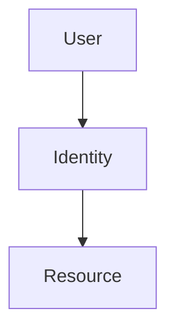

# GitHub Copilot Instructions

This repository builds the **Microsoft Sovereign Cloud Brain Trek**, a
technical training site for architects and solutions professionals covering
Microsoft Sovereign Cloud, Azure Local, Azure Arc, Edge RAG (Retrieval-Augmented
Generation), and Zero Trust.

## Stack

- **Framework:** [Astro 5](https://astro.build/) with the
  [Starlight 0.32](https://starlight.astro.build/) documentation theme.
- **Content:** MDX + Markdown under `site/src/content/docs/`.
- **Diagrams:** Mermaid via `rehype-mermaid-lite` (client-side rendering, Azure
  color palette configured in `site/astro.config.mjs`).
- **Search:** [Pagefind](https://pagefind.app/) (built-in to Starlight).
- **Hosting:** GitHub Pages, deployed by `.github/workflows/astro-deploy.yml`
  at base path `/microsoft-sovereign-cloud-brain-trek/`.

When you have a question about Astro or Starlight, use the **Astro Docs MCP
server** wired in at `.vscode/mcp.json` (`search_astro_docs` tool) before
guessing.

## Content layout

```text
site/src/content/docs/
├── index.mdx                 # Splash hero with CardGrid
├── introduction.md           # Project introduction
├── level-50/                 # Prerequisites (cloud, security, Azure fundamentals)
├── level-100/                # Foundational
│   ├── module-01-digital-sovereignty/
│   ├── module-02-cloud-models/
│   ├── module-03-azure-local/
│   ├── module-04-azure-arc/
│   └── module-05-edge-rag/
├── level-200/                # Intermediate
├── level-300/                # Advanced
└── resources/                # External links + glossary

site/public/images/           # Static images served at /images/...
```

Levels render in the left sidebar with badges (L50/L100/L200/L300) configured
in `site/astro.config.mjs`. The Resources section gets no badge.

## Authoring conventions

### Front matter

Every content page **must** have a `title` and `description` (validated by the
Zod schema in `site/src/content.config.ts`; description is 20–220 chars). All
other keys are optional.

```yaml
---
title: Page Title
description: "Short description for SEO and the sidebar tagline (20-220 chars)."
sidebar:
  order: 1        # Position within its parent folder. Lower = earlier.
  hidden: false   # Optional: hide from the sidebar.
---
```

Do **not** add `layout`, `nav_order`, or `parent` — those were Jekyll keys and
are not used by Starlight.

### Components (only inside `.mdx` files)

`.mdx` is required to use any component. Plain `.md` cannot host JSX.

- **`<KnowledgeCheck answer="B" reference="...">…</KnowledgeCheck>`** —
  quiz-question wrapper. Children are full MDX (the question, options, and
  explanation). See `site/src/components/KnowledgeCheck.astro`.
- **`<DiagramContainer title="..." defaultOpen>…</DiagramContainer>`** —
  collapsible wrapper for Mermaid blocks. See
  `site/src/components/DiagramContainer.astro`.

If a page uses neither component, keep it as `.md`.

### Callouts

Use Starlight asides (NOT kramdown `{: .note }` blockquotes):

```markdown
:::note[Optional title]
Helpful side note.
:::

:::tip[Optional title]
Good-to-know.
:::

:::caution[Optional title]
Warning to the reader.
:::

:::danger[Optional title]
Critical warning.
:::
```

### Mermaid diagrams

Use a fenced code block with the `mermaid` language. The site-wide init script
(in `site/astro.config.mjs`) applies the Azure color palette automatically.

````markdown

````

If you want the diagram inside a collapsible container, wrap it in
`<DiagramContainer>` (which requires `.mdx`).

### Internal links

Use Starlight slugs, not `.md` paths:

```markdown
<!-- ✅ correct -->
[Azure Arc Intro](/level-100/module-04-azure-arc/azure-arc-intro/)
[Same-folder sibling](./sibling-page/)

<!-- ❌ wrong -->
[Azure Arc Intro](azure-arc-intro.md)
[Same-folder sibling](sibling-page.md)
```

The base path `/microsoft-sovereign-cloud-brain-trek/` is added automatically
by Starlight. Never hard-code it in content.

### Images

Place files under `site/public/images/level-XX/...` and reference them with
root-relative URLs:

```markdown

```

Starlight prepends the base path at build time.

### File names

Use **lowercase kebab-case** for all content files. Examples:

- `cloud-deployment-models.md`
- `azure-arc-intro.mdx`
- `module-04-azure-arc/index.md` (module landing page)

Uppercase or snake_case file names break the link rewriter (Starlight lowercases
route slugs, so `VISUAL_SPECIFICATIONS.md` would ship at
`/level-100/visual_specifications/` while content authors and old bookmarks
expect `visual-specifications`).

## Local development

```bash
cd site
npm ci                    # one-time install
npm run dev               # dev server with HMR at http://localhost:4321/microsoft-sovereign-cloud-brain-trek/
npm run check             # astro check (types + content collection schema)
npm run build             # full static build into site/dist/
npm run preview           # serve the built site (matches production)
npm run emit-legacy-stubs # post-build: regenerate static .html redirect stubs
                          # for legacy Jekyll URLs from path-rewrite-map.json
```

Run `npm run check && npm run build` before opening a PR that touches `site/**`.

## CI

- `.github/workflows/astro-ci.yml` — runs `astro check` + `astro build` on
  every PR touching `site/**` and uploads `dist/` as an artifact.
- `.github/workflows/astro-deploy.yml` — deploys `dist/` to GitHub Pages on
  every push to `main` that touches `site/**`.
- `.github/workflows/markdown-lint.yml` — runs `markdownlint-cli2` (pinned to
  the pre-commit hook version) on `.md` files. `.mdx` files are not linted by
  markdownlint (cannot parse JSX); MDX correctness is enforced by
  `astro check`.
- `.github/workflows/link-check.yml` — runs `lychee` on demand.

## Rollback

If a deploy regresses production, the `legacy/jekyll-last` tag preserves the
pre-cutover state. Detailed rollback steps live in
[`CONTRIBUTING.md`](../CONTRIBUTING.md#rollback-runbook-post-cutover-safety-net).

## Things to avoid

- Don't add Jekyll/kramdown syntax (`{: .note }`, `{:toc}`, ``,
  `<details markdown="1">`, `layout:`, `nav_order:`, `parent:`).
- Don't add `Just the Docs` classes (`.btn`, `.fs-9`, `.text-delta`,
  `.no_toc`).
- Don't hard-code the base path in content.
- Don't enable a dark-theme selector — the site is locked to light theme by
  the `ThemeProvider.astro` and `ThemeSelect.astro` overrides under
  `site/src/components/`.
- Don't create a top-level `package.json` install — Astro dependencies live in
  `site/package.json`. Running `npm install` at the repo root will produce a
  conflicting `node_modules/` tree.
