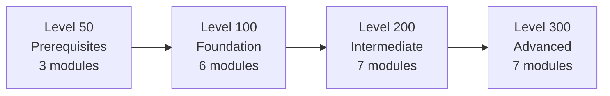

# Microsoft Sovereign Cloud Brain Trek

Training for architects and solutions professionals on Microsoft Sovereign Cloud, Azure Local, Azure Arc, Foundry Local, and Zero Trust.

**Read the course:** [jonathan-vella.github.io/microsoft-sovereign-cloud-brain-trek](https://jonathan-vella.github.io/microsoft-sovereign-cloud-brain-trek/)

[](LICENSE)
[](https://learn.microsoft.com/azure/azure-sovereign-clouds/microsoft-sovereign-cloud)
[](https://learn.microsoft.com/azure/azure-local/)
[](https://learn.microsoft.com/azure/azure-arc/overview)
[](https://starlight.astro.build/)
[](https://github.com/features/copilot)
[](CONTRIBUTING.md)

## What the course covers

- **Microsoft Sovereign Cloud:** Sovereign Public Cloud, Sovereign Private Cloud, and National Partner Clouds, plus digital sovereignty, the EU Data Boundary, and regulations such as GDPR, NIS2, and DORA.
- **Sovereign Public Cloud controls:** Data Guardian, Customer Lockbox, External Key Management with Managed HSM, confidential computing, and Sovereign Control Panel.
- **Sovereign Private Cloud stack:** Azure Local (connected and disconnected operations), Microsoft 365 Local, GitHub Enterprise Local, and Foundry Local on Azure Local.
- **Azure Arc:** servers, Kubernetes, data services, policy, and governance at scale.
- **Foundry Local:** local model inference on Azure Local and Agentic Retrieval (formerly Edge RAG).
- **Sovereign Landing Zone, Zero Trust, operations, and industry solutions** at architect depth.

Every page lists the Microsoft Learn pages and Microsoft announcements it was checked against, and shows the date it was last verified. Preview features are marked as preview.

## Who it's for

- **Sales and pre-sales:** account executives, solution specialists, and technical sellers. Levels 50 to 200.
- **Technical roles:** cloud architects, field engineers, and AI developers. Levels 50 to 300.

## Learning path

| Level | Focus | Modules |
|---|---|---|
| [Level 50: Prerequisites](https://jonathan-vella.github.io/microsoft-sovereign-cloud-brain-trek/level-50/) | Cloud, security, and Azure basics | Cloud computing fundamentals; Security and compliance fundamentals; Microsoft Azure introduction |
| [Level 100: Foundation](https://jonathan-vella.github.io/microsoft-sovereign-cloud-brain-trek/level-100/) | What the offerings are and why customers need them | Digital sovereignty; Sovereign cloud models; Azure Local; Azure Arc; Foundry Local; Microsoft 365 Local |
| [Level 200: Intermediate](https://jonathan-vella.github.io/microsoft-sovereign-cloud-brain-trek/level-200/) | Solution design, sizing, and compliance | Azure Local architecture; Azure Arc at scale; Foundry Local on Azure Local; Pre-sales for sovereign solutions; Compliance and security; Sovereign Public Cloud controls; Sovereign Private Cloud stack |
| [Level 300: Advanced](https://jonathan-vella.github.io/microsoft-sovereign-cloud-brain-trek/level-300/) | Deployment architecture and operations | Azure Local advanced; Sovereign Landing Zone; Architecture patterns; Foundry Local in production; Zero Trust; Operations; Industry solutions |

Each module ends with a knowledge check. The site tracks which pages you have visited in your browser only.



## Repository layout

```text
site/
├── src/content/docs/          # Course content (Markdown and MDX)
│   ├── index.mdx              # Home page
│   ├── introduction.md
│   ├── level-50/ … level-300/ # One folder per level, one subfolder per module
│   └── resources/             # Glossary, links, visual assets index
├── src/components/            # KnowledgeCheck, DiagramContainer, navigation and landing-page components
├── public/images/             # SVG diagrams, served at /images/...
├── redirects.json             # Old URL -> new URL for moved or deleted pages
├── url-baseline.json          # Every published URL; CI checks none of them 404
└── scripts/                   # Sidebar, redirects, URL check, content lint
.github/skills/unslop/         # Writing rules for course content
```

## Local development

The site uses [Astro](https://astro.build/) and the [Starlight](https://starlight.astro.build/) documentation theme, and needs Node.js 22.12 or later.

```bash
cd site
npm ci                         # install
npm run dev                    # dev server at http://localhost:4321/microsoft-sovereign-cloud-brain-trek/
npm run check                  # types and content schema
npm run build                  # static build into site/dist/
npm run emit-legacy-stubs      # redirect pages for old Jekyll .html URLs
npm run check:urls             # every published URL resolves, no broken links or images
npm run lint:content           # lastVerified, Sources, base path, writing style
npm run preview                # serve the built site
```

Run `check`, `build`, `emit-legacy-stubs`, `check:urls`, and `lint:content` before opening a PR. CI runs the same steps.

There are two `package.json` files. `site/package.json` holds the site and its build tools. The root `package.json` holds only `markdownlint-cli2` for linting Markdown across the repo (`npm run lint` from the root). Install site dependencies inside `site/`.

## Contributing

See [CONTRIBUTING.md](CONTRIBUTING.md). In short:

- Put pages in the right `level-NN/module-NN-name/` folder. The sidebar, learning path, and prev/next links are built from the folders.
- Every page needs `title`, `description`, and `lastVerified` front matter, and ends with a `## Sources` section of Microsoft Learn or official Microsoft links.
- Follow the [unslop writing rules](.github/skills/unslop/SKILL.md).
- Never break a published URL. When you move or delete a page, add an entry to `site/redirects.json`.

Pushes to `main` that touch `site/**` deploy to GitHub Pages through `.github/workflows/astro-deploy.yml`.

## Microsoft resources

- [Microsoft Sovereign Cloud](https://learn.microsoft.com/azure/azure-sovereign-clouds/microsoft-sovereign-cloud)
- [Azure Local](https://learn.microsoft.com/azure/azure-local/)
- [Azure Arc](https://learn.microsoft.com/azure/azure-arc/overview)
- [Foundry Local on Azure Local](https://learn.microsoft.com/azure/azure-sovereign-clouds/private/foundry-local/overview)
- [Microsoft 365 Local](https://learn.microsoft.com/azure/azure-sovereign-clouds/private/m365-local/microsoft-365-local-overview)
- [Microsoft Learn training](https://learn.microsoft.com/training/)

## License

MIT. See [LICENSE](LICENSE).

The content is based on Microsoft's public documentation.
