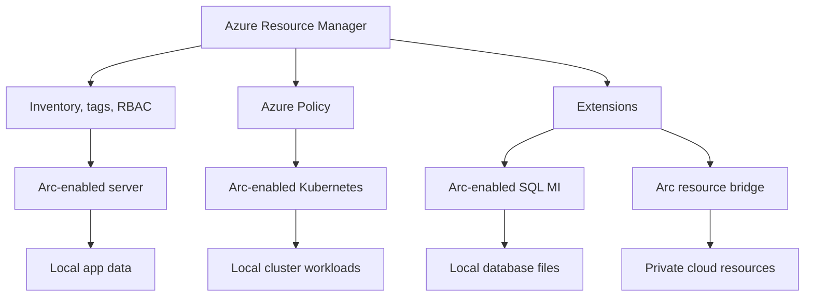

import DiagramContainer from "~/components/DiagramContainer.astro";

Azure Arc extends Azure Resource Manager to resources that run outside Azure. It does not move those resources into Azure. It gives them Azure identities, resource IDs, tags, role assignments, policy assignments, and access to selected Azure services.

For sovereign cloud work, Arc is useful because it lets an organization keep workloads in a chosen location while using one governance plane. It is also important to know where that governance plane stops. Arc control-plane features are different from services such as Azure Monitor, Microsoft Defender for Cloud, or Azure Arc-enabled SQL Managed Instance.

## What Azure Arc projects into Azure

Azure Arc creates Azure resource projections for several kinds of infrastructure and workloads. The core Arc control plane can manage inventory, tags, Azure role-based access control, Resource Graph search, templates, and extensions at no extra charge, while Azure services used on top of Arc bill at their own rates ([Azure Arc overview](https://learn.microsoft.com/azure/azure-arc/overview#pricing)).

| Arc resource type | What appears in Azure | What keeps running outside Azure |
|---|---|---|
| Arc-enabled servers | Windows and Linux machines as Azure resources | The operating system, applications, and data on the machine |
| SQL Server enabled by Azure Arc | SQL Server instances and databases in inventory and management views | SQL Server on a Windows or Linux host |
| Arc-enabled Kubernetes | CNCF-certified Kubernetes clusters as connected clusters | The cluster control plane, nodes, workloads, and persistent volumes |
| Arc-enabled data services | Azure SQL Managed Instance enabled by Azure Arc | Database pods and database files on the target Kubernetes infrastructure |
| Arc resource bridge resources | Private cloud resources managed through Azure | VMware vSphere, Azure Local, or SCVMM infrastructure |

<DiagramContainer title="Azure Arc control plane and local data planes" defaultOpen>

</DiagramContainer>

## Control plane and data plane

The **control plane** is the management path. In Arc, it includes Azure Resource Manager, Azure Policy, Azure RBAC, tags, Azure Resource Graph, extensions, and the Arc agents or operators that receive management instructions.

The **data plane** is where workload traffic and workload data live. A web app on an Arc-enabled server still serves users from that server. A workload on an Arc-enabled Kubernetes cluster still runs in that cluster. A database deployed as Azure Arc-enabled SQL Managed Instance stores its database files on the target Kubernetes storage.

This split matters for sovereignty. Arc can centralize governance without moving application data to Azure by itself. If you add Azure Monitor, Defender for Cloud, Microsoft Sentinel, backup, or other services, each service has its own data flow, pricing, and configuration. Review those services separately before you claim a data residency outcome.

## Pricing model

Azure Arc's baseline control-plane functionality is offered at no extra charge. Microsoft lists management groups and tags, Resource Graph search, Azure RBAC, templates, and extensions as included control-plane capabilities ([Azure Arc overview](https://learn.microsoft.com/azure/azure-arc/overview#pricing)).

That statement does not make every Arc scenario free. Azure Monitor, Microsoft Defender for Cloud, Microsoft Sentinel, Azure Policy for Kubernetes, Azure Arc-enabled SQL Managed Instance, and other services layered on Arc follow their own pricing pages and meters. In a design review, separate "connecting the resource to Arc" from "turning on a billable service for that resource."

## Arc resource bridge

Azure Arc resource bridge is a Microsoft-managed Kubernetes appliance that connects private cloud platforms to Azure management. It is generally available and supports VMware vSphere, Azure Local, and System Center Virtual Machine Manager (SCVMM) as private clouds ([Azure Arc resource bridge overview](https://learn.microsoft.com/azure/azure-arc/resource-bridge/overview#version-and-region-support)).

Resource bridge is the component that lets Azure manage private cloud resources through a custom location. For example, Azure Local uses Arc resource bridge for VM management, and VMware or SCVMM environments can expose VM lifecycle operations through Azure. Resource bridge is not a general-purpose application cluster. Treat it as management infrastructure and keep it within the supported update window. Microsoft states that the appliance must be upgraded at least every six months and that support covers the latest version plus three prior versions ([Azure Arc resource bridge overview](https://learn.microsoft.com/azure/azure-arc/resource-bridge/overview#version-and-region-support)).

## Arc gateway

Azure Arc gateway reduces the number of outbound endpoints that some Arc resources need. Instead of allowing a long list of service endpoints from every connected machine, you create a gateway resource and route supported Arc traffic through it. Microsoft documents a reduction from more than 200 endpoints to as few as 7 to 9 endpoints for supported scenarios ([Azure Arc gateway](https://learn.microsoft.com/azure/azure-arc/servers/arc-gateway)).

Status depends on the resource type. Arc gateway is generally available for Arc-enabled servers. It is also generally available for Azure Local infrastructure and VMs on Azure Local, while Arc gateway for AKS on Azure Local remains in preview ([Azure Local Arc gateway overview](https://learn.microsoft.com/azure/azure-local/deploy/deployment-azure-arc-gateway-overview?view=azloc-2609)). Current gateway limits include five gateway resources per subscription, public cloud connectivity only, and a recommendation not to use it where TLS termination or TLS inspection is required ([Azure Arc gateway limitations](https://learn.microsoft.com/azure/azure-arc/servers/arc-gateway#current-limitations)).

Arc gateway is a network simplification feature. It is not an offline control plane and it does not remove the need to review which Azure services a resource uses.

## How Arc supports sovereignty

Arc supports sovereignty through consistent governance across locations. You can use Azure Policy, Azure RBAC, tags, inventory, and resource graph queries across Azure resources and Arc resources. This helps organizations apply the same baseline to servers, Kubernetes clusters, and Azure Local resources that live in different facilities or clouds.

Arc also underpins Azure Local management. Azure Local uses Azure and Arc for connected operations, and Arc resource bridge exposes VM lifecycle management to Azure. If a design needs local operations with limited or no cloud connectivity, use the Azure Local disconnected operations module instead of assuming that ordinary Arc connectivity is disconnected by default.

For AI at the edge, see [Module 5: Foundry Local](/level-100/module-05-foundry-local/).

## Sources

- [Azure Arc overview](https://learn.microsoft.com/azure/azure-arc/overview)
- [What is Azure Arc-enabled Kubernetes?](https://learn.microsoft.com/azure/azure-arc/kubernetes/overview)
- [SQL Server enabled by Azure Arc](https://learn.microsoft.com/sql/sql-server/azure-arc/overview?view=sql-server-ver17)
- [Connectivity mode and requirements](https://learn.microsoft.com/azure/azure-arc/data/connectivity)
- [Simplify network configuration requirements with Azure Arc gateway](https://learn.microsoft.com/azure/azure-arc/servers/arc-gateway)
- [About Azure Arc gateway for Azure Local](https://learn.microsoft.com/azure/azure-local/deploy/deployment-azure-arc-gateway-overview?view=azloc-2609)
- [What is Azure Arc resource bridge?](https://learn.microsoft.com/azure/azure-arc/resource-bridge/overview)
