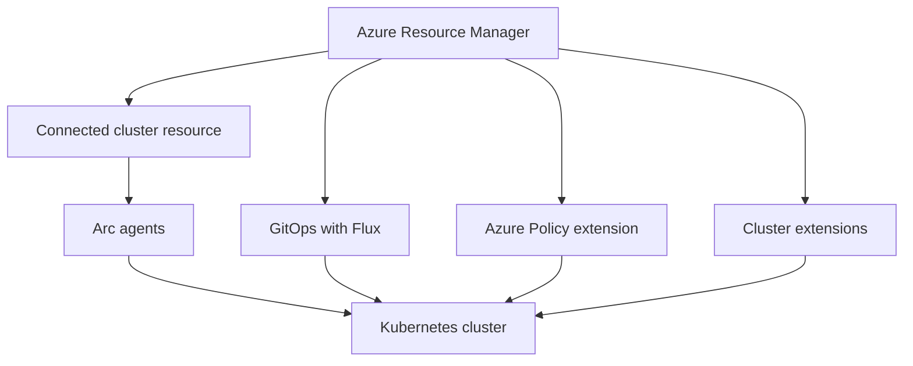
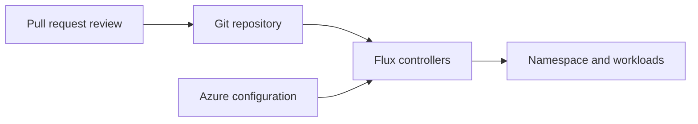

import DiagramContainer from "~/components/DiagramContainer.astro";

Azure Arc-enabled Kubernetes connects Kubernetes clusters to Azure without moving the cluster into Azure. Microsoft describes the service as working with any Cloud Native Computing Foundation certified Kubernetes cluster ([Azure Arc-enabled Kubernetes overview](https://learn.microsoft.com/azure/azure-arc/kubernetes/overview)).

For sovereign cloud design, this means a cluster can run on-premises, on Azure Local, or in another cloud while Azure provides inventory, GitOps configuration, extensions, monitoring, and policy.

<DiagramContainer title="Arc-enabled Kubernetes control flow" defaultOpen>

</DiagramContainer>

## What Arc adds to a Kubernetes cluster

Arc registers the cluster as an Azure resource. After registration, administrators can use Azure to see the cluster in inventory, assign tags and role-based access, and attach selected services.

Arc can also install extensions. Common examples include Azure Policy for Kubernetes, Azure Monitor Container Insights, GitOps with Flux, and other Microsoft or partner extensions. Each extension has its own prerequisites and data flow.

Arc does not replace the Kubernetes API server, the container runtime, or cluster operations tools. Cluster administrators still need Kubernetes operations skills, local break-glass access, backup planning, and a lifecycle plan for the distribution they run.

## Validated distributions

Arc-enabled Kubernetes works with CNCF-certified Kubernetes clusters. Microsoft also publishes a validation program for distributions that have passed conformance tests for Arc-enabled Kubernetes. Current validated distributions ([validation program](https://learn.microsoft.com/azure/azure-arc/kubernetes/validation-program)) include:

| Distribution | Version note from Microsoft validation |
|---|---|
| AKS enabled by Azure Arc on Azure Local | Validated distribution |
| Kubernetes on Azure Stack Edge | Validated distribution |
| AKS Edge Essentials | Validated distribution |
| Cluster API Provider on Azure | Validated distribution |
| Canonical Charmed Kubernetes | Versions 1.32 through 1.34 |
| Wind River Cloud Platform | Version 26.03 with Kubernetes 1.34.1 |

The validation list is volatile, so use the current Microsoft validation page before you commit to a distribution in a design ([Azure Arc-enabled Kubernetes validation](https://learn.microsoft.com/azure/azure-arc/kubernetes/validation-program)).

## GitOps with Flux

GitOps uses a Git repository as the source of truth for cluster configuration. Arc-enabled Kubernetes uses Flux so the cluster can pull manifests, Helm releases, or Kustomize overlays from a repository and reconcile the desired state.

This pattern helps sovereignty work because it creates a reviewable record of cluster configuration changes. It also lets a central platform team publish baseline configuration while local teams keep operational control of the cluster.

GitOps does not remove the need for change control. Protect the repository, require review for production changes, and define how emergency fixes are reconciled back into Git.

## Azure Policy for Kubernetes

Azure Policy for Kubernetes extends policy evaluation into the cluster. The extension can audit or enforce Kubernetes settings such as allowed container images, pod security, labels, resource constraints, and networking rules.

Microsoft states that the Azure Policy extension for Arc-enabled Kubernetes is generally available and lists conformance-tested environments that include AKS on Azure Local, Azure Red Hat OpenShift, Kind, Rancher Government with RKE2, Minikube, K3s, AKS Edge, and VMware Tanzu Kubernetes Grid. The same Microsoft page notes that RKE is deprecated in favor of RKE2 ([available extensions for Arc-enabled Kubernetes](https://learn.microsoft.com/azure/azure-arc/kubernetes/extensions-release#azure-policy)).

Policy can help a platform team apply guardrails across clusters in different locations. It is not a substitute for cluster hardening, image signing, network design, or local incident response.

## Relationship to AKS on Azure Local

AKS on Azure Local is a Microsoft-managed way to run Kubernetes on Azure Local. Azure Arc is the management connection that lets those clusters appear in Azure, use extensions, and take part in Azure governance.

Do not treat every Azure Local Kubernetes scenario as generally available in every connectivity mode. AKS on Azure Local with disconnected operations is explicitly in preview, and the Azure Local disconnected operations service table also labels Arc-enabled Kubernetes clusters under disconnected operations as preview ([AKS on Azure Local disconnected operations](https://learn.microsoft.com/azure/aks-hybrid-edge/local/disconnected-operations/overview)).

Arc gateway also has a different status for Kubernetes than for servers. Gateway is generally available for Azure Local infrastructure and VMs, but Microsoft lists Arc gateway for AKS on Azure Local as preview ([Azure Local Arc gateway overview](https://learn.microsoft.com/azure/azure-local/deploy/deployment-azure-arc-gateway-overview?view=azloc-2609)).

## Sovereign design checks

Use these questions during early design:

- Which organization operates the Kubernetes cluster and handles local break-glass access?
- Which extensions are required, and what data does each extension send to Azure?
- Which policy assignments are audit-only, and which ones deny workload deployment?
- Which distribution and version are validated for the planned Arc features?
- Does the design need connected operations, or does it require an Azure Local disconnected operations pattern?

The answer should name the cluster distribution, connectivity model, extensions, policy scope, and data flows. Avoid a generic statement that the cluster is "managed by Azure" unless you specify which management functions are enabled.

## Sources

- [What is Azure Arc-enabled Kubernetes?](https://learn.microsoft.com/azure/azure-arc/kubernetes/overview)
- [Azure Arc-enabled Kubernetes validation](https://learn.microsoft.com/azure/azure-arc/kubernetes/validation-program)
- [Available extensions for Azure Arc-enabled Kubernetes clusters](https://learn.microsoft.com/azure/azure-arc/kubernetes/extensions-release)
- [GitOps with Flux v2 in Azure Arc-enabled Kubernetes](https://learn.microsoft.com/azure/azure-arc/kubernetes/conceptual-gitops-flux2)
- [AKS on Azure Local with disconnected operations](https://learn.microsoft.com/azure/aks-hybrid-edge/local/disconnected-operations/overview)
- [About Azure Arc gateway for Azure Local](https://learn.microsoft.com/azure/azure-local/deploy/deployment-azure-arc-gateway-overview?view=azloc-2609)
