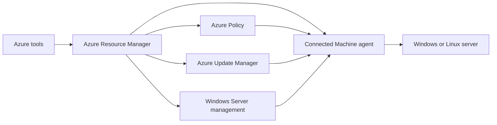

import DiagramContainer from "~/components/DiagramContainer.astro";

Azure Arc-enabled servers connects Windows and Linux machines that run outside Azure to Azure Resource Manager. A connected machine gets an Azure resource ID, a managed identity, tags, role assignments, policy assignments, and access to Azure extensions.

The server does not become an Azure virtual machine. Its operating system, applications, and data remain on the host. Arc adds a management channel that uses outbound connectivity to Azure.

<DiagramContainer title="Arc-enabled server management path" defaultOpen>

</DiagramContainer>

## Connected Machine agent

The Connected Machine agent is the software that registers a non-Azure server with Azure Arc. It runs on the machine, authenticates to Azure, and maintains the management channel. Microsoft documents support for Windows Server 2012 R2 and later and a set of supported Linux distributions for Arc-enabled server update scenarios, including Red Hat Enterprise Linux, Ubuntu LTS, SUSE Linux Enterprise Server, Debian, Oracle Linux, AlmaLinux, Rocky Linux, and Amazon Linux versions listed in the support matrix ([Azure Update Manager support matrix](https://learn.microsoft.com/azure/update-manager/support-matrix-updates)).

The agent uses outbound HTTPS. You do not need to open inbound management ports to Azure for ordinary Arc registration. If the network must minimize allowed destinations, Arc gateway can reduce required outbound endpoints for supported server scenarios.

The agent also gives the server a system-assigned managed identity. Azure services and extensions can use that identity instead of storing long-lived credentials on the server.

## Onboarding approaches

You can onboard servers one at a time from the Azure portal, Azure CLI, or PowerShell. At scale, use tools such as Configuration Manager, Group Policy, scripted deployment, or service principal based automation. The right method depends on who owns the servers and how software is normally deployed in that environment.

At L100 depth, remember the onboarding sequence:

1. Confirm the operating system, network, and Azure permissions.
2. Install the Connected Machine agent.
3. Connect the agent to a subscription, resource group, region, and tenant.
4. Organize the new Arc resource with tags, role assignments, and policy assignments.
5. Add only the extensions and Azure services that the design needs.

When SQL Server is installed on a connected Windows or Linux server, Microsoft can automatically connect the SQL Server instances to Azure Arc as SQL Server enabled by Azure Arc. Microsoft documents an opt-out tag named `ArcSQLServerExtensionDeployment` with value `Disabled` for environments that do not want automatic SQL Server connection ([Azure Connected Machine agent deployment options](https://learn.microsoft.com/azure/azure-arc/servers/deployment-options#automatic-connection-for-sql-server)).

## Management features

Arc-enabled servers can use Azure-native governance and operations features.

| Feature | What it does | Sovereignty note |
|---|---|---|
| Azure Policy and machine configuration | Audits or configures settings inside the guest operating system | Use it for consistent baselines across datacenters and clouds |
| Azure Update Manager | Assesses and schedules operating system updates | Validate maintenance windows and reboot policies locally |
| Azure Monitor | Collects metrics and logs when configured | Log data follows the workspace and data collection rule configuration |
| Microsoft Defender for Cloud | Adds security posture and threat protection plans | Defender plans bill separately and can collect security data |
| Windows Admin Center in Azure | Provides browser-based Windows Server management | Scope access with Azure RBAC |
| Run Command | Runs scripts on connected machines | Treat it as privileged remote administration |

Azure machine configuration, formerly Guest Configuration, extends Azure Policy inside the guest operating system of Arc-connected servers ([cloud-native governance and policy](https://learn.microsoft.com/azure/azure-arc/servers/cloud-native/governance-policy)). This is useful when a sovereign baseline requires settings inside the operating system, not just resource tags or Azure-side configuration.

## Windows Server pay-as-you-go through Arc

Windows Server pay-as-you-go through Azure Arc is available for Windows Server 2025 and later. It bills Windows Server use through Azure by physical or virtual core, depending on how you configure licensing, and Microsoft states that it requires no product key and no client access licenses for the pay-as-you-go subscription ([cloud-native licensing and cost management](https://learn.microsoft.com/azure/azure-arc/servers/cloud-native/licensing-cost-management)).

This licensing model is different from bringing an existing Windows Server license. It is useful when an organization wants Azure-billed Windows Server licensing for servers outside Azure, especially where demand changes over time.

## Windows Server Management enabled by Azure Arc

Windows Server Management enabled by Azure Arc is a management benefit for eligible Windows Server machines. Microsoft lists Update Manager, Change Tracking and Inventory, Machine Configuration, Windows Admin Center in Azure, Remote Support, Network HUD for Windows Server 2025, Best Practices Assessment, Site Recovery configuration, and discounted Azure File Sync among the included capabilities ([Windows Server Management enabled by Azure Arc](https://learn.microsoft.com/azure/azure-arc/servers/windows-server-management-overview)).

At L100 depth, think of the benefit as a bundle that reduces the friction of using Azure management on Windows Server. It does not make every Azure service free, and it does not change where the server runs. Check the benefit prerequisites and service-specific data flows before you include it in a design.

## Arc gateway for servers

Arc gateway is generally available for Arc-enabled servers. It can reduce outbound connectivity requirements from more than 200 endpoints to as few as 7 to 9 endpoints for supported Arc traffic ([Azure Arc gateway](https://learn.microsoft.com/azure/azure-arc/servers/arc-gateway)).

Arc gateway has limits. Microsoft currently limits a subscription to five gateway resources, supports public-cloud connectivity only, and does not recommend the feature where TLS termination or TLS inspection is required ([current limitations](https://learn.microsoft.com/azure/azure-arc/servers/arc-gateway#current-limitations)). One gateway resource can handle about 2,000 Arc-enabled server resources per region ([plan your Azure Arc gateway setup](https://learn.microsoft.com/azure/azure-arc/servers/arc-gateway#plan-your-azure-arc-gateway-setup)).

Use Arc gateway when firewall simplification is the goal. Do not use it as a substitute for Azure Local disconnected operations or as proof that no telemetry or service data leaves the site.

## Sources

- [Azure Arc-enabled servers overview](https://learn.microsoft.com/azure/azure-arc/servers/overview)
- [Azure Connected Machine agent overview](https://learn.microsoft.com/azure/azure-arc/servers/agent-overview)
- [Azure Connected Machine agent deployment options](https://learn.microsoft.com/azure/azure-arc/servers/deployment-options)
- [Support for Updates](https://learn.microsoft.com/azure/update-manager/support-matrix-updates)
- [Cloud-native governance and policy with Azure Arc-enabled servers](https://learn.microsoft.com/azure/azure-arc/servers/cloud-native/governance-policy)
- [Cloud-native licensing and cost management with Arc-enabled servers](https://learn.microsoft.com/azure/azure-arc/servers/cloud-native/licensing-cost-management)
- [Windows Server Management enabled by Azure Arc](https://learn.microsoft.com/azure/azure-arc/servers/windows-server-management-overview)
- [Simplify network configuration requirements with Azure Arc gateway](https://learn.microsoft.com/azure/azure-arc/servers/arc-gateway)
