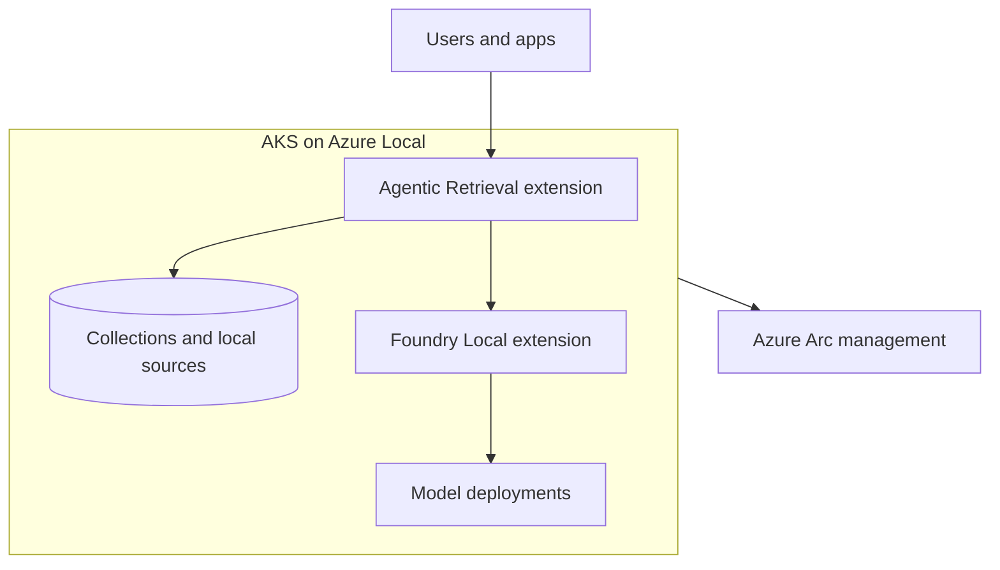

import DiagramContainer from "~/components/DiagramContainer.astro";

Foundry Local on Azure Local is the model inference service in the Foundry Local family. It runs AI models on an Arc-enabled Kubernetes cluster on Azure Local and is installed as an Azure Arc extension. Foundry Local on Azure Local is in preview and deployment is request-only during preview ([source](https://learn.microsoft.com/azure/azure-sovereign-clouds/private/foundry-local/overview)).

Agentic Retrieval in Foundry Local is the retrieval and agent platform in the same family. It was called Edge RAG enabled by Azure Arc until the June 2026 release renamed it and added an agentic layer ([source](https://learn.microsoft.com/azure/azure-arc/agents-tools-foundry-local/whats-new#june-2026)). Agentic Retrieval in Foundry Local is also in preview ([source](https://learn.microsoft.com/azure/azure-arc/agents-tools-foundry-local/overview)).

Together, the two extensions support a [Sovereign Private Cloud](/level-100/module-02-cloud-models/sovereign-private-cloud/) pattern. Model inference, retrieval, embeddings, collections, agent state, and chat conversations can run on infrastructure the organization operates in its own environment.

<DiagramContainer title="Foundry Local family on Azure Local" defaultOpen>

</DiagramContainer>

## Foundry Local on Azure Local

Foundry Local on Azure Local provides Kubernetes-native model serving. The extension includes an inference operator that watches custom resources and reconciles model deployments. A `Model` resource defines model metadata. A `ModelDeployment` resource defines how the model is served, scaled, and exposed.

Applications call inference endpoints through OpenAI-compatible REST patterns. The service supports API key authentication, Microsoft Entra ID authentication, Kubernetes Service Account Token authentication for in-cluster callers, and Transport Layer Security (TLS) through Kubernetes Gateway API.

Foundry Local on Azure Local supports these inference paths:

| Runtime | Hardware path | Use |
|---|---|---|
| ONNX-GenAI | CPU or GPU | Default generative AI inference engine |
| vLLM | GPU only | Higher-throughput generative AI serving |

The service can run CPU-backed or GPU-backed deployments. GPU workloads require NVIDIA GPU nodes and supported device configuration. AMD GPUs are not supported for Foundry Local on Azure Local ([source](https://learn.microsoft.com/azure/azure-sovereign-clouds/private/foundry-local/concept-requirements#gpu-requirements)).

## Disconnected environments

The June 2026 Foundry Local on Azure Local release added disconnected-environment operations in preview ([source](https://learn.microsoft.com/azure/azure-sovereign-clouds/private/foundry-local/whats-new#june-2026)). The requirements article states that disconnected deployments require Azure Local Disconnected Operations version `2604.3.0` or later ([source](https://learn.microsoft.com/azure/azure-sovereign-clouds/private/foundry-local/concept-requirements#software-requirements)).

Disconnected deployments keep the same basic model as connected deployments, but dependency delivery changes. Instead of pulling every dependency online, the disconnected path uses expansion packs, local registries, local certificate tooling, and local model artifacts.

## Agentic Retrieval as the sibling extension

Agentic Retrieval in Foundry Local uses local knowledge sources, collections, agents, and a built-in MCP server. It does not bundle the language model. The June 2026 release requires all deployments to provide a language model endpoint, with Foundry Local on Azure Local as the recommended local option or an external Bring Your Own Model endpoint that supports the OpenAI-compatible chat completions API ([source](https://learn.microsoft.com/azure/azure-arc/agents-tools-foundry-local/whats-new#june-2026)).

This separation matters for architecture. Foundry Local answers inference requests. Agentic Retrieval handles document ingestion, chunking, embedding, collection search, agent orchestration, chat, and API access. A sovereign design can place both extensions on the same Arc-enabled Kubernetes cluster when the environment needs local inference and local retrieval.

## Sources

- [What is Foundry Local on Azure Local?](https://learn.microsoft.com/azure/azure-sovereign-clouds/private/foundry-local/overview)
- [What's new in Foundry Local on Azure Local](https://learn.microsoft.com/azure/azure-sovereign-clouds/private/foundry-local/whats-new)
- [Requirements for Foundry Local on Azure Local](https://learn.microsoft.com/azure/azure-sovereign-clouds/private/foundry-local/concept-requirements)
- [What is Agentic Retrieval in Agents and Tools with Foundry Local?](https://learn.microsoft.com/azure/azure-arc/agents-tools-foundry-local/overview)
- [What's new in Agentic Retrieval in Foundry Local](https://learn.microsoft.com/azure/azure-arc/agents-tools-foundry-local/whats-new)
