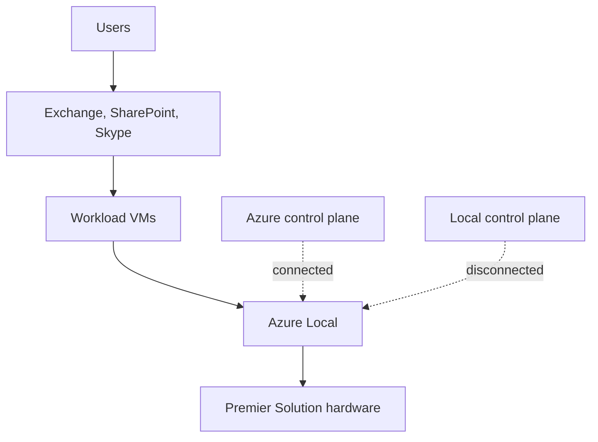

Microsoft 365 Local is a partner-delivered solution on Azure Local. The architecture combines Microsoft 365 server workloads, Azure Local infrastructure, certified hardware, and either a cloud-connected or local control plane.

Microsoft Learn says customers must deploy Microsoft 365 Local through a Microsoft 365 Local solution partner certified by Microsoft. A typical engagement covers assessment, planning, acquisition, and deployment. The partner sizes the Azure Local Premier Solution and helps align the deployment with migration, integration, security, and compliance needs.

## Stack view

The core stack is simple at the foundation level. Users reach local productivity workloads. Those workloads run on Azure Local virtualized infrastructure. The control plane is either cloud-connected through Azure or local in disconnected operation.

The diagram is a teaching view, not a sizing guide. Learn says Microsoft 365 Local reference architectures include networking, security, virtual networks, network security groups, and load balancers. It also says the final architecture is tailored to each customer.

## Hardware and deployment type

Microsoft 365 Local runs on customer-owned Azure Local Premier Solution hardware. This is stricter than a generic server choice. Learn says customers must deploy Microsoft 365 Local on an Azure Local Premier Solution that meets Microsoft 365 Local hardware requirements.

Azure Local has multiple deployment types, but Microsoft 365 Local is supported only on two of them. The Azure Local deployment-type guide lists Microsoft 365 Local as supported on [hyperconverged and disaggregated deployments](https://learn.microsoft.com/azure/azure-local/plan/find-your-deployment-type#workload-availability-by-deployment-type), and not supported on multi-rack or small form factor deployments.

Use the [Azure Local hardware](/level-100/module-03-azure-local/azure-local-hardware/) page for the hardware planning concepts behind Premier Solutions and the [Azure Local disconnected mode](/level-100/module-03-azure-local/azure-local-disconnected-mode/) page for the disconnected operations foundation.

## Connected operation

In connected operation, Azure is the cloud-connected control plane. Microsoft Learn describes this mode as using Azure services for monitoring, updates, policy enforcement, and centralized management.

Connected operation is useful when an organization can use Azure for management while keeping the Microsoft 365 Local workloads on customer-owned Azure Local infrastructure. It is still a private cloud architecture because the workloads run locally.

## Disconnected operation

Disconnected operation moves the control plane into the customer's environment. Azure Local disconnected operations enable deployment and management without a connection to the Azure public cloud, using a local control plane and selected Azure Arc-enabled services.

Microsoft's February 24, 2026 blog says [Azure Local disconnected operations are now available](https://blogs.microsoft.com/blog/2026/02/24/microsoft-sovereign-cloud-adds-governance-productivity-and-support-for-large-ai-models-securely-running-even-when-completely-disconnected/). The Azure Local disconnected operations article states that the feature is available only in [Azure Local 2602 or later](https://learn.microsoft.com/azure/azure-local/manage/disconnected-operations-overview?view=azloc-2609). The same blog also says [Microsoft 365 Local disconnected is now available](https://blogs.microsoft.com/blog/2026/02/24/microsoft-sovereign-cloud-adds-governance-productivity-and-support-for-large-ai-models-securely-running-even-when-completely-disconnected/).

Disconnected operation does not mean every Azure service is present locally. Microsoft Learn describes disconnected operations as a subset of cloud capabilities with a local control plane. For Microsoft 365 Local, the listed local productivity workloads are Exchange Server, SharePoint Server, and Skype for Business Server.

## Business-continuity pattern

Microsoft Learn describes Microsoft 365 Local as a disaster recovery and business-continuity option. The documented pattern is to use Microsoft 365 Local as a fallback environment so an organization can operate in the public cloud and continue locally during crisis scenarios.

This is a continuity pattern, not a complete disaster recovery design. You still need a recovery time objective, a backup plan, and an identity plan.

## Sources

- [What is Microsoft 365 Local?](https://learn.microsoft.com/azure/azure-sovereign-clouds/private/m365-local/microsoft-365-local-overview)
- [Find your Azure Local deployment type](https://learn.microsoft.com/azure/azure-local/plan/find-your-deployment-type)
- [Disconnected operations for Azure Local](https://learn.microsoft.com/azure/azure-local/manage/disconnected-operations-overview)
- [Disconnected operations overview](https://learn.microsoft.com/azure/azure-sovereign-clouds/private/azure-local/disconnected-operations-overview)
- [Microsoft Sovereign Cloud adds governance, productivity and support for large AI models, securely running even when completely disconnected](https://blogs.microsoft.com/blog/2026/02/24/microsoft-sovereign-cloud-adds-governance-productivity-and-support-for-large-ai-models-securely-running-even-when-completely-disconnected/)
