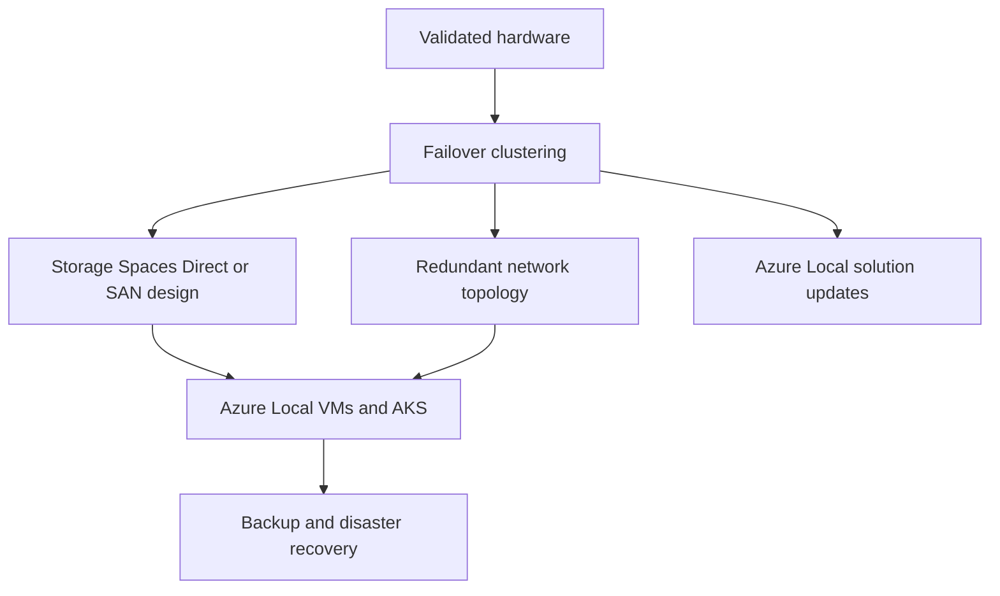

import DiagramContainer from "~/components/DiagramContainer.astro";

Azure Local high availability depends on several layers working together: supported hardware, failover clustering, resilient storage, redundant networking, controlled updates, and workload-level recovery.

<DiagramContainer title="Azure Local resiliency layers" defaultOpen>

</DiagramContainer>

## Infrastructure resiliency baseline

Microsoft frames Azure Local resiliency around validated hardware, failover clustering, storage, network, and logical networks. Use that model before designing VM failover, backup, or application recovery ([Learn](https://learn.microsoft.com/azure/azure-local/manage/disaster-recovery-infrastructure-resiliency)).

| Layer | What to design |
| --- | --- |
| Hardware | Use catalog-listed Azure Local hardware. Choose the right category for the workload and support model. |
| Failover clustering | Size the cluster so surviving nodes can host workloads after planned maintenance or a node failure. |
| Storage | Choose Storage Spaces Direct resiliency, SAN-backed design, or rack-scale storage based on deployment type. |
| Network | Avoid single points of failure in switches, adapters, and paths. Use Network ATC to keep node configuration consistent. |
| Logical networks | Segment workload traffic by function and trust boundary so recovery and policy stay manageable. |

## Storage resiliency

Azure Local uses Storage Spaces Direct for software-defined storage in hyperconverged deployments. Storage Spaces Direct integrates with failover clustering. Microsoft Learn calls out three-way mirroring and dual parity as examples of resiliency choices that can sustain drive or node failures without data loss or downtime when designed correctly ([Learn](https://learn.microsoft.com/azure/azure-local/manage/disaster-recovery-infrastructure-resiliency#storage-spaces-direct)).

Do not use old sizing shortcuts that convert directly from raw capacity to usable capacity without checking the current design. Use the workload profile, drive type, resiliency setting, node count, and reserve capacity. For production, confirm the model in the Azure Local sizer and with the OEM.

Storage Spaces Direct requires supported direct-attached drives for direct-attached designs. If the deployment uses SAN storage, follow the disaggregated or multi-rack guidance rather than applying direct-attached assumptions.

## Two-node and switchless patterns

Switchless storage designs reduce the number of storage switches and can fit branch or edge sites where space, cost, or operational simplicity matters. Microsoft documents switchless storage architecture as a pattern that builds on the Azure Local baseline reference architecture ([Learn](https://learn.microsoft.com/azure/architecture/hybrid/azure-local-switchless)).

Use switchless storage only where the deployment pattern supports it. In current SDN and network-planning guidance, switched or switchless storage is supported for several patterns up to four-node deployments, while five or more nodes require switched storage connectivity ([Learn](https://learn.microsoft.com/azure/azure-local/concepts/sdn-overview#supported-networking-patterns-for-sdn-enabled-by-arc)).

For a two-node design, plan quorum carefully. The witness is not optional design decoration. It is the tie-breaker that prevents split-brain behavior when nodes cannot communicate. Place it where it remains reachable from the partition that should continue service.

## Rack-aware clustering

Rack-aware clustering is a site-resiliency pattern inside one Azure Local instance. It places nodes across two physical racks, with each rack acting as a local availability zone. It requires 1 ms or less round-trip latency between racks and does not support external SAN configurations ([Learn](https://learn.microsoft.com/azure/azure-local/concepts/rack-aware-cluster-overview)).

Use rack-aware clustering when the failure domain is a rack, room, or nearby building and when the network can meet the latency requirement. Do not use it as a substitute for multi-site disaster recovery. For rack-aware VM placement, Azure Local supports strict and nonstrict placement. Strict placement keeps a VM in the specified zone. Nonstrict placement prefers the zone but can fail over to the other zone.

## Updates and maintenance

Azure Local solution updates use a lifecycle orchestrator. The update workflow covers the OS, core agents and services, and solution extension content where supported. It performs health checks before and during updates to reduce downtime and workload impact ([Learn](https://learn.microsoft.com/azure/azure-local/update/about-updates-23h2#benefits)).

Apply Azure Local updates by using the supported Azure Local update paths in Azure Update Manager, the Azure Local resource page, or documented PowerShell procedures. Microsoft specifically says not to use manual runs of Cluster-Aware Updating for Azure Local updates because that can install out-of-band updates and cause lifecycle issues ([Learn](https://learn.microsoft.com/azure/azure-local/update/about-updates-23h2#unsupported-interfaces-for-updates)).

Cluster-Aware Updating remains useful background knowledge for Windows Server failover clusters. It moves clustered roles, installs updates, restarts a node if needed, and then proceeds to the next node ([Learn](https://learn.microsoft.com/windows-server/failover-clustering/cluster-aware-updating)). For Azure Local, use the Azure Local update orchestrator unless Microsoft explicitly documents another path.

## Disaster recovery options

Separate infrastructure resiliency from disaster recovery. Infrastructure resiliency keeps a local instance running through drive, node, rack, or network failures. Disaster recovery protects workloads when the site, instance, or application state cannot be recovered locally.

Microsoft Learn documents site-to-cloud disaster recovery as a Sovereign Private Cloud use case, with Azure Local infrastructure paired with Azure services for recovery planning ([Learn](https://learn.microsoft.com/azure/azure-sovereign-clouds/private/use-cases/use-cases#scenario-3-stay-resilient-high-availability-and-site-to-cloud-disaster-recovery)). At design time, identify which workloads use application-native replication, backup restore, Azure Site Recovery, or another Microsoft-documented recovery option. Do not invent recovery time or recovery point numbers unless they come from the application design, test results, or a Microsoft source.

## Sources

- [Infrastructure resiliency for Azure Local](https://learn.microsoft.com/azure/azure-local/manage/disaster-recovery-infrastructure-resiliency)
- [Azure Local storage switchless architecture](https://learn.microsoft.com/azure/architecture/hybrid/azure-local-switchless)
- [Azure Local rack aware clustering overview](https://learn.microsoft.com/azure/azure-local/concepts/rack-aware-cluster-overview)
- [About updates for Azure Local](https://learn.microsoft.com/azure/azure-local/update/about-updates-23h2)
- [Use Azure Update Manager to update Azure Local](https://learn.microsoft.com/azure/azure-local/update/azure-update-manager-23h2)
- [Cluster-Aware Updating overview](https://learn.microsoft.com/windows-server/failover-clustering/cluster-aware-updating)
- [Sovereign private cloud use cases and configurations](https://learn.microsoft.com/azure/azure-sovereign-clouds/private/use-cases/use-cases)
