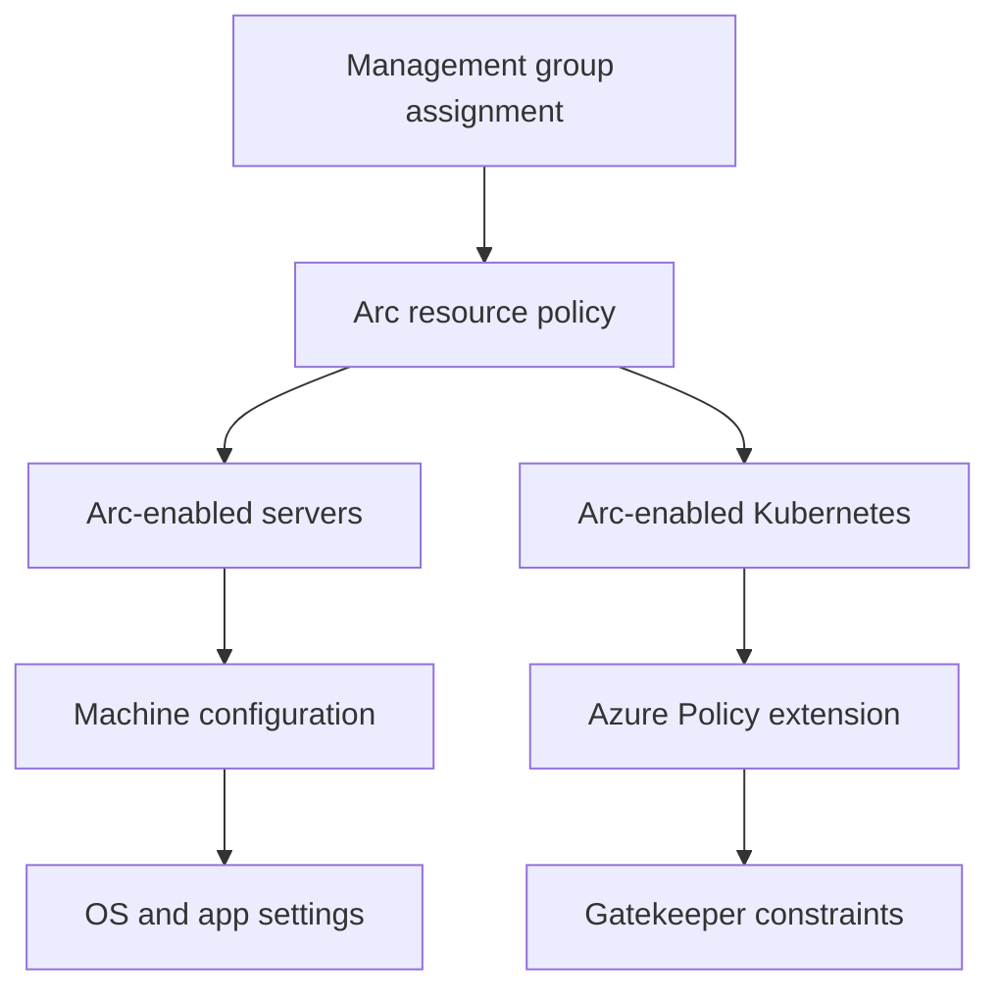

import DiagramContainer from "~/components/DiagramContainer.astro";

Azure Policy gives Arc resources a shared governance plane even when the resources run outside Azure. The design task is to decide which controls belong at the Azure resource layer, which belong inside the server operating system, and which belong inside Kubernetes admission control.

<DiagramContainer title="Policy layers for Azure Arc">

</DiagramContainer>

## Choose the policy layer

Use one assignment model, but separate the control target.

| Target | Use Azure Policy for | Use with |
| --- | --- | --- |
| Arc resource | Region, tags, allowed resource types, extension deployment, inventory, and RBAC boundary checks. | Management groups, subscriptions, resource groups, and initiatives. |
| Arc-enabled server operating system | Operating system settings, service state, file or registry checks, local security settings, and application presence. | Machine configuration. |
| Arc-enabled Kubernetes cluster | Pod, container, namespace, and workload admission controls. | Azure Policy extension for Arc-enabled Kubernetes and Gatekeeper constraints. |

Start with audit assignments so platform teams can measure scope and false positives. Move to `DeployIfNotExists`, `Modify`, or `Deny` only after resource owners know what will change and how exceptions are approved.

## Govern Arc-enabled servers

Azure Policy built-in definitions exist for Arc-enabled servers, including Windows security baselines and Extended Security Updates license controls ([Learn](https://learn.microsoft.com/azure/azure-arc/servers/policy-reference#azure-arc-enabled-servers)). Use built-ins first because they carry Microsoft-maintained aliases, effects, and resource type mappings. Write custom definitions only when a built-in policy cannot express the requirement.

For guest operating system settings, use machine configuration. Microsoft describes machine configuration as the Azure Policy feature that audits or configures operating system settings as code for machines running in Azure and hybrid Arc-enabled machines ([Learn](https://learn.microsoft.com/azure/governance/machine-configuration/overview)). It was formerly called Azure Policy Guest Configuration in Arc server guidance ([Learn](https://learn.microsoft.com/azure/azure-arc/servers/cloud-native/governance-policy#azure-machine-configuration)).

Machine configuration has three enforcement modes:

| Mode | Use when |
| --- | --- |
| Audit | You need compliance evidence without changing the server. |
| Apply and monitor | You want the setting applied once, then reported if it drifts. |
| Apply and autocorrect | You want the setting applied and brought back into conformance after drift. |

Plan these controls as code. Store custom configuration packages and policy definitions in source control, publish only reviewed versions, and use staged assignments from test resource groups to production management groups.

## Govern Arc-enabled Kubernetes

Azure Policy for Kubernetes extends Gatekeeper v3, an admission controller webhook for Open Policy Agent, to apply safeguards to pods, containers, and namespaces ([Learn](https://learn.microsoft.com/azure/governance/policy/concepts/policy-for-kubernetes)). For Arc-enabled Kubernetes, install Azure Policy's extension for Arc-enabled Kubernetes clusters. The extension deploys policy definitions into the cluster as Gatekeeper constraint templates, constraints, or mutation template resources, then reports compliance back to Azure Policy.

The policy extension checks Azure Policy for assignment changes every 15 minutes. It also performs full scans and reports compliance details for active assignments ([Learn](https://learn.microsoft.com/azure/governance/policy/concepts/policy-for-kubernetes)). This means admission decisions and portal compliance are related but not identical. A denied pod is blocked at admission. An existing non-compliant pod can continue running until it is recreated or rescheduled, and it appears in compliance reporting.

Use this pattern:

1. Assign an audit policy to the cluster scope.
2. Review violations in Azure Policy and in Gatekeeper constraint status.
3. Fix deployment manifests or namespace labels.
4. Move mature controls to deny when the cluster owner has a rollback path.

## Check Kubernetes distribution support

Arc-enabled Kubernetes works with CNCF-certified Kubernetes clusters, even when a distribution is not listed on the validation page ([Learn](https://learn.microsoft.com/azure/azure-arc/kubernetes/validation-program)). For enterprise support planning, prefer distributions that Microsoft has validated for the specific extension you need.

For the Azure Policy extension, Microsoft lists conformance-validated distributions including AKS on Azure Local, Azure Red Hat OpenShift, Kind, Rancher Government RKE2, Minikube, K3s, AKS Edge, and VMware Tanzu Kubernetes Grid. The same page states that EKS, GKE, and RKE are supported without conformance validation, and that RKE is deprecated in favor of RKE2 ([Learn](https://learn.microsoft.com/azure/azure-arc/kubernetes/extensions-release#azure-policy)).

Do not turn that list into a hard business rule for every Arc-enabled Kubernetes scenario. It is the conformance list for the Azure Policy extension, not a full statement of support for every Arc extension.

## Use initiatives for repeatable baselines

An initiative groups policy definitions into one assignment. Use initiatives for controls that need to travel together, such as:

| Initiative | Typical contents |
| --- | --- |
| Arc server baseline | Required tags, Log Analytics or Azure Monitor Agent deployment, machine configuration baseline, update assessment, and ESU enrollment checks. |
| Kubernetes workload baseline | Allowed container registries, privilege restrictions, required labels, allowed host paths, and namespace guardrails. |
| Data services baseline | Direct connectivity checks, inventory, required monitoring endpoints, and approved Kubernetes distributions. |

Sovereignty initiatives can be part of a wider control set. Microsoft publishes sovereignty baseline initiatives in Azure Policy, and this learning path covers them in [Sovereign Control Panel and policy](/level-200/module-06-sovereign-public-cloud-controls/sovereign-control-panel-and-policy/). Keep those initiatives separate from Arc platform hygiene so a regulatory exception does not weaken basic operations controls.

## Manage exemptions as first-class records

Policy exemptions are safer than broad scope exclusions because they keep the assignment visible. Require an owner, a reason, an expiry date, and evidence of compensating controls. For example, a production server may need a temporary machine configuration exemption during an application migration, but the exemption should expire after the migration window.

Track these fields:

| Field | Reason |
| --- | --- |
| Resource | Identifies the exact Arc server, cluster, namespace, or assignment. |
| Policy assignment | Shows which control is waived or mitigated. |
| Expiry | Prevents permanent exceptions. |
| Approver | Documents the accountable platform or risk owner. |
| Evidence | Links to ticket, compensating control, or migration plan. |

## Roll out governance without breaking operations

Use assignments that match team boundaries. Management groups work for enterprise-wide standards. Subscriptions work for platform or business unit boundaries. Resource groups can be useful during onboarding, but do not rely on them as the long-term control boundary if resource owners can create new groups without the right baseline.

Pair policy with naming and tagging standards before cost reporting or chargeback. Arc projects non-Azure assets into Azure Resource Manager, so standard tags such as `Owner`, `Environment`, `CostCenter`, `DataClassification`, and `OperationsTeam` become the join keys for policy, inventory, incident routing, and cost analysis.

## Sources

- [Azure Policy built-in definitions for Azure Arc-enabled servers](https://learn.microsoft.com/azure/azure-arc/servers/policy-reference#azure-arc-enabled-servers)
- [Cloud-native governance and policy with Azure Arc-enabled servers](https://learn.microsoft.com/azure/azure-arc/servers/cloud-native/governance-policy)
- [What is Azure Machine Configuration?](https://learn.microsoft.com/azure/governance/machine-configuration/overview)
- [Understand Azure Policy for Kubernetes clusters](https://learn.microsoft.com/azure/governance/policy/concepts/policy-for-kubernetes)
- [Azure Arc-enabled Kubernetes validation](https://learn.microsoft.com/azure/azure-arc/kubernetes/validation-program)
- [Available extensions for Azure Arc-enabled Kubernetes clusters](https://learn.microsoft.com/azure/azure-arc/kubernetes/extensions-release#azure-policy)
- [Azure Policy built-in initiative definitions](https://learn.microsoft.com/azure/governance/policy/samples/built-in-initiatives)
