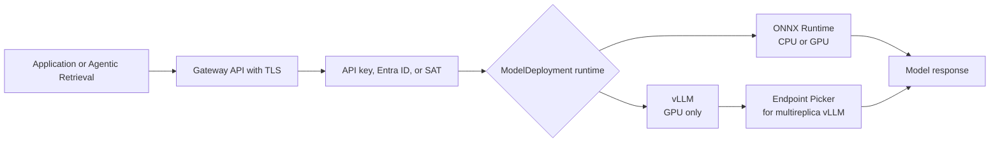

import DiagramContainer from "~/components/DiagramContainer.astro";

Foundry Local runtime choice controls hardware, model format, throughput, and operational risk. The service is in preview, and GPU support is limited to documented NVIDIA DDA-passthrough SKUs. AMD GPUs are not supported ([Learn](https://learn.microsoft.com/azure/azure-sovereign-clouds/private/foundry-local/concept-requirements#gpu-requirements)).

<DiagramContainer title="Runtime and routing path" defaultOpen>

</DiagramContainer>

## Runtime decision table

Foundry Local supports ONNX Runtime through ONNX-GenAI and vLLM for generative workloads. Catalog models declare their runtime. Custom models can set runtime in the `ModelDeployment` spec, with `onnx-genai` as the default ([Learn](https://learn.microsoft.com/azure/azure-sovereign-clouds/private/foundry-local/concept-inference-runtimes#how-the-runtime-is-selected)).

| Requirement | Choose ONNX Runtime | Choose vLLM |
| --- | --- | --- |
| No GPU available | Yes. ONNX Runtime supports CPU. | No. vLLM requires GPU. |
| Small language model | Good fit for compact models and lower overhead. | Works if the model is packaged for vLLM, but may add platform cost. |
| High concurrency | Possible, but not the main strength. | Best fit because of continuous batching and GPU memory management. |
| Large model | Only if the ONNX model fits the target CPU or GPU. | Best fit for larger GPU-served models. |
| Custom model format | ONNX format. | Hugging Face safetensors. |
| Tuning model context length | Manual sizing. | GPU-aware planner can size context and batch settings. |
| Predictive models | Foundry Local uses ONNX Runtime for non-generative prediction. | Not used for predictive workloads. |

Use one runtime per model deployment. If the same logical model appears in both formats, treat each catalog entry as a separate deployment option and benchmark both with the same prompt set.

## Supported GPU families

Foundry Local GPU workloads require NVIDIA GPUs exposed through DDA passthrough on Azure Local. Supported SKU families include `Standard_NC*_A2`, `Standard_NC*_L4_*`, `Standard_NC*_L40_*`, `Standard_NC*_L40S_*`, `Standard_NC*_RTX6000Pro_*`, and Tesla T4 `Standard_NK*` ([Learn](https://learn.microsoft.com/azure/azure-sovereign-clouds/private/foundry-local/concept-requirements#gpu-requirements)).

| GPU planning factor | Design guidance |
| --- | --- |
| Host compatibility | Use Azure Local hardware that supports DDA passthrough for the selected NVIDIA GPU. |
| Kubernetes scheduling | Install CUDA drivers and the NVIDIA Kubernetes device plugin on GPU nodes. |
| Model fit | Compare model memory, context length, and replica count with available VRAM. |
| Isolation | Use a separate GPU node pool when inference and embedding workloads have different scaling patterns. |
| Unsupported hardware | Do not plan AMD GPUs for Foundry Local preview deployments. |

Foundry Local validates GPU compatibility at deployment time and returns clear errors for insufficient resources ([Learn](https://learn.microsoft.com/azure/azure-sovereign-clouds/private/foundry-local/concept-requirements#gpu-requirements)). That validation catches many startup failures, but it does not replace load testing.

## DDA passthrough and AKS Arc

Discrete Device Assignment passes the physical GPU from the Azure Local host into a VM. AKS Arc then schedules GPU pods onto those worker nodes. Plan the hardware and Kubernetes layers together because a supported physical GPU is not enough by itself.

A production design should document:

- The Azure Local host model and GPU placement.
- The worker VM sizes mapped to GPU devices.
- Driver and device-plugin installation steps.
- The node labels and taints used to reserve GPU capacity.
- The models allowed on each GPU pool.
- The failure behavior when one GPU node is unavailable.

For Agentic Retrieval, keep the embedding GPUs separate in your capacity model from the Foundry Local language-model GPU. Agentic Retrieval uses two GPUs for BGE-M3 and CLIP ViT-L/14. GPT-OSS-20B through Foundry Local needs its own GPU when used as the language model endpoint ([Learn](https://learn.microsoft.com/azure/azure-arc/agents-tools-foundry-local/requirements#requirements-by-deployment-mode)).

## Multi-GPU model parallelism

Foundry Local added multi-GPU model parallelism for vLLM deployments in the August 2026 preview release. vLLM can distribute a single model replica across multiple GPUs by tensor parallelism, pipeline parallelism, or both ([Learn](https://learn.microsoft.com/azure/azure-sovereign-clouds/private/foundry-local/whats-new#august-2026)).

Use tensor parallelism when model weights need to be split across GPUs at the same layer. Use pipeline parallelism when layers can be assigned to different GPUs. Combine them only when a single model is too large or too slow for one GPU and the site can absorb the extra scheduling and troubleshooting complexity.

| Multi-GPU choice | Use when | Avoid when |
| --- | --- | --- |
| Single GPU per replica | The model fits VRAM and concurrency can scale by adding replicas. | The model cannot fit in one GPU. |
| Tensor parallelism | The model needs weight partitioning across GPUs. | Inter-GPU communication is the bottleneck. |
| Pipeline parallelism | Layer groups can be split across GPUs. | Latency is more important than fitting a larger model. |
| Tensor plus pipeline | Very large model needs both methods. | Operations team cannot troubleshoot distributed inference. |

## Automatic GPU tuning

The vLLM planner validates the selected model and serving configuration against allocated GPUs during startup. It profiles runtime memory needs with the installed vLLM runtime, fits maximum context length when you do not set one, and applies the resulting settings ([Learn](https://learn.microsoft.com/azure/azure-sovereign-clouds/private/foundry-local/whats-new#august-2026)).

Use automatic tuning as a starting point, not as a substitute for design. Record the chosen context length, replica count, token throughput, time to first token, and out-of-memory behavior during performance testing. If a deployment serves Agentic Retrieval, include multi-turn and tool-heavy prompts because they pressure the KV cache differently than single-turn prompts.

## Inference-aware routing

Foundry Local replaced basic ingress routing with Gateway API and added the Endpoint Picker for multireplica vLLM deployments in July 2026 ([Learn](https://learn.microsoft.com/azure/azure-sovereign-clouds/private/foundry-local/whats-new#july-2026)). Endpoint Picker scores replicas with queue depth, KV-cache use, and prefix-cache locality, then routes requests through the Gateway API Inference Extension ([Learn](https://learn.microsoft.com/azure/azure-sovereign-clouds/private/foundry-local/concept-inference-runtimes#inference-aware-routing-with-the-endpoint-picker-epp)).

Endpoint Picker is off for a single vLLM replica and on by default when replicas are greater than one. Leave the default for most chat deployments. Turn it off only when testing shows very long, batch-heavy outputs perform better without it. If you use disconnected operations, plan the extra Endpoint Picker pod and expansion-pack content because the routing stack is imported locally.

## Sizing example

A combined Agentic Retrieval deployment using GPT-OSS-20B through Foundry Local has at least three GPU roles:

| Role | Component | Minimum from Learn | Sizing implication |
| --- | --- | --- | --- |
| Text embedding | Agentic Retrieval | One GPU for BGE-M3 | Required for combined and knowledge modes. |
| Image embedding | Agentic Retrieval | One GPU for CLIP ViT-L/14 | Required for multimodal and image retrieval. |
| Language model | Foundry Local | One NVIDIA GPU with at least 24 GB VRAM for GPT-OSS-20B | Use at least 48 GB VRAM for production guidance. |

This table is not a full bill of materials. Add CPU workers, Gateway API, certificate management, model cache storage, and operations overhead before procurement.

## Sources

- [Requirements for Foundry Local on Azure Local](https://learn.microsoft.com/azure/azure-sovereign-clouds/private/foundry-local/concept-requirements)
- [Inference runtimes in Foundry Local on Azure Local](https://learn.microsoft.com/azure/azure-sovereign-clouds/private/foundry-local/concept-inference-runtimes)
- [What's new in Foundry Local on Azure Local](https://learn.microsoft.com/azure/azure-sovereign-clouds/private/foundry-local/whats-new)
- [What you need for Agentic Retrieval in Foundry Local](https://learn.microsoft.com/azure/azure-arc/agents-tools-foundry-local/requirements)
