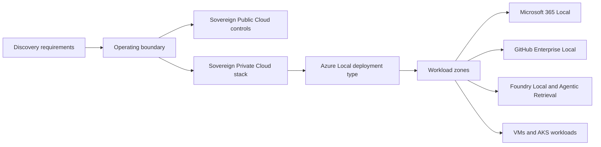

Solution design turns discovery evidence into an architecture choice the customer can review. At Level 200 depth, focus on why each deployment model fits, which workload support limits apply, and which preview items create delivery risk.

## Design from the operating boundary

Start with the boundary the customer must defend:

| Boundary decision | Primary design option | What to validate |
| --- | --- | --- |
| Microsoft-operated cloud within a geopolitical boundary is acceptable | Sovereign Public Cloud | Region choice, EU Data Boundary scope, Sovereign Landing Zone controls, Data Guardian, Customer Lockbox, keys, and confidential computing. |
| Workloads and selected control-plane services must run on customer-owned infrastructure | Sovereign Private Cloud | Azure Local deployment type, connected or disconnected operations, workload support, support plan, and partner delivery. |
| A national operator or joint governance model is required | National Partner Cloud | Service availability, rollout status, latency, compliance scope, and partner onboarding. |

Do not jump from a control need to a private cloud. Many requirements can be met in Sovereign Public Cloud through data boundary, access, policy, encryption, and confidential computing controls. Move to Sovereign Private Cloud when the customer needs local operation, local control-plane capability, specific on-premises workloads, or disconnected operation.

## Position Sovereign Public Cloud controls

Sovereign Public Cloud fits when the customer can use Azure regions and Microsoft-operated services with added control evidence.

Common design elements include:

- Region and service selection aligned to the required boundary, such as the EU Data Boundary.
- Sovereign Landing Zone policy assignments and management group structure.
- Data Guardian when the customer needs EU and EFTA monitoring of Microsoft remote access.
- Customer Lockbox when the customer needs explicit approval for Microsoft support access to supported services.
- Azure Key Vault Managed HSM for key sovereignty, or External Key Management preview when the key encryption key must be held outside Microsoft.
- Confidential computing when workloads need hardware-backed protection in use.

Use this model when the customer's requirement is control, evidence, and region scope, not ownership of the physical platform.

## Position the Sovereign Private Cloud stack

[Sovereign Private Cloud](https://learn.microsoft.com/azure/azure-sovereign-clouds/private/overview/sovereign-private-cloud) is the private cloud path for customers that need Microsoft capabilities on customer-owned infrastructure. It uses these main components:

| Component | Design role | Pre-sales note |
| --- | --- | --- |
| Azure Local | Infrastructure for VMs, AKS enabled by Azure Arc, connected operations, and disconnected operations. | Choose the deployment type before sizing. Workload support changes by type. |
| Microsoft 365 Local | Runs Exchange Server, SharePoint Server, and Skype for Business Server Subscription Editions on Azure Local. | Generally available, deployed on Azure Local Premier Solutions through a certified Microsoft 365 Local solution partner. |
| Foundry Local on Azure Local | Runs local model serving on an Arc-enabled Kubernetes cluster. | In preview and request-only during preview. Size GPU, Kubernetes, gateway, certificate, and model cache requirements. |
| Agentic Retrieval in Foundry Local | Adds local knowledge and agentic retrieval services on AKS Arc. | In preview. Combined mode needs embedding GPUs and a separate language model endpoint. |
| GitHub Enterprise Local | Runs supported GitHub Enterprise workloads on Azure Local. | Supported on hyperconverged and disaggregated deployment types only. |

For the full private cloud architecture, link the design review to [private cloud stack architecture](/level-200/module-07-sovereign-private-cloud-stack/private-cloud-stack-architecture/).

## Select the Azure Local deployment type

[Azure Local has four deployment types](https://learn.microsoft.com/azure/azure-local/plan/find-your-deployment-type). Disconnected operations is a connectivity mode, not a separate deployment type.

| Deployment type | Scale | Best fit | Workload support note |
| --- | --- | --- | --- |
| Hyperconverged | 1 to 16 machines. Rack-aware clusters have a maximum of 8 machines. | Most general private cloud designs where compute and storage scale together. | Supports Microsoft 365 Local, GitHub Enterprise Local, Azure Local VMs, AKS, SQL Server, Azure Virtual Desktop, AI workloads, and Foundry Local. |
| Disaggregated | 1 to 64 machines with SAN storage. | Designs where compute and storage scale at different rates. | Supports Microsoft 365 Local and GitHub Enterprise Local. |
| Multi-rack | Rack-scale deployments up to hundreds of machines per the deployment-type article, with shared fact-pack guidance of up to 128 nodes per instance. | Large, prescriptive, rack-integrated environments. | Does not support Microsoft 365 Local or GitHub Enterprise Local. |
| Small form factor | Compact appliance for space and power constrained sites. | Retail, branch, and edge sites that need a small footprint. | AI workloads and Foundry Local are supported only as preview. Microsoft 365 Local and GitHub Enterprise Local are not supported. |

:::caution[Workload support changes the answer]
Microsoft 365 Local and GitHub Enterprise Local are supported on hyperconverged and disaggregated deployments only. Do not propose them on multi-rack or small form factor deployments.
:::

## Choose connected, intermittent, or disconnected operation

Connected Azure Local uses Azure as the control plane and needs each machine to connect outbound to Azure endpoints at least every 30 days. This model has the broadest service support and should be the default private cloud design unless discovery proves it does not satisfy the requirement.

Disconnected operations moves selected control plane functions local. [Disconnected operations require Azure Local 2602 or later](https://learn.microsoft.com/azure/azure-local/manage/disconnected-operations-overview), an eligible Microsoft agreement, and Standard or higher support. The [dedicated management cluster](https://learn.microsoft.com/azure/azure-local/manage/disconnected-operations-control-plane-appliance) must be isolated from workload clusters in production.

Use disconnected operations when the customer cannot depend on Azure public cloud connectivity for management because of regulation, mission, or air-gap needs. Record the tradeoffs:

- Smaller service set than connected mode.
- Separate management cluster cost and lifecycle.
- Account-team approval and partner coordination.
- Preview status for AKS under disconnected operations.

## Design the workload zones

Use a simple zone model in pre-sales workshops:

Design each zone with its own owner, data classification, connectivity assumption, and sizing input. A customer may need Sovereign Public Cloud for most applications and Sovereign Private Cloud for a smaller set of regulated workloads.

## Handle preview items explicitly

Preview status affects contracts, support expectations, and go-live plans.

| Capability | Current status | Design action |
| --- | --- | --- |
| Foundry Local on Azure Local | Preview and request-only during preview | Use it in proof-of-concept or controlled production planning only after account-team review. |
| Agentic Retrieval in Foundry Local | Preview | Size its own CPU and embedding GPU workers, then add a separate language model endpoint. |
| AKS on Azure Local with disconnected operations | Preview | Do not position disconnected AKS as fully GA. Confirm acceptable preview risk. |
| Small form factor AI workloads and Foundry Local | Preview on small form factor | Use for edge validation only when the customer accepts preview status. |

## Design review checklist

Before leaving the design phase, confirm these items:

- The deployment model is tied to a named law, policy, or operating requirement.
- Public cloud controls were considered before private cloud was selected.
- Azure Local deployment type matches both scale and workload support.
- Connected or disconnected mode is stated and justified.
- Every preview capability is named, sourced, and risk-reviewed.
- Sizing inputs are measurable, not estimated from broad labels such as "medium" or "critical".
- Commercial assumptions are separated from technical requirements.

## Sources

- [What is Sovereign Public Cloud?](https://learn.microsoft.com/azure/azure-sovereign-clouds/public/overview-sovereign-public-cloud)
- [What is Sovereign Private Cloud?](https://learn.microsoft.com/azure/azure-sovereign-clouds/private/overview/sovereign-private-cloud)
- [National Partner Clouds](https://learn.microsoft.com/azure/azure-sovereign-clouds/partner/overview-national-partner-clouds)
- [Find your Azure Local deployment type](https://learn.microsoft.com/azure/azure-local/plan/find-your-deployment-type)
- [What are hyperconverged deployments of Azure Local?](https://learn.microsoft.com/azure/azure-local/overview/hyperconverged-overview)
- [Connected operations overview](https://learn.microsoft.com/azure/azure-sovereign-clouds/private/azure-local/connected-operations-overview)
- [Disconnected operations for Azure Local](https://learn.microsoft.com/azure/azure-local/manage/disconnected-operations-overview)
- [Dedicated management cluster for disconnected operations](https://learn.microsoft.com/azure/azure-local/manage/disconnected-operations-control-plane-appliance)
- [What is Microsoft 365 Local?](https://learn.microsoft.com/azure/azure-sovereign-clouds/private/m365-local/microsoft-365-local-overview)
- [What is Foundry Local on Azure Local?](https://learn.microsoft.com/azure/azure-sovereign-clouds/private/foundry-local/overview)
- [Requirements for Foundry Local on Azure Local](https://learn.microsoft.com/azure/azure-sovereign-clouds/private/foundry-local/concept-requirements)
- [What you need for Agentic Retrieval in Foundry Local](https://learn.microsoft.com/azure/azure-arc/agents-tools-foundry-local/requirements)
