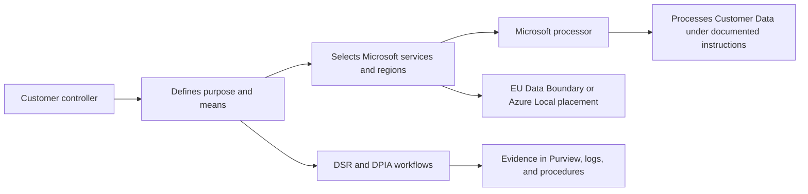

import DiagramContainer from "~/components/DiagramContainer.astro";

GDPR implementation is not a single Azure setting. It is a set of controller decisions, processor commitments, data location choices, request workflows, and evidence records.

<DiagramContainer title="GDPR responsibility flow">

</DiagramContainer>

## Separate controller and processor duties

Microsoft's GDPR documentation states that Microsoft acts as a data processor when it processes personal data on behalf of the customer, and the customer is the data controller when the customer determines the purposes and means of processing. Microsoft processes Customer Data to provide the Online Services according to the controller's documented instructions in the Product Terms and Data Protection Addendum ([Learn](https://learn.microsoft.com/compliance/regulatory/gdpr)).

That split matters during architecture review:

| Area | Customer controller duty | Microsoft processor support |
| --- | --- | --- |
| Lawful purpose | Decide why personal data is collected and processed. | Provide online services according to documented instructions. |
| Data minimization | Decide what data the application needs and how long to keep it. | Provide platform features that can support retention, discovery, export, and deletion. |
| Security | Select and configure suitable technical and organizational measures. | Operate the cloud service controls and provide security documentation. |
| Data subject rights | Receive, validate, and answer requests from data subjects. | Provide product-specific tools and guidance for finding and acting on personal data. |
| Data Protection Impact Assessment | Decide whether a DPIA is required and complete it. | Provide product-specific DPIA guidance and information about data processing. |

Do not describe Microsoft as the controller for a customer's workload unless a specific Microsoft service relationship says so. For most business applications built on Azure, the customer controls the purpose and means of processing.

## Build the Data Subject Request workflow

Microsoft's GDPR guidance describes a Data Subject Request as a formal request by a data subject to a controller to take an action regarding personal data. It lists six activities that complete a DSR: Discovery, Access, Rectification, Restriction, Export, and Deletion ([Learn](https://learn.microsoft.com/compliance/regulatory/gdpr)).

| DSR activity | Implementation pattern |
| --- | --- |
| Discovery | Find personal data across application databases, object stores, Microsoft 365 content, logs, and support systems. |
| Access | Provide a copy or view of personal data held by the organization. |
| Rectification | Correct inaccurate data in systems where the customer owns the record. |
| Restriction | Pause or limit processing when the law and customer policy require it. |
| Export | Provide data in a structured, commonly used, machine-readable format when portability applies. |
| Deletion | Delete personal data where no legal hold or retention requirement applies. |

For Azure workloads, Microsoft provides product-specific DSR guidance that covers customer data and system-generated logs. The Azure DSR guide discusses how controller customers can find and act on personal data, including access, rectify, restrict, delete, and export actions for customer data, and access, delete, and export actions for system-generated logs ([Learn](https://learn.microsoft.com/compliance/regulatory/gdpr-dsr-azure)).

Design the workflow as an operating process, not as a one-time script:

1. Receive the request and verify identity.
2. Determine the systems in scope.
3. Discover records and system-generated logs that may contain personal data.
4. Decide whether exceptions apply, such as legal retention requirements.
5. Execute the action and record evidence.
6. Respond to the data subject through the approved channel.

## Use the EU Data Boundary correctly

The EU Data Boundary is a geographically defined boundary where Microsoft has committed to store and process Customer Data and personal data for Microsoft enterprise online services, including Azure, Dynamics 365, Power Platform, and Microsoft 365. Professional Services Data is stored at rest for these services. The boundary covers EU and EFTA countries, and limited transfer scenarios still apply ([Learn](https://learn.microsoft.com/privacy/eudb/eu-data-boundary-learn)).

Scope depends on the product:

| Product area | EU Data Boundary scope rule |
| --- | --- |
| Azure | Regional Azure services are in scope when customers deploy them in an EU Data Boundary region. Non-regional Azure services have product-specific configuration requirements. |
| Dynamics 365 and Power Platform | The tenant and environments must be provisioned in the EU and EFTA Macro Region Geography, and the customer must maintain a billing address in an EU Data Boundary country. |
| Microsoft 365 | Customers with a sign-up location in an EU or EFTA country are in scope, but Multi-Geo customers are not in scope even if the tenant country or region is in the EU or EFTA. |

The EU Data Boundary documentation also explains that system-generated logs may contain personal data and that Microsoft requires all personal data in system-generated logs to be pseudonymized. Pseudonymization protects user privacy while preserving the operational record Microsoft needs for service quality, security, and reliability ([Learn](https://learn.microsoft.com/privacy/eudb/eu-data-boundary-learn)).

Use Azure Local when the requirement is stronger than regional storage or EU Data Boundary configuration. For example, a health or public-sector workload may need data to remain in a customer-operated facility, with local SIEM retention and controlled cloud telemetry. That is a data placement decision, not a general GDPR requirement for every workload.

## Use Compliance Manager for GDPR tasks

Compliance Manager provides regulatory templates for assessments, including premium templates that require licensing. When you build an assessment, you select the underlying regulation and the services to assess. Universal templates provide general control mapping and require manual implementation and testing by the organization ([Learn](https://learn.microsoft.com/purview/compliance-manager-regulations)).

Use Compliance Manager to track:

- GDPR assessment actions and owners.
- Data protection baseline tasks.
- DSR operating procedure evidence.
- DPIA evidence and approvals.
- Improvement actions for Microsoft 365, Azure, Dynamics 365, Power Platform, and multicloud controls where supported.

Compliance Manager does not determine lawful basis, approve cross-border transfer decisions, or answer a regulator on your behalf. Keep legal review, privacy office approval, and business risk acceptance outside the tool, then attach the resulting evidence where appropriate.

## Plan a DPIA when risk requires it

Microsoft's DPIA guidance states that the customer, as data controller, must determine whether a DPIA is needed. GDPR Article 35 requires a DPIA when processing is likely to result in high risk to the rights and freedoms of natural persons. Microsoft says there is nothing inherent in Microsoft products and services that requires a DPIA, but a DPIA may be needed depending on the customer's configuration and use ([Learn](https://learn.microsoft.com/compliance/regulatory/gdpr-data-protection-impact-assessments)).

For a sovereign solution, a DPIA usually needs these design inputs:

| DPIA input | Example |
| --- | --- |
| Purpose of processing | Citizen eligibility, patient record management, fraud detection, or employee identity lifecycle. |
| Categories of data | Identity attributes, health data, financial data, device telemetry, support logs, or audit logs. |
| Location and transfers | Azure region, EU Data Boundary scope, Azure Local site, backup region, and support access path. |
| Retention | Application retention, backup retention, SIEM retention, audit evidence retention, and deletion exceptions. |
| Safeguards | Encryption, key ownership, access controls, logging, incident response, and DSR workflow. |

## GDPR implementation checklist

| Step | Evidence to keep |
| --- | --- |
| Define controller and processor roles | Architecture decision record and service contract references. |
| Classify personal data | Data inventory, retention schedule, and business owner. |
| Select location controls | Azure region list, EU Data Boundary configuration notes, or Azure Local site approval. |
| Configure security controls | Policy assignments, key settings, access controls, and logging configuration. |
| Build the DSR workflow | Procedure, test result, tool list, and evidence template. |
| Assess DPIA need | DPIA decision record and completed DPIA where required. |
| Track improvement actions | Compliance Manager assessment exports and action-owner status. |

## Sources

- [General Data Protection Regulation](https://learn.microsoft.com/compliance/regulatory/gdpr)
- [Azure Data Subject Requests for the GDPR and CCPA](https://learn.microsoft.com/compliance/regulatory/gdpr-dsr-azure)
- [What is the EU Data Boundary?](https://learn.microsoft.com/privacy/eudb/eu-data-boundary-learn)
- [Data Protection Impact Assessment for the GDPR](https://learn.microsoft.com/compliance/regulatory/gdpr-data-protection-impact-assessments)
- [Learn about regulations in Compliance Manager](https://learn.microsoft.com/purview/compliance-manager-regulations)
