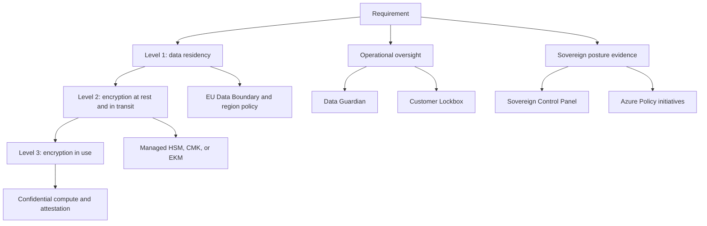

Sovereign Public Cloud adds sovereignty controls to Microsoft-operated public cloud regions. Start with the requirement. Then select the capability that changes where data resides, who can oversee provider access, who controls keys, or how you prove posture.

Microsoft Learn names four Sovereign Public Cloud capabilities: Data Guardian, External Key Management, Azure Confidential Computing, and Sovereign Control Panel ([Learn](https://learn.microsoft.com/azure/azure-sovereign-clouds/public/sovereign-public-cloud-capabilities)). The EU Data Boundary is a separate but related commitment for in-scope Microsoft enterprise online services.

## Capability map

| Requirement | Primary control | What it changes | Evidence to collect |
|---|---|---|---|
| Keep in-scope data in Europe | EU Data Boundary and regional deployment policy | Limits storage and processing for in-scope services to EU and EFTA countries, subject to documented exceptions | Tenant location, region choices, Azure Policy results, service data residency documentation |
| Add local oversight of Microsoft remote access | Data Guardian | Authorized European-resident Microsoft staff monitor remote access by Microsoft personnel to in-scope systems and write sessions to a tamper-evident ledger | Data Guardian logs, support records, access session records |
| Require customer approval for Microsoft customer data access | Customer Lockbox | Customer approvers can approve or reject eligible Microsoft customer data access requests | Lockbox request logs, approval records, support ticket references |
| Keep keys under customer control | Managed HSM key sovereignty or Managed HSM External Key Management | Customer controls HSM-backed keys. EKM can keep the key-encryption key outside Microsoft infrastructure | Key inventory, HSM security domain records, EKM proxy logs, Azure Monitor logs |
| Protect data while it is processed | Azure Confidential Computing | Runs VMs or containers in trusted execution environments with attestation | Attestation tokens, SKU inventory, Secure Key Release policy, deployment evidence |
| Prove and remediate posture | Sovereign Control Panel and Azure Policy | Evaluates sovereignty posture and enforces resource configuration | SCP findings, Azure Policy compliance state, remediation records |

## EU Data Boundary scope

The EU Data Boundary covers Azure, Dynamics 365, Power Platform, and Microsoft 365 enterprise online services. Microsoft states that Customer Data and personal data for in-scope services are stored and processed inside the boundary, and Professional Services Data is stored at rest for those services, subject to documented transfer scenarios ([Learn](https://learn.microsoft.com/privacy/eudb/eu-data-boundary-learn)).

The boundary consists of the 27 European Union member states plus the European Free Trade Association countries Liechtenstein, Iceland, Norway, and Switzerland ([Learn](https://learn.microsoft.com/privacy/eudb/eu-data-boundary-learn)). Microsoft says the boundary uses or may use datacenters in Austria, Belgium, Denmark, Finland, France, Germany, Greece, Ireland, Italy, the Netherlands, Norway, Poland, Spain, Sweden, and Switzerland.

Scope depends on the product:

| Product area | Scope rule |
|---|---|
| Azure | Regional Azure services are in scope when the customer deploys them in an EU Data Boundary region. Azure non-regional services need service-specific configuration. |
| Dynamics 365 and Power Platform | The tenant and all environments must be provisioned in the EU and EFTA Macro Region Geography, and the customer must maintain a billing address in an EU Data Boundary country. |
| Microsoft 365 | Customers with a tenant sign-up location in an EU or EFTA country are in scope. Multi-Geo customers are excluded. |

Microsoft also states that personal data in system-generated logs is pseudonymized rather than anonymized, because logs must still support service quality, reliability, security, and operational investigations ([Learn](https://learn.microsoft.com/privacy/eudb/eu-data-boundary-learn)).

:::caution[Residency is not the same as sovereignty]
Data residency limits where data is stored or processed. It does not, by itself, control provider access, cryptographic custody, or runtime exposure. Use it with operational oversight, key management, and confidential computing when the requirement extends beyond location.
:::

## Level 1, Level 2, and Level 3 controls

Sovereign Public Cloud guidance uses a progressive control model. Microsoft maps Level 1 to data residency, Level 2 to encryption at rest and in transit, and Level 3 to encryption in use through confidential computing ([Learn](https://learn.microsoft.com/azure/azure-sovereign-clouds/public/overview-controls-principles)).

| Control level | Applies to | Common Azure implementation | Design question |
|---|---|---|---|
| Level 1 | Data residency | Restrict resources to approved regions with Azure Policy. Review regional and non-regional service behavior. | Which data types must stay in which geography, and which services can meet that rule? |
| Level 2 | Encryption at rest and in transit | Use customer-managed keys where supported, Managed HSM for higher key assurance, TLS or private connectivity for traffic, and service-specific encryption settings. | Who controls the key, and can the network path meet the requirement? |
| Level 3 | Encryption in use | Use confidential VMs, confidential AKS worker nodes, confidential containers on Azure Container Instances, attestation, and Secure Key Release where needed. | Must operators, host administrators, or other infrastructure roles be kept out of workload memory? |

Not every workload needs Level 3. A public website may only need a regional deployment policy. A regulated analytics platform that processes secret data may need region restrictions, customer-managed keys in Managed HSM, private endpoints, confidential compute, and attestation-gated key release.

## Map controls to requirements

Use the following sequence in design workshops:

1. Classify data and operational risk. Separate public, internal, confidential, and secret data. Do not apply Level 3 everywhere because it increases SKU, deployment, and operational constraints.
2. Identify residency scope. For Azure, decide region placement and non-regional service configuration. For Microsoft 365, Dynamics 365, and Power Platform, check tenant geography and billing rules before using the EU Data Boundary as evidence.
3. Select key custody. Use Managed HSM key sovereignty for most high-assurance workloads. Consider Managed HSM External Key Management only when a legal or contractual mandate requires the key-encryption key to remain outside Microsoft infrastructure.
4. Define operator access controls. Use Data Guardian for European-resident oversight of Microsoft remote access where it applies. Use Customer Lockbox when customer approval of eligible customer data access is required.
5. Decide whether memory exposure is in scope. If the requirement includes data in use, use confidential VMs, confidential AKS worker nodes, confidential containers, attestation, and Secure Key Release.
6. Make evidence repeatable. Use Sovereign Control Panel for posture review, and use Azure Policy initiatives at the management group or subscription scope to audit or enforce settings.

## Design trade-offs

Sovereign controls carry operational cost. EKM gives the strongest physical key custody but adds proxy, HSM, networking, and availability responsibilities. Confidential computing can protect runtime memory but may limit SKU choice and require attestation-aware deployment patterns. Customer Lockbox gives approval control for eligible access requests, but it does not cover every service or emergency path.

Document the control decision in the workload design record. Include the requirement, selected control, service scope, evidence owner, and exception process. That record helps reviewers distinguish a deliberate risk acceptance from a missing control.

## Sources

- [What is Sovereign Public Cloud?](https://learn.microsoft.com/azure/azure-sovereign-clouds/public/overview-sovereign-public-cloud)
- [Capabilities of Sovereign Public Cloud](https://learn.microsoft.com/azure/azure-sovereign-clouds/public/sovereign-public-cloud-capabilities)
- [Controls and principles in Sovereign Public Cloud](https://learn.microsoft.com/azure/azure-sovereign-clouds/public/overview-controls-principles)
- [What is the EU Data Boundary?](https://learn.microsoft.com/privacy/eudb/eu-data-boundary-learn)
