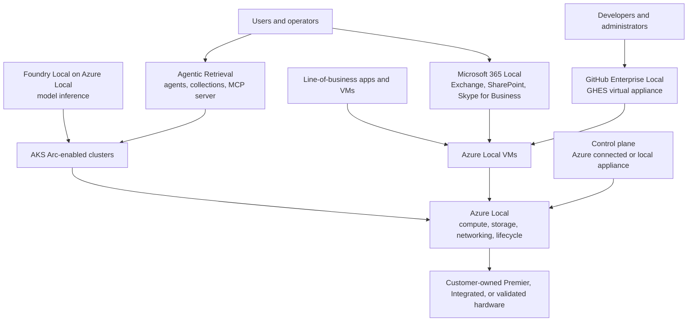

Sovereign Private Cloud starts with Azure Local and adds Microsoft services that run inside a customer-controlled operational boundary. The design decision is not only which service to use. You must also choose the Azure Local deployment type, the connectivity model, and the workload placement pattern.

## Layer the stack from infrastructure upward

Azure Local provides compute, storage, networking, and lifecycle management for the stack. Microsoft documents it as the foundation for Sovereign Private Cloud and states that the other private-cloud solutions depend on Azure Local ([Learn](https://learn.microsoft.com/azure/azure-sovereign-clouds/private/overview/sovereign-private-cloud)).

Treat the diagram as a placement model, not a deployment recipe. Microsoft 365 Local runs on Azure Local Premier Solutions through a certified solution partner. GitHub Enterprise Local runs GitHub Enterprise Server as a prebuilt virtual appliance on Azure Local and is currently preview ([Learn](https://learn.microsoft.com/azure/azure-sovereign-clouds/private/github-local/github-local-overview)). Foundry Local on Azure Local runs as a preview Azure Arc extension on an Arc-enabled Kubernetes cluster ([Learn](https://learn.microsoft.com/azure/azure-sovereign-clouds/private/foundry-local/overview)). Agentic Retrieval is also preview and runs as an Azure Arc-enabled Kubernetes extension. Microsoft renamed Edge RAG enabled by Azure Arc to Agentic Retrieval in June 2026 ([Learn](https://learn.microsoft.com/azure/azure-arc/agents-tools-foundry-local/whats-new#june-2026)).

## Choose the connectivity model first

Azure Local has two documented connectivity modes. Connected operations use periodic connectivity to Azure for control-plane activities. Microsoft says connected deployments tolerate intermittent disconnections up to 30 days without affecting running workloads ([Learn](https://learn.microsoft.com/azure/azure-sovereign-clouds/private/azure-local/connected-operations-overview)). Disconnected operations run without ongoing connectivity to Azure and move the control plane into the customer environment through a local appliance ([Learn](https://learn.microsoft.com/azure/azure-sovereign-clouds/private/azure-local/disconnected-operations-overview)).

Microsoft also uses "intermittently connected" in official blog language for environments that may lose connectivity but are not designed as fully disconnected deployments. In Learn terms, model that requirement as connected operations with intermittent loss of connectivity unless the customer qualifies for disconnected operations. The difference matters because disconnected operations need eligibility approval, a dedicated management cluster, local identity integration, DNS, PKI, and offline servicing workflows.

| Model | Control plane | Use when | Design watchpoint |
| --- | --- | --- | --- |
| Connected | Azure control plane with periodic connectivity | The site can reach Azure endpoints at least periodically and needs the broadest set of Azure Local capabilities. | Running workloads continue through disconnections up to 30 days, but deployment, monitoring, policy, and lifecycle tasks rely on connectivity windows. |
| Intermittent | Connected operations with expected outages | The site usually connects to Azure but has unreliable WAN, temporary ISP outages, or tactical connectivity windows. | Do not assume this is the disconnected product. Plan operational runbooks for what operators can and cannot do during an outage. |
| Disconnected | Local control plane appliance | Sovereign, classified, regulated, or remote environments cannot depend on Azure public cloud connectivity. | Requires eligibility approval, Premier Solutions hardware for the management cluster, and a subset of Azure capabilities. |

## Match deployment type to workload support

Azure Local supports hyperconverged, disaggregated, multi-rack, and small form factor deployment types. The deployment-type page states that disconnected operations is a connectivity mode, not a separate deployment type. It also states that hyperconverged and disaggregated deployments can run in connected or disconnected mode, while multi-rack and small form factor deployments are connected only ([Learn](https://learn.microsoft.com/azure/azure-local/plan/find-your-deployment-type)).

| Deployment type | Single-instance scale | Workload fit |
| --- | --- | --- |
| Hyperconverged | 1 to 16 machines. Rack-aware clusters support up to 8 machines. | General-purpose VMs, AKS, SQL Server, Azure Virtual Desktop, Microsoft 365 Local, GitHub Enterprise Local, AI workloads, Foundry Local, and Azure IoT Operations where supported. |
| Disaggregated | 1 to 64 machines with SAN storage. | Workloads that need compute and storage to scale independently. Microsoft 365 Local and GitHub Enterprise Local are supported. |
| Multi-rack | Up to 128 nodes per instance. | Rack-scale environments with integrated compute, storage, and networking. The deployment-type table does not list Microsoft 365 Local or GitHub Enterprise Local as supported on multi-rack. |
| Small form factor | Compact edge appliance. | Space and power-constrained sites. The deployment-type table lists AI workloads and Foundry Local as preview on small form factor, but not Microsoft 365 Local or GitHub Enterprise Local. |

For Microsoft 365 Local and GitHub Enterprise Local, plan on hyperconverged or disaggregated Azure Local. The deployment-type table lists both workloads as supported only on those two deployment types ([Learn](https://learn.microsoft.com/azure/azure-local/plan/find-your-deployment-type#workload-availability-by-deployment-type)).

## Separate fleet scale from instance limits

Microsoft's connected operations overview says Azure Local deployment options scale "from one node to thousands of nodes" ([Learn](https://learn.microsoft.com/azure/azure-sovereign-clouds/private/azure-local/connected-operations-overview)). The April 27, 2026 Microsoft blog says Azure Local now scales to thousands of servers within a single sovereign environment ([Microsoft Blog](https://blogs.microsoft.com/blog/2026/04/27/microsoft-sovereign-private-cloud-scales-to-thousands-of-nodes-with-azure-local/)). Use that statement for aggregate sovereign-environment or fleet scale.

Do not turn "thousands of nodes" into a single-instance limit. The single-instance limits remain 16 machines for hyperconverged, 64 machines for disaggregated, and 128 nodes for multi-rack. At architecture review, state both numbers together so platform, network, and facilities teams do not size one giant cluster when the design needs a managed fleet of Azure Local instances.

## Place the services by control boundary

Microsoft 365 Local gives customers core productivity workloads on customer-owned Azure Local infrastructure. The service includes Exchange Server, SharePoint Server, and Skype for Business Server Subscription Editions. Learn states that Microsoft 365 Local is generally available and supports hybrid and fully disconnected deployments ([Learn](https://learn.microsoft.com/azure/azure-sovereign-clouds/private/m365-local/microsoft-365-local-overview)). Use it when productivity data and operations must stay inside the private-cloud boundary.

GitHub Enterprise Local gives developers a self-hosted GitHub Enterprise Server environment on Azure Local. Learn labels GitHub Enterprise Local as preview and describes it as a prebuilt virtual appliance for source code management, pull requests, issues, Actions with self-hosted runners, Packages, and Advanced Security ([Learn](https://learn.microsoft.com/azure/azure-sovereign-clouds/private/github-local/github-local-overview)). State only those capabilities unless you verify more in GitHub Enterprise Server documentation for the target version.

Foundry Local on Azure Local provides local model inference through an Arc-enabled Kubernetes cluster. It is preview and supports ONNX-GenAI for CPU or GPU deployments and vLLM for GPU-only generative AI deployments ([Learn](https://learn.microsoft.com/azure/azure-sovereign-clouds/private/foundry-local/overview)). Use it when inference must run near data sources or inside the disconnected boundary.

Agentic Retrieval adds the RAG and agent layer. It combines local knowledge sources, collections, an agents runtime, a built-in MCP server, and a local chat experience. Learn states that all customer content, including ingested documents, embeddings, agent configurations, and conversation threads, stays on the on-premises infrastructure within customer-defined network boundaries ([Learn](https://learn.microsoft.com/azure/azure-arc/agents-tools-foundry-local/overview#data-on-premises-versus-cloud)). Use it when teams need grounded assistants over local content, not only raw inference endpoints.

## Architecture checklist

Use these questions before you pick hardware or write a statement of work.

| Question | Why it matters |
| --- | --- |
| Does the customer need no Azure public cloud dependency, or can it operate with periodic connectivity? | This decides whether connected operations are enough or whether disconnected operations procurement and the local control plane are required. |
| Which workloads must run on the same Azure Local instance? | Microsoft 365 Local and GitHub Enterprise Local need hyperconverged or disaggregated deployment types. |
| Is the scale target an instance target or a fleet target? | Single-instance limits and aggregate sovereign-environment scale use different designs. |
| Which identity, PKI, and DNS services are authoritative inside the boundary? | Disconnected operations depend on local identity, certificate, and name-resolution planning. |
| Which AI layer is required? | Foundry Local serves models. Agentic Retrieval adds ingestion, vector search, agents, and the MCP server. |

## Sources

- [What is Sovereign Private Cloud?](https://learn.microsoft.com/azure/azure-sovereign-clouds/private/overview/sovereign-private-cloud)
- [Connected operations overview](https://learn.microsoft.com/azure/azure-sovereign-clouds/private/azure-local/connected-operations-overview)
- [Disconnected operations overview](https://learn.microsoft.com/azure/azure-sovereign-clouds/private/azure-local/disconnected-operations-overview)
- [Find your Azure Local deployment type](https://learn.microsoft.com/azure/azure-local/plan/find-your-deployment-type)
- [What is Microsoft 365 Local?](https://learn.microsoft.com/azure/azure-sovereign-clouds/private/m365-local/microsoft-365-local-overview)
- [What is GitHub Enterprise Local?](https://learn.microsoft.com/azure/azure-sovereign-clouds/private/github-local/github-local-overview)
- [What is Foundry Local on Azure Local?](https://learn.microsoft.com/azure/azure-sovereign-clouds/private/foundry-local/overview)
- [What is Agentic Retrieval in Agents and Tools with Foundry Local?](https://learn.microsoft.com/azure/azure-arc/agents-tools-foundry-local/overview)
- [What's new in Agentic Retrieval in Foundry Local](https://learn.microsoft.com/azure/azure-arc/agents-tools-foundry-local/whats-new)
- [Microsoft Sovereign Private Cloud scales to thousands of nodes with Azure Local](https://blogs.microsoft.com/blog/2026/04/27/microsoft-sovereign-private-cloud-scales-to-thousands-of-nodes-with-azure-local/)
