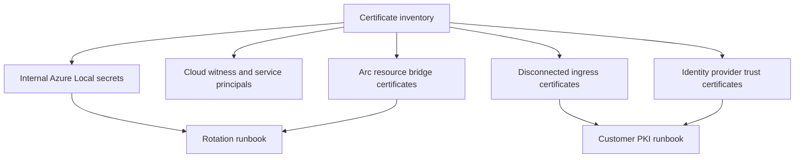

Azure Local uses certificates, passwords, secure strings, keys, and service principals across the platform. Architects need two operating models. Connected deployments use Azure-connected lifecycle tooling and Azure Local secret rotation procedures. Disconnected deployments add customer PKI, local identity-provider trust, appliance certificates, and offline update pressure.



## Internal secret rotation

The Azure Local security features article says the platform creates authentication and encryption certificates for services running on the system. It also says Azure Local has internal secret creation and rotation capabilities, including autorotation before certificates expire, manual rotation during the system lifetime, and monitoring or alerts for certificate validity.

Manual internal secret rotation is not a routine weekly task. Microsoft says [internal secret rotation is required only if you suspect compromise or receive an expiration alert](https://learn.microsoft.com/azure/azure-local/manage/manage-secrets-rotation?view=azloc-2609#rotate-internal-secrets). For Azure Local 2411.2 and later, the documented command is:

```powershell
Start-SecretRotation
```

Older software versions have extra preparation steps for the CA certificate password and, for 2408.2 or earlier, File Copy Agent certificates. Avoid copying old procedures into a current runbook. Tie each runbook to the Azure Local software version it supports.

## Deployment user and cloud witness secrets

Azure Local documents `Set-AzureStackLCMUserPassword` for rotating the deployment user password associated with the `AzureStackLCMUserCredential` domain administrator credential. The cmdlet can update Active Directory when the `UpdateAD` parameter is used.

```powershell
$old_pass = ConvertTo-SecureString "<Old password>" -AsPlainText -Force
$new_pass = ConvertTo-SecureString "<New password>" -AsPlainText -Force

Set-AzureStackLCMUserPassword -Identity mgmt -OldPassword $old_pass -NewPassword $new_pass -UpdateAD
```

For connected two-node designs that use a cloud witness, Azure Local also documents a storage account key rotation sequence. The sequence changes the cluster quorum to use the secondary key, rotates the primary key, changes quorum back to the rotated primary key, rotates the secondary key, and updates the `WitnessCredential` secret in the ECE store. Include this in key rotation calendars because quorum and storage account key changes touch both Azure and the local cluster.

## Arc resource bridge certificate pressure

[Azure Local updates guidance](https://learn.microsoft.com/azure/azure-local/update/about-updates-23h2?view=azloc-2609#lifecycle-cadence) includes a separate warning for Arc resource bridge. Solution updates must be applied within one year to keep certificates valid and Azure Local VM functionality working. This certificate validity requirement is separate from the six-month support window for the current Azure Local release.

For a production fleet, track two clocks:

| Clock | Source | Risk if missed |
| --- | --- | --- |
| Six-month support window | Azure Local Modern Lifecycle support requirement | Instance leaves supported release window. |
| One-year Arc resource bridge update requirement | Arc resource bridge certificate warning in Azure Local update guidance | Azure Local VM functionality can fail because certificates are no longer valid. |

Do not rely on certificate expiration alerts alone. Put the update date, certificate-dependent components, and resource bridge version in the platform inventory.

## Disconnected operations PKI

Disconnected operations add a customer PKI requirement. Microsoft says [PKI for disconnected operations](https://learn.microsoft.com/azure/azure-local/manage/disconnected-operations-pki?view=azloc-2609) secures the endpoints that the disconnected operations appliance exposes. Certificates must come from a public certificate authority or enterprise certificate authority and be part of the Microsoft Trusted Root Program. For fully disconnected deployments, Microsoft says to use a private or internal CA and not a public or external CA, because the deployment cannot reach public CRL and OCSP services.

Key PKI requirements include:

- Self-signed certificates are not supported.
- Disconnected operations require several external certificates for appliance endpoints.
- Each endpoint needs the required subject and subject alternative name.
- All certificates should share the same trust chain and have at least a two-year expiration from deployment.
- Root certificates must be exported in Base64 encoded format.
- The disconnected operations infrastructure must reach the internal CRL endpoint listed in the certificates.

The ingress endpoint certificate list includes Azure Blob storage, Azure Container Registry, queue storage, Service Bus, table storage, Key Vault, Azure Resource Manager, public portal, secure token service, Arc services, and related appliance endpoints. The management endpoint also requires server and client certificates. Treat this as a platform PKI project, not as an application certificate request.

## Disconnected certificate rotation

Disconnected operations certificate rotation has its own operations module. [Microsoft documents two primary categories](https://learn.microsoft.com/azure/azure-local/manage/disconnected-operations-certificate-rotation?view=azloc-2609): external ingress certificates and identity provider trust certificates.

External ingress certificates secure client connections to platform services. The documented process imports the `Azure.Local.DisconnectedOperations.psd1` module, sets a disconnected operations client context with the management endpoint client certificate, and then runs `Set-ApplianceExternalEndpointCertificates` with a folder of replacement certificates and a certificate password.

Identity provider trust certificates secure trust with Active Directory, AD FS, or another supported federation service. The documented process creates a partial external identity configuration with the new OIDC and LDAPS certificate chain information, then runs `Update-ApplianceExternalIdentityConfiguration`.

This is not the same as `Start-SecretRotation` for internal Azure Local secrets. Keep connected internal secrets, disconnected ingress certificates, and identity-provider trust certificates in separate runbooks.

## Identity and certificate planning for disconnected operations

Disconnected operations supports Active Directory for groups and memberships and AD FS for authentication. Only Universal groups are supported for Active Directory group memberships. Identity integration uses an OIDC endpoint for user authentication and an LDAP endpoint for groups and memberships.

The identity planning page lists certificate chain parameters for LDAPS and OIDC. You can omit certificate chain information for demo purposes, but production runbooks should collect and validate certificate chain information before deployment. Identity synchronization also affects access recovery. If operators lose access to the operator subscription, the host administrator can reset the root operator user principal name through the disconnected operations identity configuration cmdlets.

## BitLocker recovery keys

[BitLocker management for Azure Local](https://learn.microsoft.com/azure/azure-local/manage/manage-bitlocker?view=azloc-2609#get-bitlocker-recovery-keys) documents how to retrieve recovery keys. Microsoft warns that if the cluster is down and you do not have the keys, you might be unable to access encrypted data. The documented command is:

```powershell
Get-AsRecoveryKeyInfo | ft ComputerName, PasswordID, RecoveryKey
```

Export and store recovery keys in a secure external location, such as Azure Key Vault for connected environments. For disconnected environments, store them in an approved offline secret store that operations can reach during recovery. Also account for update operations. Disconnected operations update guidance separately instructs operators to export appliance BitLocker recovery keys before triggering updates.

## Planning checklist

- Inventory every certificate, service principal, storage account key, and BitLocker key.
- Record the owning runbook, renewal owner, expiration date, and test procedure.
- Keep Azure Local internal secret rotation separate from disconnected operations certificate rotation.
- Align Arc resource bridge update planning with the one-year certificate requirement.
- Validate CRL access for disconnected PKI before deployment.
- Store BitLocker recovery keys outside the cluster.
- Test sign-in, portal access, ARM access, VM operations, and identity synchronization after every certificate change.

## Sources

- [Security features for Azure Local](https://learn.microsoft.com/azure/azure-local/concepts/security-features?view=azloc-2609)
- [Rotate secrets on Azure Local](https://learn.microsoft.com/azure/azure-local/manage/manage-secrets-rotation?view=azloc-2609)
- [About updates for Azure Local](https://learn.microsoft.com/azure/azure-local/update/about-updates-23h2?view=azloc-2609)
- [Public key infrastructure for disconnected operations on Azure Local](https://learn.microsoft.com/azure/azure-local/manage/disconnected-operations-pki?view=azloc-2609)
- [Manage secret rotation for Azure Local disconnected operations](https://learn.microsoft.com/azure/azure-local/manage/disconnected-operations-certificate-rotation?view=azloc-2609)
- [Plan your identity for disconnected operations on Azure Local](https://learn.microsoft.com/azure/azure-local/manage/disconnected-operations-identity?view=azloc-2609)
- [Manage BitLocker encryption on Azure Local](https://learn.microsoft.com/azure/azure-local/manage/manage-bitlocker?view=azloc-2609)
