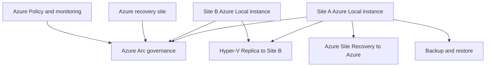

Multi-site Azure Local design starts with a correction. The current Azure Local stretched-clusters page states that [stretched clusters are not supported in Azure Local](https://learn.microsoft.com/azure/azure-local/concepts/stretched-clusters?view=azloc-2609). Do not design a single Azure Local instance that spans datacenters for synchronous site failover. Use separate Azure Local instances per site, or use rack-aware clustering when the requirement is same-campus rack or room tolerance.

The architecture below keeps site failure domains separate. Azure Arc provides common governance, and workload recovery uses the replication or backup option that matches the recovery objective.

## Choose the site pattern

Use the smallest pattern that meets the failure and recovery target.

| Requirement | Recommended pattern | Reason |
| --- | --- | --- |
| A rack or room can fail inside one campus. | Rack-aware cluster. | It is one Azure Local instance across two racks, with one storage pool and 1 ms or less round-trip latency. |
| A datacenter can fail and workloads can restart in Azure. | Azure Site Recovery from Azure Local to Azure. | Site Recovery can replicate Azure Local VMs to Azure and orchestrate failover to Azure VMs. |
| A datacenter can fail and workloads must restart on another on-premises Azure Local instance. | Hyper-V Replica between separate Azure Local clusters. | Hyper-V Replica supports asynchronous VM replication between Azure Local clusters. |
| Data must be recoverable to a point in time. | Backup plus documented restore order. | Backup protects against deletion, corruption, and ransomware cases where replication would copy bad data. |
| Two sites need shared governance but independent operations. | Separate Azure Local instances managed through Azure Arc. | Arc gives inventory, policy, and monitoring without merging site failure domains. |

## Rack-aware clustering is same-site availability

[Rack-aware clustering](https://learn.microsoft.com/azure/azure-local/concepts/rack-aware-cluster-overview?view=azloc-2609) places one Azure Local instance across two physical racks in two rooms or buildings. Microsoft Learn says the required round-trip latency between the two racks is 1 ms or less. The design uses a single storage pool and distributes data copies evenly between racks.

Use rack-aware clustering for campus or same-facility designs, such as a hospital, airport, plant, or datacenter room pair where the racks share high-bandwidth, low-latency connectivity. Do not use it as a wide-area disaster recovery design. It also does not support configurations with external storage area networks.

Rack-aware clusters scale by adding pairs of nodes. Microsoft documents 2+2, then 3+3, then 4+4. That makes the maximum eight nodes for this subset of hyperconverged deployments. If the site needs more than that, use a different instance design, multi-rack where appropriate, or multiple instances.

## Separate instances are the multi-site default

For separate sites, deploy separate Azure Local instances. Each instance has its own cluster, local storage or SAN design, local network, lifecycle, and failure domain. This pattern avoids the unsupported stretched-cluster design and lets each site operate through its own maintenance windows.

Use Azure Arc to make the sites feel operationally consistent. Arc-connected resources can be governed with Azure Policy, observed through Azure Monitor, and updated through the Azure Local update workflow. This is common management, not shared cluster state. If Site A is isolated or failed, Site B should not depend on Site A cluster quorum, storage, or management endpoints.

Architects should document three runbooks for each workload group:

1. Normal operations, including which site owns the workload.
2. Planned move, including maintenance or migration steps.
3. Unplanned recovery, including who declares failover and how clients find the recovered workload.

## Replication and recovery options

Microsoft documents two continuous replication technologies for Azure Local VMs: [Azure Site Recovery and Hyper-V Replica](https://learn.microsoft.com/azure/azure-local/manage/disaster-recovery-vm-resiliency?view=azloc-2609#continuous-replication-of-business-critical-vms).

Azure Site Recovery replicates Azure Local VMs to Azure. Learn states that it continuously transmits changes from on-premises VMs to Azure and can provide recovery point objectives as low as 30 seconds. The Azure Site Recovery extension for Azure Local is preview and applies to test environments. For production, Microsoft points to manual configuration through the Hyper-V to Azure disaster recovery option.

Hyper-V Replica is built into Azure Local and replicates VMs asynchronously between two Hyper-V hosts or failover clusters. For Azure Local cluster-to-cluster replication, Learn says you must configure the Hyper-V Replica Broker role on each cluster. Replication frequency can be 30 seconds, 5 minutes, or 15 minutes. Hyper-V Replica is configured through PowerShell on Azure Local nodes or through Failover Cluster Manager from a Windows Server machine on the same network.

Backups still matter. Replication can reduce downtime, but it can also replicate application corruption or destructive changes. Use backup when the design needs point-in-time recovery, long-term retention, or ransomware recovery. Place backup traffic on a planned network path rather than allowing it to contend with management or storage traffic.

## Witness and quorum planning

Cluster quorum remains a local cluster design item. In the Azure Local baseline reference architecture, Microsoft uses a [cloud witness](https://learn.microsoft.com/azure/architecture/hybrid/azure-local-baseline#components) for two-machine Azure Local instances. The cloud witness uses Azure Storage to serve as the failover cluster quorum. That pattern fits connected deployments that can reach the witness storage account.

If a design uses Windows Server failover clustering patterns outside Azure Local, Microsoft documents file share witness and cloud witness as quorum options for stretch cluster topologies. For Azure Local, keep the witness decision aligned to the current Azure Local deployment guidance and the connectivity mode. A fully disconnected design cannot depend on an Azure Storage cloud witness, so witness and quorum must be planned with the supported disconnected design and local dependencies.

## Design checklist

- Confirm whether the requirement is rack failure, site failure, region failure, or operational isolation.
- Use rack-aware clustering only for two-rack, same-site designs with 1 ms or less round-trip latency.
- Use separate Azure Local instances for multi-site designs.
- Choose Azure Site Recovery when Azure is the recovery target.
- Choose Hyper-V Replica when another Azure Local cluster is the recovery target.
- Keep backup and restore in the design even when replication is enabled.
- Document how DNS, application routing, firewall policy, and identity behave after failover.
- Use Arc for common governance, not for shared cluster state.

## Sources

- [Stretched clusters overview](https://learn.microsoft.com/azure/azure-local/concepts/stretched-clusters?view=azloc-2609)
- [Azure Local rack aware clustering overview](https://learn.microsoft.com/azure/azure-local/concepts/rack-aware-cluster-overview?view=azloc-2609)
- [Virtual machine resiliency for Azure Local](https://learn.microsoft.com/azure/azure-local/manage/disaster-recovery-vm-resiliency?view=azloc-2609)
- [Azure Local baseline reference architecture](https://learn.microsoft.com/azure/architecture/hybrid/azure-local-baseline)
- [What is a quorum witness?](https://learn.microsoft.com/windows-server/failover-clustering/witness)
- [Deploy a quorum witness](https://learn.microsoft.com/windows-server/failover-clustering/deploy-cloud-witness)
