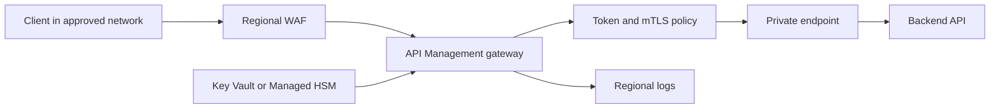

APIs are often the first place where a sovereign workload loses control of data movement. A gateway can enforce regional routing, token validation, certificate checks, throttling, logging, and private backend access before a request reaches application code. The design risk is centralization. A gateway that spans boundaries can become the path that moves regulated data outside its approved region.

Use this pattern set when clients need one stable API entry point, backend services are private, or security policy must be consistent across many APIs. Avoid it for a small internal service where direct private service-to-service calls already meet latency, identity, and audit requirements.

## Architecture Center patterns

Azure Architecture Center defines three gateway patterns that matter most for sovereign API design.

| Pattern | Use it when | Sovereignty design point |
| --- | --- | --- |
| Gateway Routing | A client needs one endpoint for multiple services, service versions, or regional instances. | Route by geography, tenant, data classification, or API version before the request reaches private backends. |
| Gateway Aggregation | A client operation needs data from several backend services. | Aggregate only inside the boundary that owns the data. If a response would mix EU and non-EU personal data, split the product experience or return references instead of raw data. |
| Gateway Offloading | Many services need the same TLS, authentication, logging, or throttling controls. | Centralize cross-cutting controls in a regional gateway, but keep business logic in services. |

The gateway is not a sovereignty product by itself. It is a policy enforcement point. The rest of the architecture must still restrict direct backend access, use private networking, and log the decision that allowed or denied each request.

## Reference architecture

For public APIs, place a web application firewall before the API gateway. For private APIs, use private DNS and private network paths so callers reach the gateway without exposing backends. Do not let clients bypass the gateway and call backend services directly.

## API Management deployment decisions

Azure API Management has managed gateways in Azure and an optional self-hosted gateway. The self-hosted gateway is a containerized gateway that can run near backend APIs on premises, in another cloud, or on Kubernetes. Microsoft Learn states that self-hosted gateway applies to the Developer and Premium tiers, and the feature table shows it is not available in Consumption, Basic, Standard, or the v2 tiers ([source](https://learn.microsoft.com/azure/api-management/api-management-features)). The self-hosted gateway overview also states that it can be deployed as a cluster extension to an Azure Arc-enabled Kubernetes cluster ([source](https://learn.microsoft.com/azure/api-management/self-hosted-gateway-overview)).

Use the managed gateway when the API traffic is allowed to flow through Azure in the chosen region. Use the self-hosted gateway when backend traffic must remain local to Azure Local, an on-premises datacenter, or another controlled environment. In that model, the management plane remains the API Management instance in Azure, while API traffic flows locally between clients, the gateway, and backends. The self-hosted gateway still needs outbound TCP connectivity to Azure on port 443 for configuration, status, and telemetry unless your architecture and product limits support a temporary disconnected posture.

Choose the tier and gateway model from the data path, not from an abstract preference.

| Requirement | Prefer | Reason |
| --- | --- | --- |
| Public API in one Azure region | Managed API Management with regional networking controls | The data path stays in the selected Azure region and uses managed platform operations. |
| Private API reached from a hub network | API Management with inbound private endpoint where supported | Private endpoint support applies to Developer, Basic, Standard, Standard v2, Premium, and Premium v2 ([source](https://learn.microsoft.com/azure/api-management/private-endpoint)). |
| API backends isolated in a virtual network | Tier that supports backend virtual network access | The feature matrix shows backend VNet connectivity support differs by tier ([source](https://learn.microsoft.com/azure/api-management/api-management-features)). |
| API traffic must stay on premises | Self-hosted gateway on local Kubernetes or Arc-enabled Kubernetes | The gateway data path can stay near the backend while policy is managed centrally. |
| Multi-region active API gateways | Premium managed gateway or separate regional gateway instances | Premium supports multi-region managed deployment; separate instances give stronger residency separation. |

## Identity and transport controls

API Management supports OAuth 2.0 authorization between the client and the gateway, between the gateway and backend APIs, or both ([source](https://learn.microsoft.com/azure/api-management/authentication-authorization-overview)). Use Microsoft Entra ID tokens for caller authorization when the API has user or workload identity context. Validate issuer, audience, expiry, and required claims at the gateway. For service-to-service traffic, use managed identity where the backend is an Azure resource that supports Microsoft Entra authentication.

Use mutual TLS when the caller must prove possession of a certificate or when backend services need to authenticate the gateway. API Management can validate certificates presented by clients and check certificate properties through policy expressions ([source](https://learn.microsoft.com/azure/api-management/api-management-howto-mutual-certificates-for-clients)). Store gateway certificates in Azure Key Vault where the deployment model supports it, and decide who owns certificate issuance, rotation, revocation, and incident response.

Do not use API keys as the only control for regulated APIs. They can identify a subscription or product, but they do not prove user identity and are hard to scope to least privilege. If you use subscription keys, combine them with OAuth 2.0, mTLS, or a managed identity pattern.

## Sovereignty controls

Start with the approved data boundary. For EU workloads, align API deployment, logs, diagnostics, secrets, keys, and backend services with EU Data Boundary scope. For national, sector, or customer-specific boundaries, define the allowed Azure regions and on-premises locations in policy before a gateway is deployed.

Design decisions:

1. Put the gateway in the same boundary as the data it inspects. A gateway that terminates TLS can see request headers and payloads.
2. Keep gateway logs local. Avoid sending full request or response bodies to a global log workspace.
3. Use private endpoints or internal network paths for backends. Gateway routing loses value if clients can call the backend directly.
4. Separate gateway instances for boundaries that cannot share operations data. Do not rely on header filtering alone to isolate incompatible jurisdictions.
5. Keep key material in the approved boundary. For higher-control scenarios, Azure Key Vault Managed HSM key sovereignty is GA and uses FIPS 140-3 Level 3 hardware security modules ([source](https://learn.microsoft.com/azure/azure-sovereign-clouds/public/external-key-management)).

## Limits and trade-offs

The gateway adds a network hop and can become a bottleneck. Size it for peak traffic, not average traffic, and load test policies that call other services. Aggregation policies can create hidden dependencies. If one backend is slow, the client experience might fail even when the main API is healthy.

The gateway is also a high-value target. Restrict management access, keep the policy change process under source control, and monitor policy drift. A compromised gateway can see tokens, headers, and payloads after TLS termination.

Self-hosted gateways reduce local traffic movement but add operational work. You own the Kubernetes or container runtime, persistent configuration backup, scaling, image version pinning, and local observability. In production, use specific image tags instead of rolling tags because Microsoft warns that rolling tags can move to newer versions without a deployment change ([source](https://learn.microsoft.com/azure/api-management/self-hosted-gateway-overview)).

Gateway offloading should not become gateway business logic. If a policy needs domain rules, long-running orchestration, or complex transformations, put that code in a service behind the gateway. Keep the gateway responsible for transport, identity, routing, shaping, throttling, and observability.

## Sources

- [Gateway Routing pattern](https://learn.microsoft.com/azure/architecture/patterns/gateway-routing)
- [Gateway Aggregation pattern](https://learn.microsoft.com/azure/architecture/patterns/gateway-aggregation)
- [Gateway Offloading pattern](https://learn.microsoft.com/azure/architecture/patterns/gateway-offloading)
- [Feature-based comparison of the Azure API Management tiers](https://learn.microsoft.com/azure/api-management/api-management-features)
- [Self-hosted gateway overview](https://learn.microsoft.com/azure/api-management/self-hosted-gateway-overview)
- [Connect privately to API Management by using an inbound private endpoint](https://learn.microsoft.com/azure/api-management/private-endpoint)
- [Authentication and authorization to APIs in Azure API Management](https://learn.microsoft.com/azure/api-management/authentication-authorization-overview)
- [How to secure APIs using client certificate authentication in API Management](https://learn.microsoft.com/azure/api-management/api-management-howto-mutual-certificates-for-clients)
- [What is External Key Management?](https://learn.microsoft.com/azure/azure-sovereign-clouds/public/external-key-management)
