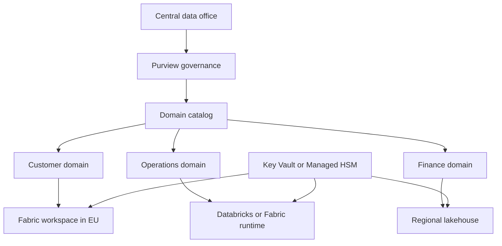

Data mesh assigns data ownership to business domains, but sovereignty adds a stricter test. A domain can own a data product only if it can prove where the data is stored, who can access it, which keys protect it, and which consumers can use it across boundaries. Federated governance gives domain teams autonomy while a central data office sets rules that every domain must meet.

Use this pattern when one central team cannot model, secure, and publish every dataset, or when different domains have different regulatory boundaries. Avoid it when the organization has no domain owners, no shared governance vocabulary, or no platform controls to stop noncompliant publishing.

## Domain model

Microsoft Fabric documentation describes data mesh as a decentralized data architecture that organizes data by business domains. Fabric domains logically group data by areas such as marketing, sales, or human resources, and some tenant-level governance settings can be delegated to domain-level control ([source](https://learn.microsoft.com/fabric/governance/domains)).

In a sovereign data mesh, a domain is a team, residency, and accountability boundary.

| Domain element | Sovereign requirement |
| --- | --- |
| Data owner | Named person or group accountable for classification, residency, access, and quality. |
| Data product | Published dataset, API, or stream with contract, lineage, allowed uses, and service targets. |
| Storage boundary | Approved Azure region, EU Data Boundary scope, national cloud, or Azure Local environment. |
| Key boundary | Microsoft-managed key, customer-managed key, Managed HSM, or external key management decision. |
| Consumer contract | Allowed consumer domains, fields, purpose, retention, and transfer limits. |

## Reference architecture

Keep the catalog global only for metadata that is allowed to be global. Microsoft Purview Data Map and Unified Catalog store metadata, not underlying data, and their roles do not grant access to the underlying data itself ([source](https://learn.microsoft.com/purview/data-governance-overview)). That distinction matters in sovereignty reviews. Catalog visibility is not the same as data access.

## Platform choices

The Cloud Adoption Framework guidance for data and analytics now frames Microsoft Fabric as the unified data platform for trusted data products, analytics, and AI. It describes a four-step framework: organizational readiness, architecture, governance and security baselines, and operational standards ([source](https://learn.microsoft.com/azure/cloud-adoption-framework/scenarios/cloud-scale-analytics/architectures/data-management-landing-zone)).

Use Fabric when domains need OneLake, Fabric domains, Power BI, Real-Time Intelligence, data engineering, and shared governance in one platform. Use Azure Databricks when a domain already needs Spark engineering, machine learning workflows, or Databricks-native governance patterns. The same CAF guidance notes that Azure services such as Azure Databricks and Azure Machine Learning can integrate with the unified platform and have their own pricing models ([source](https://learn.microsoft.com/azure/cloud-adoption-framework/scenarios/cloud-scale-analytics/architectures/data-management-landing-zone)).

Do not let tooling split the governance model. Whether a data product is produced in Fabric, Azure Databricks, Synapse, Azure SQL, or Azure Local, it needs the same classification, ownership, region, key, and access contract fields.

## Federated governance with Purview

Microsoft Purview data governance uses a federated model where a central data office sets the rules and domain roles govern data in context ([source](https://learn.microsoft.com/purview/data-governance-overview)). Use that model to separate policy from product ownership.

Central data office responsibilities:

1. Define classification labels and residency classes.
2. Define required metadata for data products.
3. Approve regions, key tiers, private networking, and retention defaults.
4. Monitor catalog health, lineage gaps, and access workflow performance.
5. Define escalation paths for cross-boundary access requests.

Domain responsibilities:

1. Register data assets and data products.
2. Maintain quality metrics and lineage.
3. Assign owners and stewards.
4. Classify columns, files, tables, events, and reports.
5. Approve consumers based on purpose and residency.

Purview can scan sources and capture metadata across a data estate. Use scans to find unlabeled assets, orphaned products, and products that contain sensitive fields. Use Unified Catalog data products to group assets that serve a business use case. The catalog does not replace resource-level access control. Enforce access in the source platform with Microsoft Entra ID, workspace permissions, row-level security, private networking, and the service's own data controls.

## Residency and key design

For each data product, record the residency rule in the contract. A rule can be "EU regions only," "France regions only," "customer site only," or another approved boundary. The EU Data Boundary includes Azure, Dynamics 365, Power Platform, and Microsoft 365 across the EU and EFTA countries, but Azure scope follows the EU Data Boundary region where the customer deploys the service ([source](https://learn.microsoft.com/privacy/eudb/eu-data-boundary-learn)). Do not infer that a non-regional or globally managed feature is automatically in boundary.

Use customer-managed keys when the classification requires customer key control and the service supports it. For higher-control designs, Azure Key Vault Managed HSM key sovereignty is GA, uses FIPS 140-3 Level 3 hardware security modules, and gives single-tenant isolation with customer-controlled security domains ([source](https://learn.microsoft.com/azure/azure-sovereign-clouds/public/external-key-management)). True Managed HSM External Key Management, where the key-encryption-key is held outside Microsoft through an EKM Proxy, is in preview ([source](https://learn.microsoft.com/azure/key-vault/managed-hsm/external-key-management-overview)).

Key decisions:

| Classification | Key pattern | Trade-off |
| --- | --- | --- |
| Internal analytics | Platform-managed key or customer-managed key | Lower operations burden, less customer control. |
| Confidential domain product | Customer-managed key in Key Vault or Managed HSM | More control, more lifecycle work. |
| Restricted sovereign product | Managed HSM or approved external key pattern | Stronger separation, more cost and availability planning. |
| On-premises only | Local platform keys on Azure Local or source system | Local control, fewer managed cloud recovery options. |

## Cross-domain sharing

A data product contract should name the fields a consumer can access, the purpose, the legal or business basis, the allowed region, and the retention period. If the consumer is outside the domain's residency boundary, publish a derived product instead of granting direct access. Derived products can remove personal data, aggregate values, or tokenize identifiers.

For example, a customer domain in the EU can publish a "customer segment counts" product for a global marketing dashboard. The dashboard does not need email addresses, addresses, or support notes. The domain keeps source data in EU storage, publishes aggregated metrics, and records the export lineage in Purview.

Avoid shared global lakes that silently replicate all domains. A global lake can still be valid for non-regulated aggregate products, but it must not become the default path for raw data. Let domain contracts decide what crosses boundaries.

## Limits and trade-offs

Data mesh adds organizational complexity. It fails when domains publish inconsistent contracts, skip quality checks, or treat catalog registration as the only control. A central data office must keep standards small enough for domains to follow and strict enough for auditors to test.

Fabric domains improve discoverability and delegate some governance settings, but Microsoft Learn states that domain assignment does not affect item visibility or accessibility. Access still depends on workspace role and item permissions ([source](https://learn.microsoft.com/fabric/governance/domains)). Treat domains as governance metadata, not as a security boundary.

Purview catalogs metadata, not the underlying data. That makes it safe for many discovery scenarios, but it means enforcement still happens in storage accounts, databases, lakehouses, warehouses, Databricks workspaces, APIs, and pipelines. Connect the catalog to policy and deployment gates so a domain cannot publish a restricted product without required controls.

## Sources

- [Data for AI and analytics: Guidance to set your organization's data strategy](https://learn.microsoft.com/azure/cloud-adoption-framework/scenarios/cloud-scale-analytics/architectures/data-management-landing-zone)
- [Data governance with Microsoft Purview](https://learn.microsoft.com/purview/data-governance-overview)
- [Fabric domains](https://learn.microsoft.com/fabric/governance/domains)
- [What is the EU Data Boundary?](https://learn.microsoft.com/privacy/eudb/eu-data-boundary-learn)
- [What is External Key Management?](https://learn.microsoft.com/azure/azure-sovereign-clouds/public/external-key-management)
- [What is Managed HSM external key management?](https://learn.microsoft.com/azure/key-vault/managed-hsm/external-key-management-overview)
