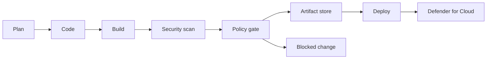

Sovereign architecture fails if the deployment pipeline can bypass it. DevSecOps turns residency, encryption, network, identity, and supply-chain controls into checks that run before code reaches production. The goal is not more gates. The goal is earlier evidence that the workload can run in its approved boundary.

Use this pattern when teams deploy infrastructure or application code to regulated environments, Azure Local, disconnected sites, or landing zones with strict policy. Avoid a heavyweight pipeline when the workload is still a prototype with no regulated data, but keep secret scanning and dependency review from the start.

## Pipeline architecture

Microsoft Learn describes DevSecOps as Secure DevOps that puts security at the center of the application lifecycle and moves security upstream from production into planning and development ([source](https://learn.microsoft.com/devops/devsecops/enable-devsecops-azure-github)). For sovereign workloads, shift-left security includes shift-left sovereignty.

| Pipeline stage | Control | Evidence |
| --- | --- | --- |
| Plan | Threat model, data classification, region and key decisions | Architecture decision record, work item tags, data flow diagram |
| Code | Code scanning, secret scanning, dependency alerts | Pull request annotations and security alerts |
| Build | Software bill of materials, signed artifacts, container scan | Artifact metadata and attestation |
| Test | Infrastructure-as-code checks, policy evaluation, unit and integration tests | Test logs and policy results |
| Release | Approval for target boundary, change record, rollback plan | Release evidence linked to environment |
| Deploy | Managed identity, private agent, regional parameter lock | Deployment logs and Azure activity records |
| Operate | Defender for Cloud posture and workload protection | Recommendations, alerts, secure score, attack paths |

## Code and supply-chain checks

GitHub Advanced Security and GitHub Advanced Security for Azure DevOps both target code-level risks. The Azure DevOps code scanning documentation states that code scanning analyzes Azure Repos code to find security vulnerabilities and coding errors, and that CodeQL identifies vulnerabilities ([source](https://learn.microsoft.com/azure/devops/repos/security/github-advanced-security-code-scanning?view=azure-devops)). The Azure DevOps secret scanning documentation states that secret scanning finds credentials and sensitive content in source code, and push protection blocks new secrets before they are exposed ([source](https://learn.microsoft.com/azure/devops/repos/security/github-advanced-security-secret-scanning?view=azure-devops)).

Apply these checks to every repository that can change the sovereign environment:

1. Code scanning for application languages and infrastructure helper code.
2. Secret scanning with push protection.
3. Dependency alerts and update workflows.
4. Container image scanning.
5. Software bill of materials generation.
6. Branch protection that requires successful checks before merge.

Treat exposed credentials as incidents. Rotate the credential, remove it from history where required, and verify no unauthorized access occurred. Do not close a secret scanning alert only because the repository is private.

## Infrastructure as code and policy as code

Sovereign landing zones rely on repeatable policy. The pipeline should evaluate infrastructure as code before deployment and then rely on Azure Policy at runtime. For Sovereign Landing Zone, use the management group structure and policy initiatives defined in the prior module as the deployment target. Keep approved regions, private endpoint requirements, customer-managed key requirements, and public network access rules in versioned policy definitions or policy assignment parameters.

Pipeline checks should block:

| Finding | Example gate |
| --- | --- |
| Unapproved region | Deployment template location is not in the approved region list for the data classification. |
| Public endpoint | Storage, database, or API service enables public network access when policy requires private access. |
| Missing customer-managed key | Resource supports customer-managed keys but the template uses platform-managed keys for confidential data. |
| Missing diagnostic setting | Critical service does not send logs to the approved regional workspace. |
| Wrong identity model | Deployment uses long-lived secrets where managed identity is supported. |

Use the same parameter names in templates, policy, and work items. If the work item says the data boundary is EU, the template should use an `allowedRegions` parameter that contains only approved EU regions.

## Defender for Cloud DevOps security

Microsoft Defender for Cloud is a Cloud Native Application Protection Platform. Microsoft Learn defines its core components as Cloud Security Posture Management, Development Security Operations, and Cloud Workload Protection Platform ([source](https://learn.microsoft.com/azure/defender-for-cloud/defender-for-cloud-introduction)). This matters because a sovereign workload needs code-to-cloud visibility, not separate dashboards that cannot connect a risky template to a risky resource.

Defender for Cloud DevOps security gives security teams a central console for code-to-cloud protection across Azure DevOps, GitHub, and GitLab. Microsoft Learn states that it shows findings from code, secrets, open-source dependency vulnerability scans, and infrastructure-as-code misconfigurations, and correlates DevOps recommendations with cloud security insights ([source](https://learn.microsoft.com/azure/defender-for-cloud/defender-for-devops-introduction)).

Use Defender for Cloud to connect preproduction findings to runtime posture:

1. Connect the source code systems used by the workload.
2. Review code, secret, dependency, and infrastructure-as-code findings by severity.
3. Enable pull request annotations where supported.
4. Map repositories to deployed resources so teams can prioritize fixes that affect production.
5. Use Defender CSPM and workload plans to monitor deployed resources, containers, servers, storage, databases, APIs, and AI workloads where those plans are enabled.

## Deploying to sovereign and disconnected targets

Cloud-hosted build agents are often wrong for sovereign targets because they cannot reach private endpoints or disconnected environments, and they can move build artifacts through unapproved locations. Azure Pipelines documentation defines an agent as computing infrastructure with agent software that runs one job at a time, and Azure Pipelines supports different agent types ([source](https://learn.microsoft.com/azure/devops/pipelines/agents/agents?view=azure-devops)). Use self-hosted agents inside the approved network when deployments target private Azure regions, Azure Local, or disconnected sites.

For GitHub-based sovereign private cloud, GitHub Enterprise Local is in preview and runs GitHub Enterprise Server on Azure Local infrastructure ([source](https://learn.microsoft.com/azure/azure-sovereign-clouds/private/github-local/github-local-overview)). The preview page states that it supports GitHub Actions with self-hosted runners for fully offline pipelines, GitHub Packages, and GitHub Advanced Security, with repositories, metadata, artifacts, and execution on customer-owned infrastructure. State the preview status in any architecture that depends on it.

Deployment design:

| Target | Recommended execution path |
| --- | --- |
| Private Azure region | Self-hosted agent in a spoke or deployment subnet with private DNS and managed identity. |
| Azure Local connected mode | Agent or runner inside the Azure Local management boundary with outbound paths restricted to required endpoints. |
| Azure Local disconnected mode | Local source, package, and artifact services with offline approval and update procedures. |
| National or partner cloud | Toolchain supported in that cloud, with separate identity, policy, and artifact trust roots. |

Do not let a pipeline deploy to every region by changing a parameter at runtime. Approved region sets should be environment-owned, reviewed, and protected. Use environment approvals for production, but do not make approvals the only control. The template and Azure Policy must still block noncompliant resources.

## Secrets, keys, and artifacts

Pipelines should not hold long-lived cloud credentials. Use workload identity federation or managed identity where supported. If a target requires a secret, store it in Key Vault or the local equivalent, scope it to one environment, and rotate it on a defined schedule. Never copy production secrets into test pipelines.

Artifacts must have provenance. Build once, scan once, sign or attest, and promote the same artifact through environments. Rebuilding for production can bypass the evidence collected in test. Store artifacts in a registry inside the approved boundary, especially for disconnected targets.

For customer-managed keys, keep key deployment separate from application deployment. The pipeline can request a key version or reference, but key administrators should control key creation, rotation, purge protection, and disaster recovery.

## Limits and trade-offs

Security gates can slow delivery if every warning blocks every deployment. Define which findings block immediately and which create a time-bound exception. For example, exposed secrets and unapproved regions should block. A low-severity dependency with no reachable code path might create a tracked risk item.

Disconnected pipelines improve sovereignty but increase operations work. You need local package mirrors, base image management, malware scanning, license review, certificate rotation, and patch import procedures. If the disconnected environment uses GitHub Enterprise Local, remember it is currently preview ([source](https://learn.microsoft.com/azure/azure-sovereign-clouds/private/github-local/github-local-overview)) and plan for feature limits, upgrades, and support terms.

Policy as code can drift from runtime policy. Keep policy definitions in source control, deploy policy through the same reviewed process, and periodically compare assignments in Azure with the repository. A passing pull request is not enough if production policy was changed manually.

## Sources

- [Enable DevSecOps with Azure and GitHub](https://learn.microsoft.com/devops/devsecops/enable-devsecops-azure-github)
- [What is Microsoft Defender for Cloud?](https://learn.microsoft.com/azure/defender-for-cloud/defender-for-cloud-introduction)
- [Overview of Microsoft Defender for Cloud DevOps security](https://learn.microsoft.com/azure/defender-for-cloud/defender-for-devops-introduction)
- [Set up code scanning](https://learn.microsoft.com/azure/devops/repos/security/github-advanced-security-code-scanning?view=azure-devops)
- [Set up secret scanning](https://learn.microsoft.com/azure/devops/repos/security/github-advanced-security-secret-scanning?view=azure-devops)
- [Azure Pipelines agents](https://learn.microsoft.com/azure/devops/pipelines/agents/agents?view=azure-devops)
- [What is GitHub Enterprise Local? (preview)](https://learn.microsoft.com/azure/azure-sovereign-clouds/private/github-local/github-local-overview)
- [Sovereign Landing Zone implementation options](https://learn.microsoft.com/azure/azure-sovereign-clouds/public/implementation-options)
