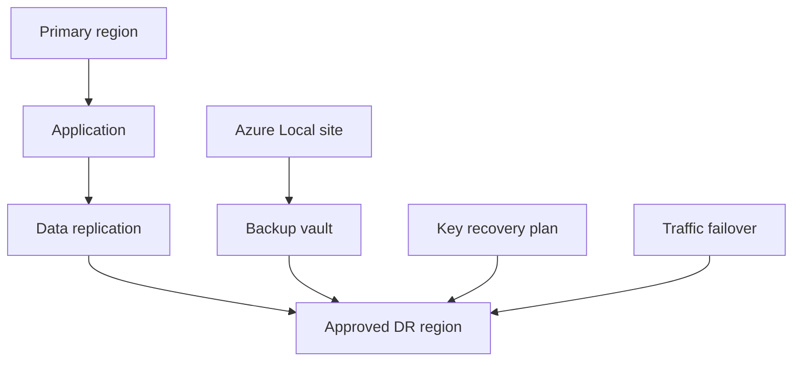

Disaster recovery is a sovereignty decision before it is a tooling decision. A recovery plan that restores service in a prohibited region can meet an uptime target and still fail the regulatory requirement. Start by defining which outages you must survive, what data can move, which keys can be restored, and who can authorize failover.

Use this guidance when an application needs formal recovery time objective and recovery point objective targets, cross-region failover, on-premises recovery, or key recovery. Keep simple backup and restore for low-criticality workloads where a longer outage is acceptable.

## Recovery targets

The Azure Well-Architected Framework reliability guidance recommends defining reliability and recovery targets for critical flows. For disaster recovery, the two targets that drive architecture are recovery time objective and recovery point objective.

| Metric | Meaning | Design effect |
| --- | --- | --- |
| Recovery time objective | Maximum acceptable time to restore a flow after failure. | Determines whether backup restore, warm standby, or active-active is needed. |
| Recovery point objective | Maximum acceptable data loss measured in time. | Determines backup frequency, replication mode, and event replay design. |
| Maximum tolerable outage | Business limit for total interruption. | Determines manual approval and crisis operating model. |
| Recovery confidence | Evidence that recovery works. | Determines test frequency, automation, and audit records. |

Do not set the same target for every flow. A public status page, a payment API, and a monthly report usually need different targets. Sovereign workloads also need a residency target: the set of regions or sites allowed during normal operations, testing, and failover.

## Pattern choices

| Pattern | When to use | Sovereignty trade-off |
| --- | --- | --- |
| Backup and restore | Long recovery time is acceptable. | Simplest data boundary control, but recovery can take hours. |
| Pilot light | Core data and minimal services run in secondary region. | Lower cost than warm standby, but more moving parts than restore-only. |
| Warm standby | Scaled-down full environment runs in secondary region. | Faster recovery, but constant replicated data and key availability are required. |
| Active-passive | Primary serves traffic, secondary can take over. | Clear authority, simpler writes, failover runbooks must be tested. |
| Active-active | Multiple regions serve traffic at the same time. | Best availability, but hardest consistency, routing, and residency model. |

## Region pairs and in-boundary DR

Azure region pairs are associated regions that are usually in the same geography. Microsoft Learn states that a small number of Azure services use region pairs for geo-replication, geo-redundancy, and some aspects of disaster recovery. It also states that many regions are not paired and that many services support geo-redundancy whether regions are paired or not ([source](https://learn.microsoft.com/azure/reliability/regions-paired)).

Region pairs are useful, but they are not automatic disaster recovery. Microsoft Learn explicitly warns that deploying resources to a paired region does not automatically make them resilient or provide automatic high availability, disaster recovery, or failover ([source](https://learn.microsoft.com/azure/reliability/regions-paired)).

For sovereignty:

1. Prefer secondary regions inside the same approved geography or legal boundary.
2. Check whether the region pair is restricted-access, asymmetric, or outside the boundary.
3. For EU workloads, use EU Data Boundary regions that match the product's data residency requirements.
4. For country-specific residency, do not assume a regional pair is allowed. France Central to France South can be valid for French residency if the restricted region is available to the customer, while West Europe to North Europe can be valid for broader EU requirements.
5. For nonpaired regions, choose another approved region if the service supports arbitrary secondary regions. If it does not, use zone redundancy, backup restore, or Azure Local recovery instead.

## Azure Site Recovery and Azure Backup

Azure Site Recovery provides continuous replication, failover, and recovery for business-critical workloads. Microsoft Learn states that Site Recovery manages replication for Azure VMs between Azure regions, from Azure Extended Zones to the connected region, and from on-premises VMs, Azure Stack VMs, and physical servers ([source](https://learn.microsoft.com/azure/site-recovery/site-recovery-overview)).

Use Site Recovery when you need orchestration, failover testing, recovery plans, and failback. It supports disaster recovery drills without affecting ongoing replication. It can also protect Azure Local Hyper-V virtual machine workloads to Azure, but that Azure Local integration is labeled preview in the Site Recovery overview ([source](https://learn.microsoft.com/azure/site-recovery/site-recovery-overview)).

Azure Backup protects data and restores it when needed. Microsoft Learn states that Azure Backup is for backup and restore, and Site Recovery is for disaster recovery and failover orchestration ([source](https://learn.microsoft.com/azure/backup/backup-overview)). Use Backup for accidental deletion, corruption, ransomware recovery, and compliance retention. Use immutable backup, soft delete, and vault access controls for ransomware resistance.

Design the two together. Backups help you recover from corruption that replication might copy to the secondary region. Replication helps you meet short recovery targets that backups alone cannot meet.

## Azure Local recovery options

Azure Local changes the recovery model because workloads can run on customer-owned infrastructure. Use Azure Local when the workload must remain on premises, when disconnected operations are required, or when cloud failover is not allowed.

Options include:

| Scenario | Recovery pattern |
| --- | --- |
| Connected Azure Local with cloud DR allowed | Replicate supported VMs to Azure with Site Recovery where the preview status and support matrix fit the workload. |
| Connected Azure Local with in-country cloud DR | Replicate only to approved Azure regions and keep backups in approved vault regions. |
| Disconnected Azure Local | Build local backup, spare capacity, and secondary-site recovery into the private cloud operating model. |
| Application-level DR | Use database, queue, or application replication between Azure Local sites when infrastructure-level replication cannot meet residency or availability needs. |

For disconnected operations, test recovery without cloud dependencies. Keep runbooks, installation media, certificates, key shares, and backups reachable in the disconnected environment. If the workload uses Arc-enabled services, confirm which services are supported in disconnected mode before writing a recovery plan.

## Key availability in DR

Encrypted data is recoverable only if keys are recoverable. Key Vault and Managed HSM design must match the recovery pattern.

For standard Azure Key Vault, Microsoft Learn reliability guidance says Key Vault replicates vault contents within the region and, when the region has a paired region in the same geography, also replicates contents to the paired region ([source](https://learn.microsoft.com/azure/reliability/reliability-key-vault)). For critical workloads, review whether that behavior fits the boundary and whether the application can continue if the vault endpoint is unavailable.

For Managed HSM, Microsoft Learn recommends downloading and securely storing the security domain immediately after provisioning, using a multiperson quorum with at least three key holders, enabling purge protection, implementing backups, and enabling multiregion replication for mission-critical workloads that need a higher service-level agreement ([source](https://learn.microsoft.com/azure/reliability/reliability-managed-hsm)). Without the security domain, disaster recovery is not possible because Microsoft cannot recover it for you.

Key recovery decisions:

1. Store security domain shares and private keys in separate approved locations.
2. Back up HSM contents to approved storage.
3. Test restore to a nonproduction HSM that uses the same security domain.
4. Update applications to use the DR key endpoint if the recovered HSM has a different name and URI.
5. Keep key failover approvals separate from routine operator access.

## Limits and trade-offs

Active-active designs reduce outage time but make data consistency harder. They can also create residency issues when both regions accept writes. If data has a single legal home, use single-writer patterns, regional partitioning, or strict routing.

Paired-region services can replicate outside the region automatically depending on the service and redundancy setting. Review service-specific reliability guidance before enabling geo-redundancy. For example, a storage redundancy choice can imply replication to a paired region. That can be correct for EU-wide residency and wrong for single-country residency.

DR tests can move data. A test failover, restored backup, or copied production dataset must use the same boundary controls as a real incident. Mask or synthesize test data when the target environment is not approved for production data.

Manual approvals protect sovereignty but add recovery time. Decide which actions require human authorization, which can be automated, and which emergency roles can approve failover. Record those decisions in the recovery plan, not in an incident chat.

## Sources

- [Architecture strategies for defining reliability targets](https://learn.microsoft.com/azure/well-architected/reliability/metrics)
- [Azure region pairs and nonpaired regions](https://learn.microsoft.com/azure/reliability/regions-paired)
- [About Site Recovery](https://learn.microsoft.com/azure/site-recovery/site-recovery-overview)
- [What is the Azure Backup service?](https://learn.microsoft.com/azure/backup/backup-overview)
- [Reliability in Azure Key Vault](https://learn.microsoft.com/azure/reliability/reliability-key-vault)
- [Reliability in Azure Key Vault Managed HSM](https://learn.microsoft.com/azure/reliability/reliability-managed-hsm)
- [What is the EU Data Boundary?](https://learn.microsoft.com/privacy/eudb/eu-data-boundary-learn)
