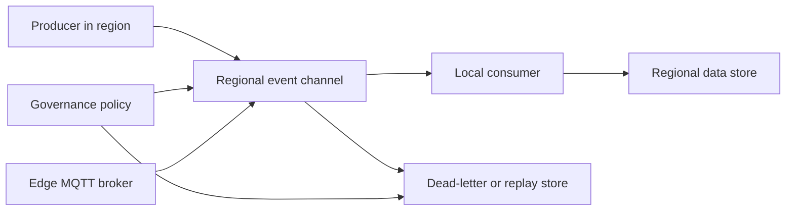

Event-driven architecture decouples producers from consumers, but it can also hide data movement. An event might contain personal data, operational telemetry, device identifiers, or regulated business facts. Once published, it can be copied to multiple consumers, dead-letter queues, archives, and analytics stores. Sovereign design treats every event channel as a data boundary.

Use this architecture when several subsystems must respond to the same fact, when producers and consumers need independent scale, or when IoT and operational technology systems produce high-volume signals. Avoid it when a simple request and response call gives better consistency, simpler recovery, and lower operational cost.

## Event style decisions

Azure Architecture Center describes an event-driven architecture as producers, consumers, and channels that transfer events. It distinguishes publish-subscribe events from event streams. Publish-subscribe sends discrete notifications to subscribers. Event streaming writes ordered records to a durable log that consumers can read and replay.

For sovereign workloads, make four decisions before choosing a service.

| Decision | Architecture question | Sovereignty check |
| --- | --- | --- |
| Payload | Does the event include the data or only a key? | Prefer keys or references when consumers can fetch data from the same approved boundary. |
| Channel | Is this a notification, stream, or transactional message? | Place the channel in the same region as the data owner. |
| Consumer | Can consumers run in different regions? | If not, block subscriptions or consumer groups outside the boundary. |
| Retention | How long do events, dead letters, and captures persist? | Apply retention, encryption, and deletion rules to every copy. |

## Choose Event Grid, Event Hubs, or Service Bus

Microsoft's comparison of Azure messaging services separates Event Grid, Event Hubs, and Service Bus by purpose, model, and features. Event Grid is for reactive event routing. Event Hubs is for high-throughput streaming and ingestion. Service Bus is for enterprise transactional messaging ([source](https://learn.microsoft.com/azure/event-grid/compare-messaging-services)).

| Service | Use it for | Important design point |
| --- | --- | --- |
| Event Grid | Status changes, cloud events, and serverless event routing. | Delivery is at least once. It has no ordering guarantee. |
| Event Hubs | Telemetry, distributed streams, real-time analytics, and replay. | Ordering is per partition. Capture and replay are available. |
| Service Bus | Order processing, workflows, financial messages, and commands. | Sessions support first-in-first-out processing, and transactions and duplicate detection are available. |

Do not select the service only by throughput. A high-volume stream with replay belongs in Event Hubs. A business command that must be handled once by one consumer often belongs in Service Bus. A notification that many handlers can react to independently often belongs in Event Grid.

## Regional pinning and geo-disaster recovery

Pin each event namespace, topic, hub, queue, and processing application to the region that owns the data. If a product publishes EU personal data, use EU regions for the broker, consumers, dead-letter storage, checkpoint storage, and analytics exports. The EU Data Boundary follows the Azure region where the customer deploys the service, while non-regional services can require separate configuration ([source](https://learn.microsoft.com/privacy/eudb/eu-data-boundary-learn)).

Geo-disaster recovery needs a separate residency decision. Some services support aliases, failover, paired regions, or replay from storage. Those features do not remove the need to choose an approved secondary region. If an Event Hubs Capture archive writes to storage in a different geography, the archive becomes a data transfer. If Service Bus geo-disaster recovery moves metadata but not messages, you still need a message recovery pattern that meets your recovery point objective.

Design the failover contract:

1. Define the primary and secondary regions for each data classification.
2. Decide whether consumers resume from a replay log, a checkpoint, or a duplicate-safe command queue.
3. Make every event idempotent. At-least-once delivery means consumers must handle duplicates.
4. Keep correlation IDs and causation IDs in the event envelope so operations teams can trace a business transaction across asynchronous hops.
5. Test failover with representative events, including dead-letter processing and replay.

## Edge eventing

For local industrial or disconnected edge sites, use local eventing before cloud forwarding. Azure IoT Operations is documented as a set of modular Kubernetes-native services deployed to an Azure Arc-enabled cluster, and it includes an edge-native MQTT broker that powers event-driven architectures ([source](https://learn.microsoft.com/azure/iot-operations/overview-iot-operations)). The MQTT broker is standards-compliant, supports MQTT v3.1.1 and MQTT v5, and provides the messaging plane for Azure IoT Operations ([source](https://learn.microsoft.com/azure/iot-operations/manage-mqtt-broker/overview-broker)).

Use the MQTT broker when devices, operational technology connectors, or local applications must continue exchanging events near the equipment. Forward only the events that the cloud workload needs. Keep raw sensor payloads, high-frequency telemetry, or plant-specific identifiers local if policy requires local processing.

Event Grid on Kubernetes with Azure Arc is a separate service. Its Microsoft Learn overview still labels it public preview and says preview versions are provided without a service-level agreement and are not recommended for production workloads ([source](https://learn.microsoft.com/azure/event-grid/kubernetes/overview)). Do not use it as the production edge eventing default unless your architecture explicitly accepts preview terms. If the workload needs production local MQTT eventing, evaluate Azure IoT Operations instead.

## Sovereignty considerations

Event payload design is the main control. Do not include personal data in an event when a stable identifier and a regional lookup can work. If a consumer in another boundary only needs a status change, publish a status event without regulated fields. If a downstream domain needs the full record, require an explicit data product, API, or sharing contract with approval.

Encrypt event data at rest with service-supported keys. Use customer-managed keys where the service and tier support them. Store keys in the same boundary as the broker. Use private endpoints and disable public network access where supported. For hybrid eventing, restrict outbound paths from edge clusters to approved endpoints and record which events are forwarded to cloud services.

Dead-letter queues and poison event stores need the same controls as the main channel. They often contain the messages that failed validation, which can include sensitive payloads. Keep them regional, restrict access, and review them before copying events into a support ticket or global incident workspace.

## Limits and trade-offs

Event-driven systems accept eventual consistency. A consumer can lag behind the producer, fail after partially processing an event, or process the same event twice. For financial, safety, or legal workflows, decide which actions need Service Bus sessions, transactions, a saga orchestrator, or a synchronous confirmation path.

Ordering is not global across most distributed event systems. Event Hubs orders records within a partition, so choose a partition key such as account, device, or aggregate identifier. Service Bus sessions support ordered message handling for related messages. Event Grid has no ordering guarantee, so do not use it when order is part of the business invariant.

Broker topology gives loose coupling, but it leaves error handling and transaction state to participants. Mediator topology gives more control but introduces a coordinator that can fail or become a bottleneck. Choose mediator topology for cross-domain processes that need compensating actions and audit visibility. Choose broker topology when each consumer can react independently.

## Sources

- [Event-driven architecture style](https://learn.microsoft.com/azure/architecture/guide/architecture-styles/event-driven)
- [Choose between Azure Event Grid, Event Hubs, and Service Bus](https://learn.microsoft.com/azure/event-grid/compare-messaging-services)
- [Event Grid on Kubernetes with Azure Arc overview](https://learn.microsoft.com/azure/event-grid/kubernetes/overview)
- [What is Azure IoT Operations?](https://learn.microsoft.com/azure/iot-operations/overview-iot-operations)
- [Azure IoT Operations built-in local MQTT broker](https://learn.microsoft.com/azure/iot-operations/manage-mqtt-broker/overview-broker)
- [What is the EU Data Boundary?](https://learn.microsoft.com/privacy/eudb/eu-data-boundary-learn)
