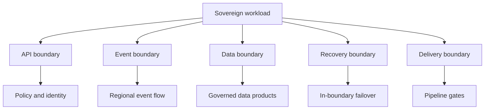

Architecture patterns become sovereignty controls when you decide where data moves, where keys live, which network paths are allowed, and how teams prove those decisions during delivery and operations. This module applies Azure Architecture Center patterns and Well-Architected Framework guidance to workloads that must keep regulated data inside an approved region, the EU Data Boundary, or an Azure Local environment.

Use the pages in this module as design reviews. Each pattern page starts with when to use the pattern, then moves into design decisions, sovereignty checks, trade-offs, and Microsoft services that implement the pattern.

## Pattern selection frame

| Need | Pattern page | Main sovereignty decision |
| --- | --- | --- |
| Publish APIs without exposing backends | API gateway patterns | Put gateway policy, certificates, token validation, and backend access in the same region as the data. |
| Decouple producers and consumers | Event-driven architecture | Choose discrete events, streams, or brokered messages based on ordering, replay, and residency needs. |
| Share data across domains | Data mesh sovereignty | Keep ownership with domains while using Purview, Fabric, and policy to enforce common controls. |
| Recover from outages | Disaster recovery | Match recovery targets to approved failover regions, key recovery, and on-premises options. |
| Ship changes safely | DevSecOps pipeline | Stop insecure code, exposed secrets, and noncompliant infrastructure before deployment. |

## Sources

- [Azure Architecture Center patterns](https://learn.microsoft.com/azure/architecture/patterns/)
- [Azure Well-Architected Framework pillars](https://learn.microsoft.com/azure/well-architected/pillars)
- [What is Microsoft Sovereign Cloud?](https://learn.microsoft.com/azure/azure-sovereign-clouds/microsoft-sovereign-cloud)
- [What is the EU Data Boundary?](https://learn.microsoft.com/privacy/eudb/eu-data-boundary-learn)
- [Controls and principles in Sovereign Public Cloud](https://learn.microsoft.com/azure/azure-sovereign-clouds/public/overview-controls-principles)
