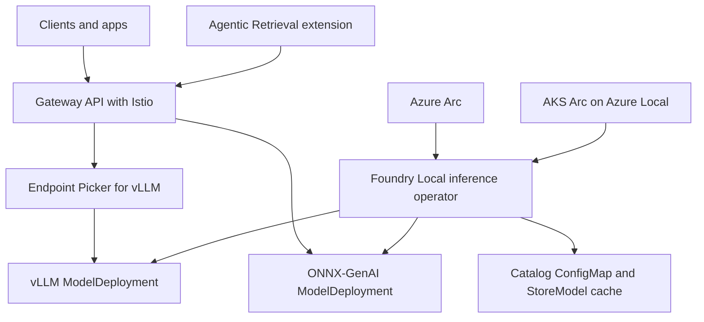

[Foundry Local on Azure Local is in preview](https://learn.microsoft.com/azure/azure-sovereign-clouds/private/foundry-local/overview). Treat every production design as a preview design with change control, non-production validation, rollback criteria, and documented assumptions. The platform runs as an Azure Arc extension on an Arc-enabled Kubernetes cluster on Azure Local. The inference operator manages `Model`, `ModelDeployment`, and internal `StoreModel` resources, then creates Kubernetes Deployments, Services, Secrets, certificates, and Gateway API resources.

Agentic Retrieval is a separate [preview](https://learn.microsoft.com/azure/azure-arc/agents-tools-foundry-local/overview) Arc-enabled Kubernetes extension. Agentic Retrieval (formerly Edge RAG) received its current name in [June 2026](https://learn.microsoft.com/azure/azure-arc/agents-tools-foundry-local/whats-new#june-2026). Use the current name in architecture documents. Agentic Retrieval provides the agentic RAG platform. Foundry Local provides the recommended local language model endpoint.

## Production component layout

| Layer | Production decision | Learn source |
| --- | --- | --- |
| Azure Local and AKS Arc | Run a Kubernetes cluster on Azure Local, registered with Azure Arc as a `connectedClusters` resource. Kubernetes must be version 1.29 or later. | [Requirements](https://learn.microsoft.com/azure/azure-sovereign-clouds/private/foundry-local/concept-requirements) |
| Foundry Local extension | Install the `microsoft.foundry` Arc extension after preview access is approved. The extension's managed identity requires the Azure Reader role at the Arc-enabled Kubernetes cluster scope as of [September 2026](https://learn.microsoft.com/azure/azure-sovereign-clouds/private/foundry-local/whats-new#september-2026). | [What's new](https://learn.microsoft.com/azure/azure-sovereign-clouds/private/foundry-local/whats-new#september-2026) |
| Model lifecycle | Use `ModelDeployment` resources for running endpoints. The operator reconciles resources and continuously checks deployment health. | [Inference operator](https://learn.microsoft.com/azure/azure-sovereign-clouds/private/foundry-local/concept-inference-operator) |
| Traffic ingress | Route model traffic through Kubernetes Gateway API with Istio. This replaced the NGINX ingress data path in [July 2026](https://learn.microsoft.com/azure/azure-sovereign-clouds/private/foundry-local/whats-new#july-2026). | [TLS and Gateway API](https://learn.microsoft.com/azure/azure-sovereign-clouds/private/foundry-local/how-to-configure-tls-authentication) |
| Agentic Retrieval | Deploy `microsoft.arc.rag` for the agentic RAG layer. It calls a Foundry Local or BYOM OpenAI-compatible chat completions endpoint. | [Agentic Retrieval requirements](https://learn.microsoft.com/azure/azure-arc/agents-tools-foundry-local/requirements) |

## Multi-node deployment

[Multi-node Kubernetes deployment support was added in June 2026](https://learn.microsoft.com/azure/azure-sovereign-clouds/private/foundry-local/whats-new#june-2026). Use it for concurrent users, larger models, and production separation between CPU and GPU workloads. Kubernetes schedules pods with standard resource requests, limits, node selectors, and affinity rules, so you can keep CPU-only models on CPU nodes and vLLM GPU deployments on GPU-capable nodes.

The minimum worker node size for Foundry Local is [Standard_D4s_v3 with 4 vCPU and 16 GiB, and the recommended worker size is Standard_D8s_v3 with 8 vCPU and 32 GiB](https://learn.microsoft.com/azure/azure-sovereign-clouds/private/foundry-local/concept-requirements#worker-node-capacity). Learn also warns not to use the default `az aksarc create` worker size `Standard_A4_v2` because it has 8 GiB memory. For production, plan at least two worker nodes when you need high availability or separate GPU pools.

GPU workloads require NVIDIA GPU nodes with CUDA drivers and the NVIDIA Kubernetes device plugin. Supported NVIDIA DDA-passthrough SKUs include [`Standard_NC*_A2`, `Standard_NC*_L4_*`, `Standard_NC*_L40_*`, `Standard_NC*_L40S_*`, `Standard_NC*_RTX6000Pro_*`, and Tesla T4 `Standard_NK*`; AMD GPUs are not supported](https://learn.microsoft.com/azure/azure-sovereign-clouds/private/foundry-local/concept-requirements#gpu-requirements). Size by the model and runtime, not by an abstract GPU count.

## Gateway API and inference-aware routing

[In July 2026](https://learn.microsoft.com/azure/azure-sovereign-clouds/private/foundry-local/whats-new#july-2026), Foundry Local moved model traffic from NGINX ingress to Kubernetes Gateway API with Istio as the provider. The `spec.endpoint.exposure` setting controls access:

| Exposure | Use it when | Behavior |
| --- | --- | --- |
| `internal` | Service-to-service callers run inside the cluster. | The operator attaches an HTTPRoute to the internal gateway. This is the default. |
| `external` | Clients outside the cluster must call the model endpoint. | The operator creates or uses an external LoadBalancer gateway and attaches the route. |
| `none` | Another mesh or route owner will handle traffic. | The operator creates the service but no HTTPRoute. |

External endpoints terminate TLS at the gateway. For production, Learn recommends a customer-managed TLS secret for the external gateway instead of relying on an internal CA certificate for off-cluster clients. The gateway still forwards to model services over HTTPS, and the operator creates a `BackendTLSPolicy` so the gateway validates backend certificates.

For multi-replica vLLM deployments, Foundry Local uses an Endpoint Picker (EPP) by default. EPP scores replicas with live signals from vLLM, including queue depth, KV-cache use, and prefix-cache locality. It routes through the Gateway API Inference Extension rather than simple round-robin. This matters for chat because follow-up turns can return to a replica that already has the conversation prefix in its KV cache.

## Authentication and authorization

Foundry Local supports three data-plane authentication methods in preview. API keys and Microsoft Entra ID can coexist on the same endpoint. [Kubernetes service account token authentication was added in September 2026](https://learn.microsoft.com/azure/azure-sovereign-clouds/private/foundry-local/whats-new#september-2026) for in-cluster callers.

| Method | Best fit | Authorization behavior |
| --- | --- | --- |
| API key | Service-to-service calls, local development, and fallback during Azure connectivity loss. | A valid key grants full inference access. The operator creates primary and secondary keys for rotation. |
| Microsoft Entra ID | Enterprise clients that need Azure RBAC checks. | The middleware validates the JWT and checks Azure RBAC for the required data action. |
| Kubernetes service account token | In-cluster workloads, including limited-connectivity and disconnected designs. | The `ModelDeployment` authorizes named service accounts with the `GeneralInferenceUser` role. |

API key authentication works inside the cluster without external connectivity. Service account token authentication does not require Azure connectivity, but the inference pod must reach the Kubernetes API. Entra ID depends on Microsoft Entra ID and Azure Resource Manager, with short-term caches for signing keys and RBAC results.

## Region and platform constraints

Foundry Local is available as an Azure Arc extension in [18 named Azure regions](https://learn.microsoft.com/azure/azure-sovereign-clouds/private/foundry-local/overview#supported-regions). Region support is a preview-era deployment constraint, not a data residency guarantee. Put the Arc-enabled Kubernetes cluster in a supported region, then enforce data placement through Azure Local, network, identity, and operational controls.

Disconnected deployments require [Azure Local Disconnected Operations 2604.3.0 or later](https://learn.microsoft.com/azure/azure-sovereign-clouds/private/foundry-local/concept-requirements#on-premises-resources). The Foundry Local expansion pack imports extension images, Istio, Gateway API CRDs, Gateway API Inference Extension CRDs, EPP images, cert-manager, trust-manager, and model artifacts into the local `edgeartifacts` registry. Model expansion packs add more catalog models.

## Agentic Retrieval integration

Agentic Retrieval is the RAG and agent layer. Foundry Local is the model-serving layer. For best experience, Learn recommends installing Foundry Local first, then using its endpoint URL when you deploy Agentic Retrieval.

Agentic Retrieval requirements that shape the Foundry Local architecture include:

- The extension is `microsoft.arc.rag`.
- All deployments require an external language model endpoint because Phi-3.5 and Mistral-7B are no longer bundled as of the [June 2026 rename release](https://learn.microsoft.com/azure/azure-arc/agents-tools-foundry-local/whats-new#june-2026).
- The recommended language model endpoint is GPT-OSS-20B through Foundry Local on Azure Local.
- The cluster uses two GPUs for local embedding models, one for BGE-M3 text embeddings and one for CLIP ViT-L/14 image embeddings. Docling runs on CPU.
- Deployment modes are `combined`, `agentic`, and `knowledge`.
- In the [July 2026](https://learn.microsoft.com/azure/azure-arc/agents-tools-foundry-local/whats-new#july-2026) release, the cluster needs a CNI that enforces Kubernetes NetworkPolicy. Learn recommends Calico.

Agentic Retrieval combined mode deploys more than 60 pods and needs [three Standard_D8s_v3 CPU workers, one GPU worker, at least 24 vCPU, and at least 96 GB RAM](https://learn.microsoft.com/azure/azure-arc/agents-tools-foundry-local/requirements#minimum-cluster-node-capacity). Its recommended GPT-OSS-20B Foundry Local endpoint runs outside the Agentic Retrieval deployment and needs its own GPU. Learn gives [24 GB VRAM minimum and 48 GB VRAM recommended for production](https://learn.microsoft.com/azure/azure-arc/agents-tools-foundry-local/requirements#hardware-requirements-gpt-oss-20b-via-foundry-local).

## Sources

- [What is Foundry Local on Azure Local?](https://learn.microsoft.com/azure/azure-sovereign-clouds/private/foundry-local/overview)
- [What's new in Foundry Local on Azure Local](https://learn.microsoft.com/azure/azure-sovereign-clouds/private/foundry-local/whats-new)
- [Requirements for Foundry Local on Azure Local](https://learn.microsoft.com/azure/azure-sovereign-clouds/private/foundry-local/concept-requirements)
- [Foundry Local multiple node deployment](https://learn.microsoft.com/azure/azure-sovereign-clouds/private/foundry-local/concept-multi-node-deployment)
- [Inference runtimes in Foundry Local on Azure Local](https://learn.microsoft.com/azure/azure-sovereign-clouds/private/foundry-local/concept-inference-runtimes)
- [Configure TLS for Foundry Local](https://learn.microsoft.com/azure/azure-sovereign-clouds/private/foundry-local/how-to-configure-tls-authentication)
- [Authentication and authorization in Foundry Local](https://learn.microsoft.com/azure/azure-sovereign-clouds/private/foundry-local/concept-authentication-authorization)
- [What is Agentic Retrieval in Agents and Tools with Foundry Local?](https://learn.microsoft.com/azure/azure-arc/agents-tools-foundry-local/overview)
- [What's new in Agentic Retrieval in Foundry Local](https://learn.microsoft.com/azure/azure-arc/agents-tools-foundry-local/whats-new)
- [What you need for Agentic Retrieval in Foundry Local](https://learn.microsoft.com/azure/azure-arc/agents-tools-foundry-local/requirements)
