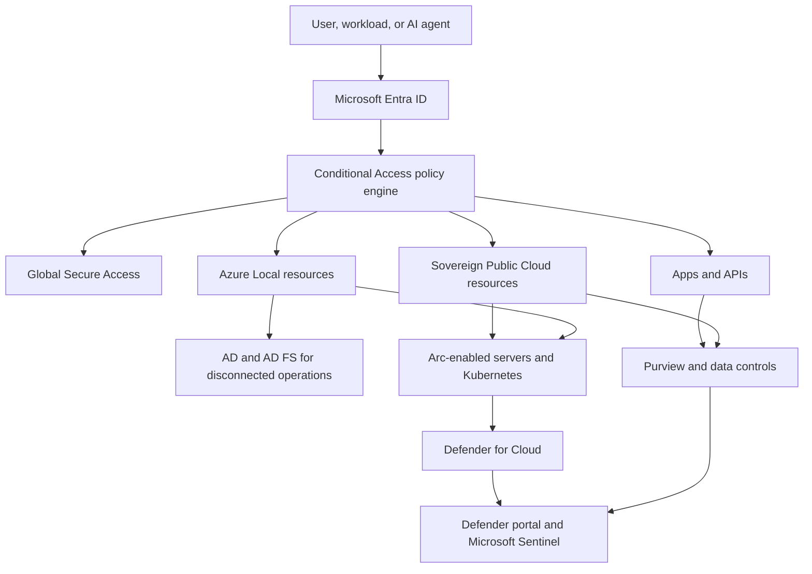

import DiagramContainer from "~/components/DiagramContainer.astro";

Zero Trust architecture for a sovereign estate has three planes. The policy plane decides whether access is allowed. The enforcement plane applies the decision at identity, network, app, infrastructure, and data boundaries. The evidence plane proves the decision happened and gives SecOps enough signal to detect abuse.

<DiagramContainer title="Zero Trust pillars for a sovereign estate" defaultOpen>

</DiagramContainer>

## Reference architecture

The same pattern applies across Sovereign Public Cloud, Azure Local, and Arc-enabled resources, but the enforcement point changes by environment.

Use Entra ID as the common identity anchor for connected resources. Conditional Access is the [Microsoft Zero Trust policy engine](https://learn.microsoft.com/entra/identity/conditional-access/overview) that combines user, group, agent, location, device, app, and risk signals before it grants, blocks, or steps up access. For workloads, use managed identities or Microsoft Entra Workload ID instead of secrets. For AI agents, use [Microsoft Entra Agent ID](https://learn.microsoft.com/entra/agent-id/what-is-microsoft-entra-agent-id) so each agent has a governed identity, least-privilege access, and audit records.

Sovereign design adds two constraints to the connected pattern. First, administrators must know which identity and security signals leave the local site, region, or tenant. Second, the design must still support the edge site when cloud connectivity is unavailable or deliberately removed.

## Identity and access plane

Identity is the first control plane because every request starts with a subject. In connected Azure subscriptions, use Entra ID, Conditional Access, Entra ID Protection, Entra ID Governance, and Privileged Identity Management to reduce standing privilege. In Azure Local, use the same identity model for connected operations when the management plane can reach Azure.

For Azure Local disconnected operations, do not design around live Entra ID policy enforcement. Microsoft Learn states that disconnected operations integrate with [Active Directory for groups and memberships and AD FS for authentication](https://learn.microsoft.com/azure/azure-local/manage/disconnected-operations-identity). The deployment specifies a root operator, creates an operator subscription, and uses Azure role-based access control within that disconnected environment. Role assignments and policies are scoped per subscription rather than inherited from the operator subscription, so architects must define operator groups, subscription ownership, and break-glass access before the site is isolated.

Use this identity split when documenting the estate.

| Environment | Identity authority | Access decision pattern |
| --- | --- | --- |
| Sovereign Public Cloud | Entra ID tenant in the required geography or cloud environment | Conditional Access, PIM, managed identities, policy and logging in Azure |
| Azure Local connected | Entra ID plus Azure Local and Arc management | Conditional Access for cloud management and local host controls for platform operations |
| Azure Local disconnected | Active Directory groups and AD FS authentication | Local operator subscription, local role assignments, local logging and synchronization |
| Arc-enabled resources | Entra ID and Azure Arc resource identity | Azure RBAC, Azure Policy, Defender for Cloud plans, extension governance |
| AI agents | Entra Agent ID and workload identity patterns | Governed nonhuman identities, least-privilege permissions, sign-in and audit logs |

## Network and connectivity plane

Global Secure Access is the Microsoft Entra umbrella for Microsoft Entra Internet Access and Microsoft Entra Private Access. The page states that [Internet Access and Private Access are generally available](https://learn.microsoft.com/entra/global-secure-access/overview-what-is-global-secure-access). Use it when the design goal is identity-aware access from users, branches, or devices to Microsoft services, internet destinations, SaaS apps, or private resources.

Global Secure Access is not a replacement for every Azure network control. It answers who can connect and under which identity, device, location, and risk conditions. Azure Firewall, network security groups, private endpoints, and Private Link still answer how traffic is segmented, inspected, and kept off the public internet inside the Azure estate.

| Requirement | Prefer Global Secure Access | Prefer Azure network controls |
| --- | --- | --- |
| Replace broad VPN access to private apps | Yes, use Entra Private Access for per-app access | Use for the private endpoint, subnet, and route design behind the app |
| Filter public internet and SaaS destinations by identity | Yes, use Entra Internet Access and Conditional Access | Use Azure Firewall when the traffic originates from Azure workloads or hub networks |
| Keep PaaS traffic off public endpoints | No | Use Private Link and private endpoints |
| Segment east-west workload traffic | No | Use subnet design, Azure Firewall, network security groups, Kubernetes network policy, or host firewalls |
| Apply session policy to user access | Yes | Use network controls as a second enforcement layer |

In sovereign designs, document where network logs are stored, which DNS paths resolve private endpoints, and whether the edge site can still resolve local identity, management, and app endpoints during disconnection.

## Data controls

Zero Trust assumes the network can fail, so the data pillar must carry protection with the asset. Use Microsoft Purview for classification, sensitivity labels, retention, data loss prevention, and evidence for compliance teams. Use Customer-Managed Keys when the customer must control encryption keys. For higher key control, Managed HSM provides FIPS 140-3 Level 3, single-tenant HSM isolation, and customer-controlled security domains according to the Sovereign Public Cloud External Key Management guidance.

Confidential computing supports the "assume breach" principle by reducing exposure while data is in use. Use confidential VMs, confidential containers, and secure key release where the workload and control requirements justify the operational complexity. Treat confidential computing as an extra isolation control, not a replacement for identity, patching, logging, or least privilege.

## Infrastructure and Arc plane

Azure Arc is the join point for servers, Kubernetes clusters, and services that must be governed from Azure but run outside Azure regions. Use Arc to attach resources to Azure RBAC, Azure Policy, tags, inventory, extensions, and Defender for Cloud. For Azure Local, Arc also lets architects apply cloud governance to local infrastructure and VMs when connected operations are available.

Microsoft Defender for Cloud should be planned with the same resource inventory. Defender for Servers protects Windows and Linux machines across Azure, AWS, GCP, and on-premises machines. Defender for Servers Plan 2 uses agentless scanning and Defender for Endpoint integration for many features, while several Plan 2 capabilities such as OS baseline checks against the Microsoft Cloud Security Benchmark and periodic system updates apply only to machines onboarded with Azure Arc.

For containers, Arc-enabled Kubernetes requires the Arc onboarding path and Defender for Containers as an Arc extension. The support matrix marks control plane detection, workload detection, and advanced hunting for Arc-enabled Kubernetes runtime threat protection as preview, while workload hardening for Arc-enabled Kubernetes is generally available. This matters for architecture diagrams and proposals: do not present every Defender for Containers capability as equal across AKS, EKS, GKE, and Arc-enabled Kubernetes.

## SecOps and evidence plane

The SecOps pillar closes the loop. Defender for Cloud supplies posture and workload protection signals. The Defender portal brings cloud security posture and threat protection into the same operations surface as other Microsoft security workloads. Microsoft Sentinel provides SIEM, SOAR, content, connectors, hunting, and automation. When Sentinel is connected to the Defender portal, analysts can use shared incident management and advanced hunting without requiring Microsoft Defender XDR or an E5 license.

Design the evidence plane before you deploy controls. For each subscription, Azure Local site, Arc scope, and Sentinel workspace, record:

1. Which logs are required for audit, investigation, and regulatory evidence.
2. Where the logs are stored and whether that location meets residency requirements.
3. Who can read, export, and delete logs.
4. How disconnected sites export or forward logs when connectivity returns.
5. Which incidents should stay local, which should flow to a central SOC, and which require customer approval before escalation.

## Sources

- [Zero Trust as a security foundation](https://learn.microsoft.com/security/zero-trust/zero-trust-overview)
- [Overview: Technology pillars](https://learn.microsoft.com/security/zero-trust/deploy/overview)
- [What is Microsoft Entra?](https://learn.microsoft.com/entra/fundamentals/what-is-entra)
- [What is Microsoft Entra Agent ID?](https://learn.microsoft.com/entra/agent-id/what-is-microsoft-entra-agent-id)
- [What is Conditional Access?](https://learn.microsoft.com/entra/identity/conditional-access/overview)
- [What is Global Secure Access?](https://learn.microsoft.com/entra/global-secure-access/overview-what-is-global-secure-access)
- [Plan your identity for disconnected operations on Azure Local](https://learn.microsoft.com/azure/azure-local/manage/disconnected-operations-identity)
- [What is Microsoft Defender for Cloud?](https://learn.microsoft.com/azure/defender-for-cloud/defender-for-cloud-introduction)
- [Defender for Servers](https://learn.microsoft.com/azure/defender-for-cloud/defender-for-servers-overview)
- [Containers support matrix in Defender for Cloud](https://learn.microsoft.com/azure/defender-for-cloud/support-matrix-defender-for-containers)
