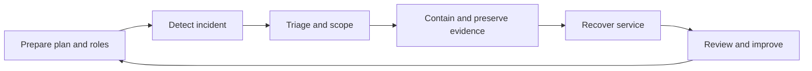

Incident response in a sovereign estate has two goals: stop the harm and preserve the controls that made the estate sovereign. Do not move evidence, grant support access, or run containment scripts without checking the data boundary, support access workflow, and notification triggers.

Microsoft's incident response overview points to the NIST Computer Security Incident Handling Guide and frames incident response around planning, detection, analysis, recovery, operations, and communications. Use that guidance with Microsoft Sentinel and Defender XDR incidents as the case-management layer.

## Response lifecycle

## Triage model

| Step | Decision | Sovereign evidence to record |
| --- | --- | --- |
| Assign owner | Who owns the incident and communications. | Sentinel owner, Defender XDR incident link, support request ID if opened. |
| Classify impact | Whether the incident affects identity, data, control plane, platform, or operations. | Subscriptions, tenants, Azure Local instances, regions, and data classes. |
| Set severity | Business impact, safety, legal, and regulatory effect. | Reason for severity and any support-plan severity selected. |
| Preserve evidence | Which logs, snapshots, exports, or device data are needed. | Workspace region, retention setting, chain of custody, and export destination. |
| Choose containment | Whether to block identity, isolate network, disable keys, or pause workload. | Change log and rollback plan. |

Microsoft's guidance calls out MTTA and MTTR as incident response metrics. MTTA ends when an analyst takes ownership and starts initial analysis. MTTR starts at that point and ends when remediation is complete.

## Sentinel and Defender XDR incidents

Microsoft Sentinel incidents aggregate relevant evidence for an investigation. They inherit entities from alerts, plus alert properties such as severity, status, and MITRE ATT&CK tactics and techniques. The incident details page is the central case page. Use it to review tasks, entities, alerts, investigation views, activity logs, comments, automation rules, and playbooks.

Use these patterns:

- Map entities in analytics rules so analysts can use incident investigation features.
- Use tasks for repeatable SOC procedures.
- Use playbooks for enrichment, collaboration, and response actions that are approved for the data boundary.
- Use the activity log and comments to record actions taken by analysts and automation.
- Close incidents with a classification and a comment that explains the conclusion.

Microsoft's incident response overview links Defender XDR and Sentinel as response tools. Use Defender XDR for incidents that span endpoint, identity, email, and cloud app signals. Use Sentinel when you need SIEM and SOAR case management across Azure, Azure Local, Arc-enabled resources, third-party products, and custom data sources.

## Regulatory notification considerations

This module does not replace legal advice. It teaches only Microsoft-documented triggers and tooling.

For DORA, Microsoft Learn states that January 17, 2025 is the compliance-readiness date for EU financial entities and designated critical ICT third-party providers. Learn also states that on November 18, 2025, the European Supervisory Authorities published the list of designated Critical ICT Third-Party Providers and identified Microsoft Ireland Operations Limited as a CTPP subject to ESA oversight. For operations teams, that means incident records for financial-sector workloads should preserve the service, timing, communications, and provider-dependency facts needed by the customer's DORA process.

For NIS2, Learn documents the NIS2 Directive as a Microsoft Purview Compliance Manager regulation template and as a built-in Microsoft Defender for Cloud regulatory-compliance standard. It does not publish a standalone Microsoft narrative page with incident-notification windows. Do not teach specific NIS2 reporting deadlines unless the customer's legal team provides them from the applicable national law.

## Microsoft support access controls

Customer Lockbox applies when Microsoft needs access to customer data for supported Azure services, including Azure Monitor Log Analytics, Azure Kubernetes Service, Azure Storage, Azure SQL, Azure Functions, Azure App Service, Azure OpenAI, and Virtual Machines in Azure. It requires at least a Developer Azure support plan. Requests stay in the customer queue for four days, then expire with no access granted. Subscription-scoped requests are approved by subscription Owners or Azure Customer Lockbox Approver for Subscription. Tenant-scoped requests are approved by Global Administrators.

Customer Lockbox does not trigger for external legal demands for data and has rare emergency exclusions. Do not tell customers that Lockbox covers every access path. Instead, document whether the affected service is in the supported-services list and whether the support case requires access to customer data.

Data Guardian is a Sovereign Public Cloud feature that applies enhanced operational oversight and control for remote access by Microsoft personnel to systems in defined regions such as EU plus EFTA. Authorized European-resident Microsoft personnel monitor access, and all such access is logged to a tamper-evident ledger that uses Azure Confidential Ledger. Use Data Guardian as an operational oversight control; use Customer Lockbox as the customer approval workflow for supported customer-data access.

## Azure Local incident specifics

Azure Local incidents often span host, storage, network, Arc, and Azure services. Before restarting nodes or changing quorum, collect the minimum evidence needed to explain the failure path.

| Incident type | First evidence | Boundary check |
| --- | --- | --- |
| Host or storage fault | Insights health fault, Health Service events, `Get-ClusterLog`, support logs. | Do logs go to Azure, local storage, or Microsoft support? |
| Arc management outage | `azcmagent show`, `azcmagent check`, Azure Resource Health, Arc service health. | Does workload keep running if Arc management is impaired? |
| AKS on Azure Local issue | `az aksarc get-logs` or `Get-AzAksArcLog`, kubeconfig, node IP, support module validation. | If disconnected, Learn says to recover the network before sending AKS logs to Microsoft Support. |
| Support escalation | Azure support request, `Send-DiagnosticData` correlation ID, Remote Support access grant. | Is access Diagnostics only or Diagnostics and Repair, and when does it expire? |

For Azure Local Remote Support, Microsoft support can access the device only after the customer submits a support request and grants consent. The access is just-in-time, limited time, audited, and scoped to Diagnostics or Diagnostics and Repair. `Enable-RemoteSupport -AccessLevel Diagnostics -ExpireInMinutes 1440` grants diagnostic access for one day. If no expiration is set for Diagnostics and Repair, Learn states access expires in eight hours by default. The maximum is 14 days.

## Review checklist

After recovery, update the runbook, not only the incident record.

1. Confirm that the incident timeline includes detection time, analyst ownership time, containment time, recovery time, and close time.
2. Verify that evidence remained in the approved workspace, storage account, tenant, or Azure Local location.
3. Attach support request IDs, Customer Lockbox records, Remote Support session history, and Sentinel incident links.
4. Check whether Service Health or Resource Health explains any Azure-side symptoms.
5. Add action items for alert tuning, workbook changes, DCR changes, playbook changes, or support-plan changes.

## Sources

- [Incident response overview](https://learn.microsoft.com/security/operations/incident-response-overview)
- [Investigate Microsoft Sentinel incidents in depth in the Azure portal](https://learn.microsoft.com/azure/sentinel/investigate-incidents)
- [What is DORA?](https://learn.microsoft.com/compliance/dora/dora-what-is-dora)
- [Regulatory compliance standards in Microsoft Defender for Cloud](https://learn.microsoft.com/azure/defender-for-cloud/concept-regulatory-compliance-standards)
- [Customer Lockbox for Microsoft Azure](https://learn.microsoft.com/azure/security/fundamentals/customer-lockbox-overview)
- [What is Data Guardian?](https://learn.microsoft.com/azure/azure-sovereign-clouds/public/data-guardian)
- [Get remote support for Azure Local](https://learn.microsoft.com/azure/azure-local/manage/get-remote-support)
- [Collect diagnostic logs for Azure Local](https://learn.microsoft.com/azure/azure-local/manage/collect-logs)
- [Azure Service Health overview](https://learn.microsoft.com/azure/service-health/overview)
