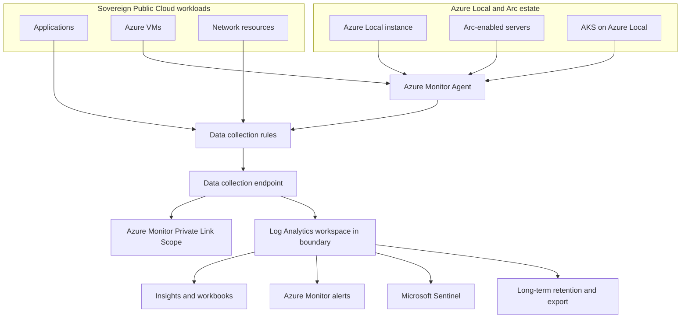

Observability for a sovereign estate starts with the data boundary. Logs can contain host names, IP addresses, user identifiers, payload fragments, and incident notes. Put collection, retention, alerting, and support access through the same residency design review as the workload.

## Reference architecture

Use one workspace architecture per sovereignty boundary unless the operations model requires stricter separation. A boundary can be a country, region pair, tenant, subscription group, or disconnected management plane. The workspace is the main Azure Monitor Logs resource, so make its region, table plan, retention, and access model explicit.

## Residency and workspace design

Azure Monitor Logs stores and manages log data in a Log Analytics workspace. Analytics and Basic tables can use [total retention up to 12 years](https://learn.microsoft.com/azure/azure-monitor/logs/data-platform-logs#table-feature-comparison), but that is a platform maximum, not a compliance requirement. Set table retention from the record schedule for the workload, then document the legal basis for any export to Storage, Event Hubs, or a SIEM outside the boundary.

Workspace replication is a paid resilience feature. When enabled, Azure Monitor creates a secondary "shadow" workspace and sends new logs to the secondary region as well as the primary region. Logs ingested before replication is activated are not copied, and switch over is a manual action. Use it only when the secondary region stays inside the approved geography and the unsupported features list fits your workload.

| Design choice | What to verify | Why it matters |
| --- | --- | --- |
| Workspace region | The workspace and optional replica are in approved regions. | Queries, alerts, Sentinel, and exports use data from this store. |
| Table plan | Analytics for real-time detection, Basic for lower-touch troubleshooting, Auxiliary for low-touch audit data. | Insights and Customer Lockbox do not apply to every table plan. |
| Retention | Analytics retention and total retention by table. | Long retention is possible, but not required for every table. |
| Export | Destination region, identity, and access controls. | Export can move data outside the original workspace boundary. |
| Network path | Azure Monitor Private Link Scope, data collection endpoints, and DNS. | Private Only mode limits ingestion and query access to resources in the scope. |

## Data collection rules and Azure Monitor Agent

The [Azure Monitor Agent](https://learn.microsoft.com/azure/azure-monitor/agents/azure-monitor-agent-overview) collects guest OS data from Azure VMs, Arc-enabled servers, other clouds, and on-premises machines. It is the supported agent for guest OS collection in Azure Monitor. It does not replace the Azure Connected Machine agent. The Connected Machine agent registers the server with Azure Arc; the Azure Monitor Agent collects monitoring data.

Data collection rules define what Azure Monitor collects, how it transforms the data, and where it sends the data. DCRs support transformations that can filter records or remove sensitive fields before data is stored. DCRs are Azure resources in a region. Learn states that DCRs are backed up to the paired region in the same geography, and that single-region data residency for DCRs is a preview feature available only in Southeast Asia and Brazil South at the time checked.

For Azure Local, Insights installs the Azure Monitor Agent on the nodes and configures a DCR. Microsoft recommends not creating your own DCR for Insights because the DCR created by Insights includes a special data stream required for operation. You can edit that DCR to collect more Windows or Syslog events.

## Azure Monitor Private Link

Azure Monitor private link uses an Azure Monitor Private Link Scope rather than one private endpoint per monitored resource. Add Log Analytics workspaces and data collection endpoints to the scope. Log Analytics ingestion uses resource-specific endpoints; Log Analytics queries use shared endpoints. That DNS behavior means the network design must be reviewed before multiple AMPLS resources are deployed.

Use Private Only mode for ingestion and queries when you need the VNet to reach only Azure Monitor resources in the scope. Open mode helps with gradual onboarding but does not prevent access to resources outside the scope.

## Azure Local telemetry and Insights

Azure Local observability has three data sources: telemetry, diagnostics, and monitoring. Learn states that telemetry data is stored within the US and retained for up to two years. Diagnostics data is stored globally or in the EU based on the customer's deployment choice and is typically retained for 30 days, with possible longer retention for ongoing support issues. Metrics data is sent to the region where the resource is deployed.

Insights for Azure Local displays health, node, VM, and storage information. It collects the `Microsoft-windows-health/operational` and `Microsoft-windows-sddc-management/operational` event channels and five default performance counters, including processor, memory, network, and RDMA counters. Health visualizations include faults such as unsupported hardware, unresponsive disks, repair needs, capacity thresholds, high CPU, high memory, high storage usage, and high latency.

| Signal | Azure Local source | Operational use |
| --- | --- | --- |
| Health faults | Health Service event channel | Triage warnings and critical faults before support escalation. |
| Node counters | Azure Monitor Agent through Insights DCR | Track CPU, memory, network, and RDMA patterns. |
| Storage counters | Insights workbook | Validate capacity, IOPS, throughput, latency, and resiliency. |
| Diagnostics | `Send-DiagnosticData`, portal log collection, standalone collection | Provide support logs with correlation IDs. |
| Remote support | Azure Local Remote Support Arc extension | Grant time-limited Diagnostics or Diagnostics and Repair access for a case. |

## Alerting, workbooks, and Sentinel

Use Azure Monitor alert rules for platform and health conditions that require operations action. Use workbooks for cross-resource views and summary rules when raw queries become slow or expensive. Use Microsoft Sentinel for security operations data that needs incident handling, entity context, automation rules, and playbooks.

Avoid one global dashboard that hides where the data lives. A better pattern is a workbook that reads from approved workspaces and labels the boundary for each tile. Cross-workspace queries help central operations teams, but they do not replace the need to control who can query each workspace.

## Disconnected operations

Connected Azure Local deployments can tolerate up to 30 days of Azure disconnection without workload impact, but management, monitoring, support, and updates still need design decisions. Azure Local disconnected operations require Azure Local 2602 or later, while AKS on Azure Local with disconnected operations remains [preview](https://learn.microsoft.com/azure/aks-hybrid-edge/local/disconnected-operations/overview). In disconnected mode, plan for local evidence capture, delayed upload, local dashboards where needed, and an explicit process for reconnecting or exporting logs to support.

Do not promise the same cloud-based alert and workbook behavior during a full disconnect. State which signals continue locally, which queue for upload, which require the management cluster, and which are unavailable until connectivity returns.

## Sources

- [Azure Monitor Logs overview](https://learn.microsoft.com/azure/azure-monitor/logs/data-platform-logs)
- [Manage data retention in a Log Analytics workspace](https://learn.microsoft.com/azure/azure-monitor/logs/data-retention-configure)
- [Enhance resilience by replicating your Log Analytics workspace across regions](https://learn.microsoft.com/azure/azure-monitor/logs/workspace-replication)
- [Azure Monitor Agent overview](https://learn.microsoft.com/azure/azure-monitor/agents/azure-monitor-agent-overview)
- [Data collection rules in Azure Monitor](https://learn.microsoft.com/azure/azure-monitor/essentials/data-collection-rule-overview)
- [Use Azure Private Link to connect networks to Azure Monitor](https://learn.microsoft.com/azure/azure-monitor/logs/private-link-security)
- [Azure Local observability](https://learn.microsoft.com/azure/azure-local/concepts/observability)
- [Monitor a single Azure Local system with Insights](https://learn.microsoft.com/azure/azure-local/manage/monitor-single-23h2)
- [Disconnected operations for Azure Local](https://learn.microsoft.com/azure/azure-local/manage/disconnected-operations-overview)
- [AKS on Azure Local with disconnected operations](https://learn.microsoft.com/azure/aks-hybrid-edge/local/disconnected-operations/overview)
