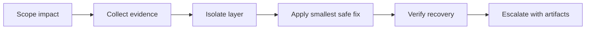

Troubleshooting a sovereign estate starts with scope control. Every diagnostic action can change availability, move data, or grant access. Use a repeatable method that separates facts from guesses and captures enough evidence for Microsoft support without collecting data you do not need.

## Method

1. Scope impact. Identify affected users, workloads, Azure Local instances, subscriptions, regions, and data classes.
2. Collect evidence. Capture health, logs, error IDs, correlation IDs, and recent changes before making disruptive changes.
3. Isolate the layer. Test one layer at a time: deployment validation, update, Arc, network, storage, AKS, support access, or cloud service health.
4. Apply the smallest safe fix. Prefer reversible changes. Record the command, operator, time, and expected effect.
5. Verify recovery. Use the original symptom, not a proxy. Confirm the alert clears, the workload works, and the data path remains inside the boundary.
6. Escalate with artifacts. If the issue persists, open support with the right service, severity, subscription, impact, correlation IDs, and log package details.

## Common issues by layer

| Layer | Symptoms | First checks | Verified tools |
| --- | --- | --- | --- |
| Deployment validation | Azure Local deployment blocks on prerequisites. | Connectivity, hardware, networking, Active Directory, and environment readiness. | Azure Local Environment Checker standalone readiness tests. |
| Updates | Precheck fails, portal is stale, update content does not download, or update runtime is longer than expected. | Azure Local release, health faults, SBE state, Arc resource bridge certificate age, and connectivity. | Insights, Health Service events, Azure Update Manager, support logs. |
| Arc connectivity | Resource shows disconnected or extensions stop reporting. | Agent status, heartbeat, endpoint reachability, proxy, Arc gateway, and region. | `azcmagent show`, `azcmagent check`, Resource Health. |
| Arc gateway | Fewer endpoints work, but some extensions fail. | Gateway support status for the resource type, TLS inspection, subscription gateway limit, and required FQDNs. | Arc gateway docs, Azure Local gateway status, `azcmagent check --extensions all`. |
| Networking | Cluster traffic slows, management endpoint fails, private link query or ingestion breaks. | DNS, proxy, firewall, AMPLS access mode, DCE membership, and storage or RDMA paths. | Azure Monitor private link checks, Network ATC status through support operations. |
| Storage | High latency, volume or drive warning, repair needed, capacity thresholds. | Insights health fault, storage visualizations, cluster logs, and Health Service fault details. | Insights, Health Service faults, `Get-ClusterLog`. |
| AKS on Azure Local | Cluster operation fails, image is not ready, node logs needed, preview feature unstable. | Kubernetes version, storage path health, logical network names, support policy, kubeconfig, SSH key. | `az aksarc get-logs`, `Get-AzAksArcLog`, Support.AksArc diagnostic tool. |
| Disconnected operations | Cloud management or support workflow is unavailable. | Whether the estate is connected mode, disconnected operations, or AKS disconnected preview. | Local diagnostics, management cluster guidance, support process after reconnect. |

## Tools and commands

Use only documented commands in runbooks. Keep example parameters generic and replace them in the change record.

| Tool | Command or entry point | Use |
| --- | --- | --- |
| Azure Local Environment Checker | Standalone Environment Checker from Learn guidance. | Assess deployment readiness for connectivity, hardware, networking, and Active Directory. |
| Azure Local Insights | Azure portal, Azure Local resource, Insights. | View health, node, VM, and storage data from Azure Monitor workbooks. |
| Azure Local diagnostic logs | `Send-DiagnosticData -FromDate (Get-Date).AddHours(-2) -ToDate (Get-Date)` | Collect and send diagnostic logs from any Azure Local machine when observability components work. |
| Azure Local diagnostic history | `Get-LogCollectionHistory` | Review log collections from the last 90 days. |
| Standalone log collection | `Send-AzStackHciDiagnosticData` | Send diagnostic data when observability components are not deployed or registration fails. |
| Remote Support | `Enable-RemoteSupport -AccessLevel Diagnostics -ExpireInMinutes 1440` | Grant Microsoft support diagnostic access for a support case. |
| Remote Support state | `Get-RemoteSupportAccess -IncludeExpired` | Review active and expired consent grants from the last 30 days. |
| Remote Support revoke | `Disable-RemoteSupport` | Revoke remote access consent and block new sessions. |
| Remote Support sessions | `Get-RemoteSupportSessionHistory -FromDate <Date>` | Review remote sessions. Session transcript details are kept for 90 days. |
| Arc agent status | `azcmagent show` | Display connected state, Azure resource information, and dependent service status. |
| Arc network checks | `azcmagent check` | Test connectivity to required Azure Arc endpoints. |
| Arc private link check | `azcmagent check --location <region> --enable-pls-check` | Check whether supported Arc endpoints resolve to private IP addresses. |
| Arc extension readiness | `azcmagent check --extensions all` | Include extension endpoint checks. Requires agent version 1.41 or later. |
| AKS logs by node | `az aksarc get-logs --ip <node-ip> --credentials-dir ./.ssh --out-dir ./logs` | Collect logs from one node. |
| AKS logs by cluster | `az aksarc get-logs --kubeconfig ./.kube/config --credentials-dir ./.ssh --out-dir ./logs` | Collect logs from all cluster nodes. |
| AKS PowerShell logs | `Get-AzAksArcLog` | Collect AKS on Azure Local logs with PowerShell. |
| AKS support module | `Install-Module -Name Support.AksArc`; `Import-Module Support.AksArc -Force` | Install and load the AKS on Azure Local support tool. |
| Service health | Azure Service Health alerts. | Check service-impacting events, planned maintenance, and health advisories for services and regions you use. |
| Resource health | Resource Health alerts. | Check availability of individual Azure resources and Arc resources. |

:::caution[Force quorum]
Older troubleshooting content suggested force quorum as an immediate recovery step. Do not make that the first step. Assess whether there is a network partition, whether nodes are still running elsewhere, and whether storage is safe before any quorum recovery action.
:::

## Escalation

Technical support requires a support plan. The Azure portal asks you to choose a severity level that reflects business impact. The maximum severity and response target depend on the support plan and local business hours.

Before opening support, collect:

- Impact statement with affected services, user count, regions, and business process.
- Timeline with first detection, recent changes, and actions taken.
- Resource IDs for Azure Local, Arc machines, AKS clusters, Log Analytics workspaces, and subscriptions.
- Correlation IDs from `Send-DiagnosticData`, Azure portal diagnostics, AKS errors, or failed deployment output.
- Output from `azcmagent show` and `azcmagent check` for Arc issues.
- AKS log zip path or PowerShell log collection output for AKS on Azure Local issues.
- Customer Lockbox preference and Remote Support access scope if Microsoft support needs access.

Customer Lockbox is separate from Azure Local Remote Support. Customer Lockbox is an approval workflow for supported Azure services when Microsoft needs customer-data access. Azure Local Remote Support is a customer-consented support channel to an Azure Local device for a support case. Use both where applicable, and document the approver, access level, duration, and audit location.

## Sources

- [Evaluate the deployment readiness of your environment for Azure Local](https://learn.microsoft.com/azure/azure-local/manage/use-environment-checker)
- [Azure Local observability](https://learn.microsoft.com/azure/azure-local/concepts/observability)
- [Monitor a single Azure Local system with Insights](https://learn.microsoft.com/azure/azure-local/manage/monitor-single-23h2)
- [Collect diagnostic logs for Azure Local](https://learn.microsoft.com/azure/azure-local/manage/collect-logs)
- [Get remote support for Azure Local](https://learn.microsoft.com/azure/azure-local/manage/get-remote-support)
- [Azure Local Remote Support Arc extension overview](https://learn.microsoft.com/azure/azure-local/manage/remote-support-arc-extension)
- [Troubleshoot Azure Connected Machine agent connection problems](https://learn.microsoft.com/azure/azure-arc/servers/troubleshoot-agent-onboard)
- [`azcmagent check`](https://learn.microsoft.com/azure/azure-arc/servers/azcmagent-check)
- [`azcmagent show`](https://learn.microsoft.com/azure/azure-arc/servers/azcmagent-show)
- [Get on-demand logs for troubleshooting](https://learn.microsoft.com/azure/aks-hybrid-edge/local/hyperconverged/get-on-demand-logs)
- [Use the Support Tool to troubleshoot and fix AKS related issues](https://learn.microsoft.com/azure/aks-hybrid-edge/local/hyperconverged/support-module)
- [What is Azure Service Health?](https://learn.microsoft.com/azure/service-health/overview)
- [Create an Azure support request](https://learn.microsoft.com/azure/azure-portal/supportability/how-to-create-azure-support-request)
- [Customer Lockbox for Microsoft Azure](https://learn.microsoft.com/azure/security/fundamentals/customer-lockbox-overview)
