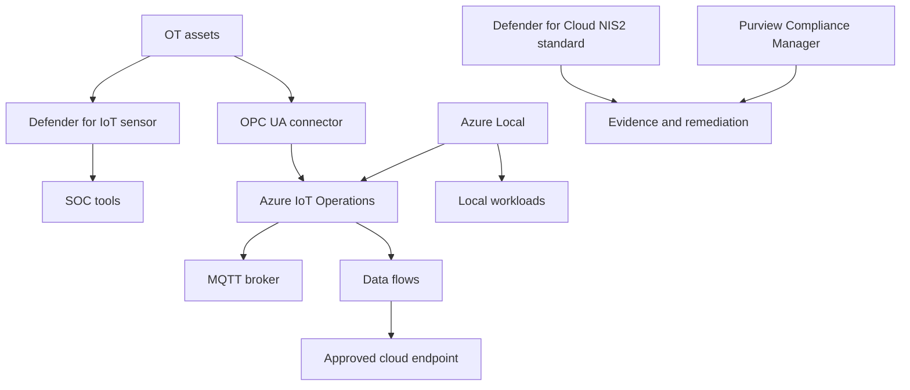

Critical infrastructure patterns must protect physical operations while still giving operators useful telemetry and governance. The first rule is to separate monitoring from control. Cloud dashboards, analytics, and security views can inform operators, but safety-critical control paths need site-specific engineering approval and should not depend on a cloud service.

## Microsoft-documented drivers

Microsoft Defender for Cloud lists [EU 2022 2555 NIS2 2022 as a built-in regulatory compliance standard](https://learn.microsoft.com/azure/defender-for-cloud/concept-regulatory-compliance-standards) for Azure, AWS, and GCP. Azure Policy built-in initiatives also include NIS2 initiatives, including [EU 2022 2555 NIS2 2022](https://learn.microsoft.com/azure/governance/policy/samples/built-in-initiatives). Microsoft Purview Compliance Manager lists a [NIS2 Directive EU 2022 2555](https://learn.microsoft.com/purview/compliance-manager-regulations-list) premium regulation template.

Azure IoT Operations is documented as a current edge-connected IoT offering. Microsoft Learn places it under [current offerings marked GA](https://learn.microsoft.com/azure/iot/iot-introduction#services-and-applications), and the product overview says it is a unified data plane for the edge that runs on [Azure Arc-enabled Kubernetes](https://learn.microsoft.com/azure/iot-operations/overview-iot-operations). The same overview states that it can operate offline for a [maximum of 72 hours](https://learn.microsoft.com/azure/iot-operations/overview-iot-operations), with possible degradation during that period. The deployment overview lists AKS on Azure Local as a supported Windows environment for Azure IoT Operations with [general availability support level](https://learn.microsoft.com/azure/iot-operations/deploy-iot-ops/overview-deploy).

[Microsoft Defender for IoT](https://learn.microsoft.com/azure/defender-for-iot/organizations/overview) is a security solution for identifying IoT and OT devices, vulnerabilities, and threats. The Azure portal experience is documented on that page. Microsoft also notes that the unified Microsoft Defender portal experience for Defender for IoT is in preview.

## Deployment model choices

| Critical infrastructure need | Preferred placement | Why this fit works | Watch points |
| --- | --- | --- | --- |
| Plant telemetry and contextualization | Azure IoT Operations on Arc-enabled Kubernetes | MQTT broker, OPC UA connector, data flows, and cloud routing run at the edge. | The 72-hour offline limit is for Azure IoT Operations. It is not the same as Azure Local disconnected operations. |
| OT asset visibility and threat detection | Defender for IoT sensors | Agentless network monitoring discovers OT devices and identifies vulnerabilities and threats. | Decide which sensors connect to Azure and which remain on-premises or air-gapped. |
| Edge compute in regulated sites | Azure Local | VMs, AKS on Azure Local, and Azure Arc governance can run close to operations. | Azure Local disconnected operations require 2602 or later. AKS under disconnected operations remains preview. |
| Small substations, factories, or remote sites | Azure Local small form factor | Microsoft documents small form factor as a deployment type for space and power constrained sites. | AI workloads and Foundry Local on small form factor are preview. Confirm hardware catalog support. |
| Central compliance and posture | Defender for Cloud NIS2 standard, Azure Policy, Purview Compliance Manager | Central teams can track NIS2 controls while site systems continue operating locally. | Do not infer compliance from a dashboard alone. Map findings to process owners and evidence. |
| Local collaboration for site teams | Microsoft 365 Local where required | Exchange Server, SharePoint Server, and Skype for Business Server can run on Azure Local. | Only use it when collaboration data also needs private-cloud placement. |

## Reference architecture

The pattern keeps operational control local. OT assets publish telemetry to local edge services. Azure IoT Operations normalizes and routes data. Defender for IoT observes the network without agents on PLCs or other constrained devices. Cloud endpoints receive approved telemetry, not direct control of safety-critical processes.

## Control mapping

| Requirement | Microsoft control | Design decision |
| --- | --- | --- |
| NIS2 posture | Defender for Cloud EU 2022 2555 NIS2 2022 standard | Assign at management group scope for Azure resources and use findings as evidence inputs. |
| NIS2 policy enforcement | Azure Policy NIS2 initiatives | Use policy assignments for technical controls that Azure Policy can evaluate. Document controls outside policy coverage. |
| NIS2 assessment workflow | Purview Compliance Manager NIS2 template | Use the template for assessment management, task assignment, and evidence tracking. |
| OT visibility | Defender for IoT | Place sensors where they can see relevant network traffic without changing safety systems. |
| OT and IT segmentation | Azure IoT Operations layered networking and site firewalls | Restrict lower layers to adjacent-layer communication. Put cloud connections through approved edge layers. |
| Edge identity and secrets | Azure IoT Operations secure settings, managed identities, Key Vault, and secret store extension | Use dedicated identities and avoid shared secrets in edge workloads. |
| Data residency | SLZ Level 1 or Azure Local placement | Keep regulated operational data in approved regions or on local infrastructure. |
| Encryption | SLZ Level 2, CMK, private endpoints, TLS | Encrypt data paths from edge to cloud and use customer-managed keys where supported. |
| Data in use | SLZ Level 3 and confidential computing where available | Use confidential compute for analytics on sensitive operational data when host access is in scope. |

## Edge and disconnected operations

Azure Local is the base platform when the site needs local compute, local storage, and Azure-consistent management. Connected Azure Local deployments can tolerate a period without Azure connectivity for running workloads, but disconnected operations are a separate mode with eligibility and deployment requirements. Microsoft documents Azure Local disconnected operations as requiring [Azure Local 2602 or later](https://learn.microsoft.com/azure/azure-local/manage/disconnected-operations-overview), while [AKS on Azure Local with disconnected operations](https://learn.microsoft.com/azure/aks-hybrid-edge/local/disconnected-operations/overview) remains preview.

Do not combine these statuses. An Azure Local platform can be ready for disconnected operations while Kubernetes workloads under that mode still carry preview constraints. If the site needs Kubernetes for Azure IoT Operations, validate the deployment mode, support level, and dependency list before promising disconnected operation.

Small form factor Azure Local can fit field sites with space or power limits. Use it for local telemetry processing, buffering, and selected VMs. If the design includes AI workloads or Foundry Local on small form factor, mark those components as preview because Microsoft documents that status for those workloads.

## OT security notes

Defender for IoT can run in cloud-connected, on-premises, air-gapped, or hybrid monitoring configurations. That matters for sovereign design. A water utility might connect sensors to Azure for centralized SOC visibility. A defense supplier or grid operator might keep sensor data on-premises and export only incident summaries. Both are valid patterns if the operational safety and reporting model is documented.

Azure IoT Operations should not be the sole authority for safety-critical decisions. Microsoft security guidance says data routed through operations experience and dashboards is best suited to monitoring, and cloud dashboards, analytics, or monitoring views should not be the sole authority for safety-critical or emergency operational decisions. Put that statement in the design review so the architecture does not create an unsafe remote-control path.

## Sources

- [Regulatory compliance standards in Microsoft Defender for Cloud](https://learn.microsoft.com/azure/defender-for-cloud/concept-regulatory-compliance-standards)
- [Azure Policy built-in initiative definitions](https://learn.microsoft.com/azure/governance/policy/samples/built-in-initiatives)
- [Compliance Manager regulations list](https://learn.microsoft.com/purview/compliance-manager-regulations-list)
- [What is Azure IoT?](https://learn.microsoft.com/azure/iot/iot-introduction)
- [What is Azure IoT Operations?](https://learn.microsoft.com/azure/iot-operations/overview-iot-operations)
- [Deployment overview for Azure IoT Operations](https://learn.microsoft.com/azure/iot-operations/deploy-iot-ops/overview-deploy)
- [Secure your IoT solutions](https://learn.microsoft.com/azure/iot/iot-overview-security)
- [What is Microsoft Defender for IoT?](https://learn.microsoft.com/azure/defender-for-iot/organizations/overview)
- [Disconnected operations for Azure Local](https://learn.microsoft.com/azure/azure-local/manage/disconnected-operations-overview)
- [AKS on Azure Local with disconnected operations](https://learn.microsoft.com/azure/aks-hybrid-edge/local/disconnected-operations/overview)
- [Find your Azure Local deployment type](https://learn.microsoft.com/azure/azure-local/plan/find-your-deployment-type)
