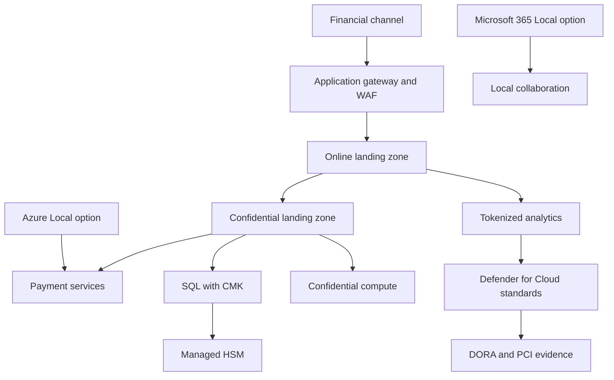

Financial services architecture starts with operational resilience, payment-card scope, outsourcing oversight, and cryptographic control. The cloud model is a control decision. Use Sovereign Public Cloud when the workload can run in commercial Azure regions with Sovereign Landing Zone controls. Use Azure Local when latency, market infrastructure, or supervisory policy requires local execution. Use Microsoft 365 Local when Exchange Server, SharePoint Server, and Skype for Business Server data must remain on customer-owned Azure Local hardware. For French or German public-sector-adjacent financial entities, National Partner Clouds such as Bleu France and Delos Cloud Germany may become relevant when their service scope matches the workload.

## Regulatory drivers Microsoft documents

The [Digital Operational Resilience Act](https://learn.microsoft.com/compliance/dora/dora-what-is-dora) applies from [January 17, 2025](https://learn.microsoft.com/compliance/dora/dora-what-is-dora) to EU financial entities and designated critical ICT third-party providers. Microsoft Learn also states that on [November 18, 2025](https://learn.microsoft.com/compliance/dora/dora-what-is-dora), the European Supervisory Authorities published the DORA Critical ICT Third-Party Provider list and identified Microsoft Ireland Operations Limited as a CTPP subject to ESA oversight. That changes the third-party risk discussion. The architecture must produce evidence for ICT risk management, incident reporting, resilience testing, and outsourcing oversight, not only region placement.

Microsoft provides a DORA contract mapping document and [Microsoft Entra customer considerations under DORA](https://learn.microsoft.com/compliance/dora/dora-entra). Microsoft Defender for Cloud lists [Digital Operational Resilience Act as a built-in regulatory compliance standard](https://learn.microsoft.com/azure/defender-for-cloud/concept-regulatory-compliance-standards). For payment workloads, the same Defender for Cloud standards page lists [PCI DSS v4.0.1](https://learn.microsoft.com/azure/defender-for-cloud/concept-regulatory-compliance-standards). Use those standards as assessment views, then map gaps to your formal DORA and PCI DSS control owners.

## Deployment model choices

| Workload type | Preferred placement | Why this fit works | Watch points |
| --- | --- | --- | --- |
| Customer-facing banking apps | Sovereign Public Cloud in approved regions | SLZ adds data residency, encryption, and confidential workload groups to Azure Landing Zone patterns. | Validate regional service availability, Customer Lockbox coverage, and Defender standard assignments. |
| Cardholder data environment | Dedicated SLZ confidential management groups, or Azure Local for local execution | Scope can be reduced with segmentation, tokenization, CMK, Managed HSM, and private endpoints. | Do not let analytics, AI, or operations logs reintroduce cardholder data into non-CDE zones. |
| Trading, clearing, and market data systems | Azure Local for low latency or local control, with connected or disconnected operations as policy allows | Compute and storage stay on customer hardware while Azure Arc provides management when connected. | Connected Azure Local tolerates limited disconnection, while disconnected operations have their own eligibility and service scope. |
| Collaboration under local data-control rules | Microsoft 365 Local on Azure Local Premier Solution hardware | Exchange Server, SharePoint Server, and Skype for Business Server Subscription Editions run on customer-owned Azure Local infrastructure. | Partner deployment and lifecycle support are required. |
| France or Germany sovereign requirements | National Partner Cloud when available and in scope | Bleu France and Delos Cloud Germany combine Microsoft technology with partner-operated governance. | These clouds are announced or building. Confirm service matrices, latency, and rollout before design commitment. |

## Reference architecture

The core pattern is a hub and spoke design with separate management groups for online, confidential online, and shared platform services. The CDE belongs in a confidential management group. Put identity, logging, and key management in platform subscriptions with break-glass access and Privileged Identity Management. Keep analytics outside the CDE by sending only tokenized transaction data, reference IDs, and risk scores.

For workloads that can use public Azure, start with SLZ. For workloads that must run near a market, branch, or sovereign facility, deploy the payment application or settlement component on Azure Local and synchronize only approved telemetry or tokenized data. If regulator or customer policy requires local email and document services, place Microsoft 365 Local beside the regulated workload and define a separate operations model.

## Control mapping

| Requirement | Microsoft control | Design decision |
| --- | --- | --- |
| DORA ICT risk management and evidence | Defender for Cloud DORA standard, Azure Policy, Service Health, Secure Score, Purview Compliance Manager | Assign the DORA standard at management group scope and export assessment evidence to the control owner. |
| PCI DSS v4.0.1 posture | Defender for Cloud PCI DSS v4.0.1 standard | Scope assignments to CDE subscriptions and document compensating controls outside Azure Policy coverage. |
| Data residency | SLZ Level 1 and Data Guardian where applicable | Keep customer data in approved regions and use Data Guardian for EU and EFTA remote-access oversight. |
| Encryption at rest and in transit | SLZ Level 2, CMK, Managed HSM, private endpoints, TLS policies | Use customer-managed keys for regulated stores and private network paths for CDE services. |
| Key isolation | [Managed HSM key sovereignty](https://learn.microsoft.com/azure/azure-sovereign-clouds/public/external-key-management) | Managed HSM is single-tenant and [FIPS 140-3 Level 3](https://learn.microsoft.com/azure/azure-sovereign-clouds/public/external-key-management). Place it in the SLZ security subscription. |
| External keys | [Managed HSM external key management preview](https://learn.microsoft.com/azure/key-vault/managed-hsm/external-key-management-overview) | EKM is preview, gated by Microsoft account-team enablement and an annual Azure revenue threshold. It excludes Azure Government and Azure China. Do not use it as a required control unless the account is approved. |
| Encryption in use | SLZ Level 3 and Azure confidential computing | Use confidential VMs, confidential AKS worker nodes, or confidential containers when the threat model includes host access to sensitive data in use. |
| Microsoft support access | Customer Lockbox and Data Guardian | Use Customer Lockbox for supported services and Data Guardian where the EU oversight model applies. |

## Design trade-offs

CDE isolation reduces audit scope only when data movement is controlled. Do not connect AI, data lake, or fraud platforms directly to cardholder data. Build a tokenization service inside the CDE and publish only tokens, risk features, and decisions to analytics zones. If fraud models need raw card data, the model-serving and feature store components become part of the CDE.

Managed HSM is the default high-control key store for Azure services that support it. EKM is different. It keeps the key-encryption key outside Microsoft through an EKM proxy, but it is still [preview](https://learn.microsoft.com/azure/key-vault/managed-hsm/external-key-management-overview), has limited operation support, and has no SLA for external keys. Treat EKM as an exception path for a regulator-driven key requirement, not as a baseline financial-services pattern.

DORA also changes operations. A resilient architecture needs incident reporting paths, service health monitoring, supplier-risk evidence, and tested recovery. Build these into the landing zone runbook. Record who owns the Defender control, who reviews Customer Lockbox requests, who approves key rotation, and who can authorize failover from Azure to Azure Local.

## Sources

- [What is DORA?](https://learn.microsoft.com/compliance/dora/dora-what-is-dora)
- [Microsoft Entra customer considerations under DORA](https://learn.microsoft.com/compliance/dora/dora-entra)
- [Regulatory compliance standards in Microsoft Defender for Cloud](https://learn.microsoft.com/azure/defender-for-cloud/concept-regulatory-compliance-standards)
- [Sovereign Landing Zone](https://learn.microsoft.com/azure/azure-sovereign-clouds/public/overview-sovereign-landing-zone)
- [Implement controls and principles in SLZ](https://learn.microsoft.com/azure/azure-sovereign-clouds/public/implement-controls-principles)
- [What is External Key Management?](https://learn.microsoft.com/azure/azure-sovereign-clouds/public/external-key-management)
- [What is Managed HSM external key management?](https://learn.microsoft.com/azure/key-vault/managed-hsm/external-key-management-overview)
- [Customer Lockbox for Microsoft Azure](https://learn.microsoft.com/azure/security/fundamentals/customer-lockbox-overview)
- [National Partner Clouds](https://learn.microsoft.com/azure/azure-sovereign-clouds/partner/overview-national-partner-clouds)
