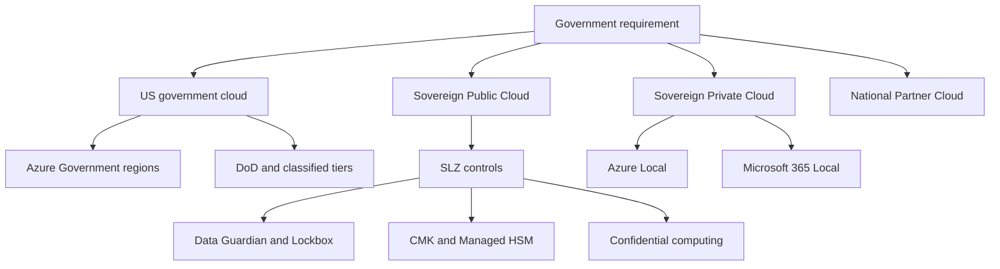

Government cloud design starts with jurisdiction, classification, operator eligibility, and service availability. A US federal workload might need Azure Government, Azure Government Secret, or Azure Government Top Secret. A non-US ministry might use Sovereign Public Cloud with Data Guardian and SLZ controls, or evaluate a National Partner Cloud such as Bleu France or Delos Cloud Germany when those environments become available for the required services.

## Microsoft-documented drivers

[Azure Government](https://learn.microsoft.com/azure/azure-government/documentation-government-welcome) uses physically isolated US datacenters and networks, and access is restricted to screened US persons. Microsoft Learn lists three Azure Government regions: US Gov Arizona, US Gov Texas, and US Gov Virginia. The same page states that only US Gov Virginia supports availability zones. For US Department of Defense workloads, Microsoft documents [US DoD Central and US DoD East](https://learn.microsoft.com/azure/azure-government/documentation-government-overview-dod) as additional regions reserved for DoD.

The Microsoft compliance offerings page also lists [Azure Government Secret with three regions and Azure Government Top Secret](https://learn.microsoft.com/azure/compliance/offerings/) for classified US national-security workloads. Keep this distinction clear. FedRAMP is not the same thing as classified workload authorization.

Microsoft Learn states that both Azure and Azure Government hold [FedRAMP High Provisional Authorizations to Operate](https://learn.microsoft.com/azure/compliance/offerings/offering-fedramp) from the Joint Authorization Board. The same page states that Azure Government's FedRAMP High P-ATO scope covers US Gov Arizona, US Gov Texas, and US Gov Virginia. It also states that the commercial Azure FedRAMP High P-ATO covers US public regions.

[Azure Copilot](https://learn.microsoft.com/azure/copilot/overview) is not available in Azure Government or Azure operated by 21Vianet. Do not include it in government runbooks or operator workflows for those clouds.

## Deployment model choices

| Government need | Preferred placement | Why this fit works | Watch points |
| --- | --- | --- | --- |
| US federal, state, local, tribal, or contractor workloads | Azure Government | Isolated US regions, screened US-person access, FedRAMP High P-ATO scope for the three Azure Government regions. | Only US Gov Virginia has availability zones. Service availability differs from commercial Azure. |
| US DoD workloads | US DoD Central or US DoD East where required | Microsoft documents two DoD-only regions for DoD workloads. | Confirm DoD service scope and agency authorization requirements. |
| US classified workloads | Azure Government Secret or Azure Government Top Secret | Microsoft documents separate cloud environments for classified national-security workloads. | Do not map classified requirements to FedRAMP alone. |
| Non-US government workloads with public-cloud fit | Sovereign Public Cloud | Data Guardian, Customer Lockbox, CMK, Managed HSM, confidential computing, and SLZ levels add sovereignty controls to Azure. | Use geopolitical data-boundary and support-access requirements to select controls. |
| French or German sovereign requirements | National Partner Cloud when service scope is sufficient | Bleu France and Delos Cloud Germany combine Microsoft technology with partner-operated governance. | These are announced or building. Confirm service matrix, operations model, and latency. |
| Local or disconnected government services | Azure Local and Microsoft 365 Local | Workloads and collaboration can run on customer-owned hardware. | Disconnected operations have eligibility requirements. AKS under disconnected operations remains preview. |

## Reference architecture

The decision tree should be explicit in the architecture record. If the workload is US government and requires Azure Government, begin with the Azure Government service catalog and region pair. If the workload is non-US and can use public Azure, begin with the SLZ management group design. If the country requires partner-operated cloud governance, evaluate National Partner Clouds, but do not assume global Azure service parity.

## Control mapping

| Requirement | Microsoft control | Design decision |
| --- | --- | --- |
| FedRAMP High evidence | Azure and Azure Government FedRAMP High P-ATOs | Use the official P-ATO scope as supplier evidence. The customer's authorization package still needs system-specific controls and inheritance mapping. |
| US-person operations | Azure Government screened US-person access | Use Azure Government when operator eligibility is a US-person control requirement. |
| Region resilience | Azure Government region selection | US Gov Virginia has availability zones. Arizona and Texas require other resiliency patterns. |
| AI assistant availability | Azure Copilot availability note | Exclude Azure Copilot from Azure Government designs because Microsoft says it is not available there. |
| Data residency | SLZ Level 1 | Place data in approved regions or approved government cloud environments. |
| Encryption at rest and in transit | SLZ Level 2, CMK, Managed HSM, private endpoints, TLS | Put Managed HSM in the security subscription or equivalent platform zone. |
| External keys | Managed HSM EKM preview | The EKM preview excludes Azure Government and Azure China. Do not require it for Azure Government designs. |
| Encryption in use | SLZ Level 3 and confidential computing | Use confidential VMs, confidential AKS worker nodes, or confidential containers where available in the selected cloud. |
| Support access | Customer Lockbox and Data Guardian | Use Customer Lockbox for supported Azure services. Use Data Guardian for EU and EFTA remote-access oversight in Sovereign Public Cloud. |

## Government design notes

FedRAMP inheritance is not a workload design. It is supplier evidence that helps the system owner build an authorization package. The architecture still needs network segmentation, identity controls, key management, audit retention, incident response, and continuous monitoring. Microsoft Defender for Cloud includes FedRAMP standards that can help check Azure resource posture, but those checks are not a replacement for agency assessment.

Azure Government service gaps matter. Build a service availability matrix before the high-level design is approved. Include core services, monitoring, private connectivity, key management, backup, and developer tooling. If a required commercial Azure feature is unavailable, choose a supported Azure Government equivalent or move that workload to Azure Local with an approved operations model.

For non-US governments, Sovereign Public Cloud and National Partner Clouds solve different problems. Sovereign Public Cloud is Microsoft-operated Azure with sovereignty controls. National Partner Clouds combine Microsoft technology with partner-operated and jointly governed operations. Choose between them based on who may operate the service, where data must remain, what services exist, and what contract terms the customer requires.

## Sources

- [What is Azure Government?](https://learn.microsoft.com/azure/azure-government/documentation-government-welcome)
- [Department of Defense in Azure Government](https://learn.microsoft.com/azure/azure-government/documentation-government-overview-dod)
- [Azure, Dynamics 365, Microsoft 365, and Power Platform compliance offerings](https://learn.microsoft.com/azure/compliance/offerings/)
- [Federal Risk and Authorization Management Program](https://learn.microsoft.com/azure/compliance/offerings/offering-fedramp)
- [What is Azure Copilot?](https://learn.microsoft.com/azure/copilot/overview)
- [What is Sovereign Public Cloud?](https://learn.microsoft.com/azure/azure-sovereign-clouds/public/overview-sovereign-public-cloud)
- [National Partner Clouds](https://learn.microsoft.com/azure/azure-sovereign-clouds/partner/overview-national-partner-clouds)
- [What is External Key Management?](https://learn.microsoft.com/azure/azure-sovereign-clouds/public/external-key-management)
- [What is Managed HSM external key management?](https://learn.microsoft.com/azure/key-vault/managed-hsm/external-key-management-overview)
