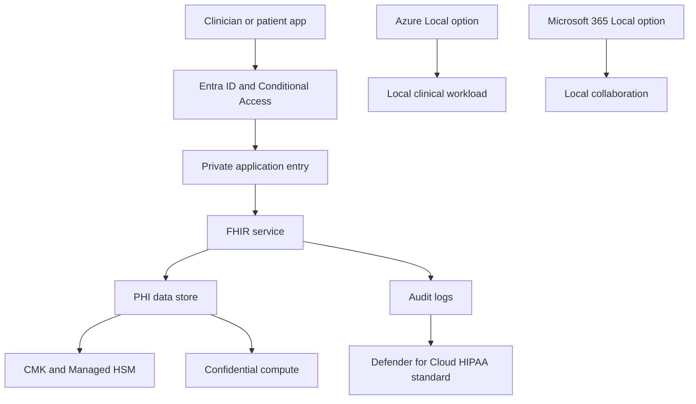

Healthcare sovereignty is a placement and access-control problem before it is a service catalog problem. Protected health information can sit in Azure, Azure Government, Azure Health Data Services, Azure Local, or Microsoft 365 Local, but each placement must match the covered entity's obligations, the Microsoft services in scope for the Business Associate Agreement, and the patient's data boundary.

## Regulatory and compliance drivers Microsoft documents

Microsoft Learn states that HIPAA applies to covered entities and business associates that create, receive, maintain, transmit, or access protected health information. When a covered entity uses a cloud provider such as Microsoft, the provider is a business associate. Microsoft offers a [Business Associate Agreement](https://learn.microsoft.com/compliance/regulatory/offering-hipaa-hitech#frequently-asked-questions) for in-scope services, but Microsoft also states that using Microsoft services does not by itself make a customer HIPAA compliant.

Microsoft's healthcare compliance overview describes HITRUST CSF as a healthcare security and privacy framework that builds on HIPAA and HITECH. Azure Health Data Services workspaces manage health data in a boundary that Microsoft Learn describes as aligned to HIPAA and HITRUST standards. For EU patient data, the [EU Data Boundary](https://learn.microsoft.com/privacy/eudb/eu-data-boundary-learn) covers Microsoft 365, Azure, Dynamics 365, and Power Platform across EU and EFTA countries, with product-specific scope rules.

Defender for Cloud lists [HIPAA as a built-in regulatory compliance standard](https://learn.microsoft.com/azure/defender-for-cloud/concept-regulatory-compliance-standards). Use it to monitor posture, then link findings to the customer's HIPAA risk analysis and remediation plan.

## Deployment model choices

| Healthcare need | Preferred placement | Why this fit works | Watch points |
| --- | --- | --- | --- |
| Cloud FHIR API and analytics | Sovereign Public Cloud with Azure Health Data Services in approved regions | The FHIR service is a managed PaaS for FHIR data storage and exchange, with Microsoft Entra RBAC and audit logs. | Region choice, BAA scope, private networking, and downstream analytics paths still need review. |
| EU patient data with Microsoft 365 and Azure services | Sovereign Public Cloud within EU Data Boundary scope | EUDB gives product-specific commitments for data residency and processing. | Multi-Geo and nonregional Azure services need separate checks. |
| Sensitive PHI processing or model training | Confidential computing in public Azure, or Azure Local for local execution | Confidential compute protects data in use. Azure Local keeps workloads on customer hardware. | Verify GPU, confidential VM, and service availability in the selected region or edge site. |
| Hospital operations in disconnected or restricted sites | Azure Local and Microsoft 365 Local | Clinical apps, local file stores, and collaboration can keep data on customer-owned hardware. | Disconnected operations and Microsoft 365 Local have eligibility, hardware, and partner requirements. |
| National health service or government health agency | Azure Government for US agencies, or National Partner Cloud where relevant | US government health data may require Azure Government. Non-US public health programs may need partner-operated sovereign governance. | Azure Copilot and some preview controls are not available in every cloud. |

## Reference architecture

The main design split is between managed healthcare data services and local execution. If the system needs FHIR interoperability, Azure Health Data Services provides the managed FHIR service. If the system cannot send PHI to public cloud, place the workload on Azure Local and use Azure Arc governance when connectivity is allowed. If clinicians need local Exchange or SharePoint services under the same data-control policy, use Microsoft 365 Local rather than routing collaboration data through a public Microsoft 365 tenant.

## Control mapping

| Requirement | Microsoft control | Design decision |
| --- | --- | --- |
| HIPAA support | Microsoft BAA for in-scope services | Confirm every service that creates, receives, maintains, or transmits PHI is covered. Keep the customer compliance program and risk analysis outside the architecture diagram. |
| HITRUST-aligned platform controls | Microsoft HITRUST CSF certifications and Azure Health Data Services workspace boundary | Use the certifications as supplier evidence, not as a substitute for customer control implementation. |
| EU patient data residency | EU Data Boundary | Put EU patient data in EUDB-covered regions and products. Record product-specific scope rules for Azure, Microsoft 365, Dynamics 365, and Power Platform. |
| HIPAA posture monitoring | Defender for Cloud HIPAA standard | Assign the standard to healthcare subscriptions and use findings as input to risk remediation. |
| Data at rest and in transit | SLZ Level 2, CMK, Managed HSM, private endpoints, TLS | Use customer-managed keys for PHI stores that support them. Use private endpoints for FHIR, storage, analytics, and database paths. |
| Data in use | SLZ Level 3 and Azure confidential computing | Use confidential VMs, confidential AKS worker nodes, or confidential containers for sensitive analytics and model inference when host access is in scope. |
| Support access | Customer Lockbox and Data Guardian where applicable | Use Customer Lockbox for supported Azure services and Data Guardian for EU and EFTA remote-access oversight. |
| Local operations | Azure Local and Microsoft 365 Local | Keep clinical or collaboration data on customer-owned Azure Local infrastructure where policy requires local processing. |

## FHIR and analytics design

The [FHIR service in Azure Health Data Services](https://learn.microsoft.com/azure/healthcare-apis/fhir/overview) is a managed FHIR-compliant server. Microsoft Learn says it provides a FHIR API endpoint, secure PHI management in a compliant cloud environment, SMART on FHIR support, Microsoft Entra RBAC, and audit log tracking. That makes it a good fit for interoperability between EHR systems, patient apps, and analytics systems.

Do not treat the FHIR service as a free path to analytics. Downstream systems inherit PHI handling requirements if they receive identifiable data. For analytics, use de-identification before secondary use when possible. If identifiable data must be processed, put analytics in the same approved region and control zone, use private endpoints, and consider confidential compute for notebooks, batch jobs, and model serving.

## On-premises and edge healthcare

Azure Local fits hospitals, labs, imaging sites, and remote-care locations that require local operations. Keep safety-critical clinical systems operational without depending on a public cloud control path. If the deployment is connected, Azure Arc can supply inventory, policy, monitoring, and update coordination. If the site needs disconnected operations, use the Azure Local disconnected operations requirements and treat AKS under disconnected operations separately because Microsoft documents it as preview.

Microsoft 365 Local is relevant when clinical communications and document collaboration must remain local. It runs Exchange Server, SharePoint Server, and Skype for Business Server Subscription Editions on Azure Local Premier Solution hardware. That is a different design choice from Microsoft 365 in the EU Data Boundary. Use Microsoft 365 Local only when the collaboration workload itself needs private-cloud placement.

## Sources

- [Health Insurance Portability and Accountability Act and HITECH Act](https://learn.microsoft.com/compliance/regulatory/offering-hipaa-hitech)
- [Compliance in Microsoft for Healthcare](https://learn.microsoft.com/industry/healthcare/compliance-overview)
- [What is Azure Health Data Services?](https://learn.microsoft.com/azure/healthcare-apis/healthcare-apis-overview)
- [What is the FHIR service in Azure Health Data Services?](https://learn.microsoft.com/azure/healthcare-apis/fhir/overview)
- [What is the EU Data Boundary?](https://learn.microsoft.com/privacy/eudb/eu-data-boundary-learn)
- [Regulatory compliance standards in Microsoft Defender for Cloud](https://learn.microsoft.com/azure/defender-for-cloud/concept-regulatory-compliance-standards)
- [Azure confidential computing offerings](https://learn.microsoft.com/azure/confidential-computing/overview-azure-products)
- [What are hyperconverged deployments of Azure Local?](https://learn.microsoft.com/azure/azure-local/overview/hyperconverged-overview)
- [What is Microsoft 365 Local?](https://learn.microsoft.com/azure/azure-sovereign-clouds/private/m365-local/microsoft-365-local-overview)
