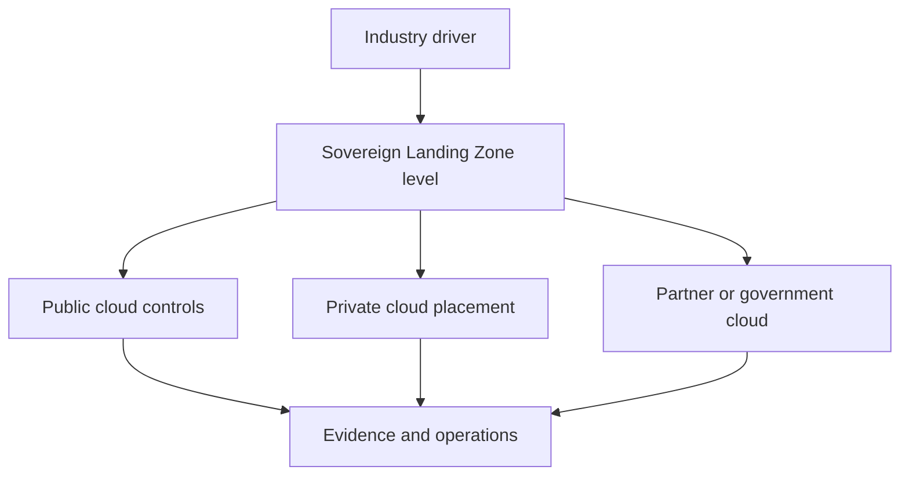

Industry designs start with obligations that change where data can live, who can operate the service, how keys are controlled, and how evidence is produced. This module applies those decisions to financial services, healthcare, government, and critical infrastructure workloads. Each pattern uses Microsoft-documented regulatory offerings and Microsoft Sovereign Cloud controls rather than sector assumptions.

Use these pages as architecture patterns, not legal advice. Your design still needs customer legal review, contract review, and a service availability check for the selected cloud environment.

## Sources

- [What is Microsoft Sovereign Cloud?](https://learn.microsoft.com/azure/azure-sovereign-clouds/microsoft-sovereign-cloud)
- [What is Sovereign Public Cloud?](https://learn.microsoft.com/azure/azure-sovereign-clouds/public/overview-sovereign-public-cloud)
- [What is Sovereign Private Cloud?](https://learn.microsoft.com/azure/azure-sovereign-clouds/private/overview/sovereign-private-cloud)
- [National Partner Clouds](https://learn.microsoft.com/azure/azure-sovereign-clouds/partner/overview-national-partner-clouds)
- [Sovereign Landing Zone](https://learn.microsoft.com/azure/azure-sovereign-clouds/public/overview-sovereign-landing-zone)
