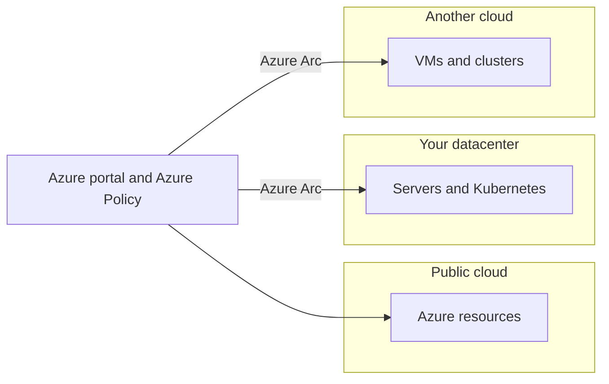

import DiagramContainer from "~/components/DiagramContainer.astro";
import LearningObjectives from "~/components/LearningObjectives.astro";

A service model says how much of the stack the provider runs. A **deployment model** says where the resources run and who can use the infrastructure. Microsoft Learn names three main models (public, private, and hybrid) and a fourth, multicloud, that more organizations end up with.

<LearningObjectives>
- Describe public, private, hybrid, and multicloud deployments.
- Compare them on control, cost, and responsibility.
- Name the Azure tools that manage resources across more than one environment.
</LearningObjectives>

<DiagramContainer title="Four deployment models">

</DiagramContainer>

## Public cloud

A third-party cloud provider builds, controls, and maintains a public cloud. Anyone who buys the service can use it. Many customers share the same physical infrastructure, and the provider keeps their resources isolated.

- You have no capital expenditure to scale up.
- You can provision and remove applications quickly.
- You pay only for what you use.
- You don't have complete control over the hardware, its location within a region, or the people who operate it.

## Private cloud

A private cloud is used by a single organization. It grew out of the traditional datacenter: IT services are delivered the cloud way, with self-service and automation, but the resources belong to one organization. A private cloud can run in your own datacenter or in a dedicated offsite datacenter, sometimes operated by a third party.

- You control the resources and their security.
- Your data isn't stored on hardware shared with other tenants.
- You buy the hardware up front and pay to maintain and update it.

## Hybrid cloud

A hybrid cloud connects public and private clouds so they work as one environment. Two common reasons:

- Burst capacity. The private cloud handles normal load and adds public cloud resources for temporary peaks.
- Workload placement. You decide which workloads stay private (for example, because of a legal requirement) and which go to the public cloud.

Hybrid gives you the most flexibility. You also manage more: two environments, the network between them, and a consistent security model across both.

## Multicloud

In a multicloud environment you use two or more public cloud providers. You might pick different services from different providers, or you might be partway through moving from one provider to another. Either way, you manage resources and security in each provider's environment.

## Compare the models

| | Public | Private | Hybrid | Multicloud |
|---|---|---|---|---|
| Who uses the infrastructure | Many customers | One organization | Mix of both | Many customers, across providers |
| Up-front hardware cost | None | High | Some | None |
| Control over hardware and location | Lowest | Highest | You choose per workload | Lowest, per provider |
| Who maintains hardware | Provider | You or your hosting partner | Both | Each provider |
| Management effort | Lowest | High | Higher | Higher |

## Manage more than one environment

Two Azure services from the Microsoft Learn fundamentals path work across deployment models:

- **Azure Arc** projects resources outside Azure into Azure Resource Manager. You can manage servers, virtual machines, Kubernetes clusters, and databases in your datacenter, at the edge, or in another cloud from the Azure portal, and govern them with the same tools, such as Azure Policy.
- **Azure VMware Solution** runs your VMware workloads in Azure, so an organization with a VMware private cloud can move to public or hybrid cloud without rebuilding its VMs first.

Azure Arc comes back many times in this course. Level 100 has a module about it.

## Choose a deployment model

Start with the requirements that rule options out, then compare cost and effort:

1. Regulation and data sensitivity. Some data must stay in a country, or must not run on shared hardware. Those rules can exclude public cloud regions or require a private cloud.
2. Connectivity. A site with an unreliable or no internet link needs local compute, which means a private or hybrid design.
3. Skills and operating effort. Every environment you add needs people to run and secure it.
4. Cost profile. Steady, predictable workloads and variable, spiky workloads favor different models.

Sovereignty requirements often lead to hybrid designs. Microsoft Sovereign Cloud offers Sovereign Public Cloud in Microsoft datacenters within defined boundaries such as the EU Data Boundary, and Sovereign Private Cloud on Azure Local in your own datacenter ([Microsoft Learn](https://learn.microsoft.com/azure/azure-sovereign-clouds/microsoft-sovereign-cloud)). Level 100 explains both.

## Sources

- [Define cloud models (Microsoft Learn training)](https://learn.microsoft.com/training/modules/describe-cloud-compute/5-define-cloud-models)
- [Azure Arc overview](https://learn.microsoft.com/azure/azure-arc/overview)
- [What is Azure VMware Solution?](https://learn.microsoft.com/azure/azure-vmware/introduction)
- [What is Microsoft Sovereign Cloud?](https://learn.microsoft.com/azure/azure-sovereign-clouds/microsoft-sovereign-cloud)
- [Sovereign Public Cloud overview](https://learn.microsoft.com/azure/azure-sovereign-clouds/public/overview-sovereign-public-cloud)
- [Sovereign Private Cloud overview](https://learn.microsoft.com/azure/azure-sovereign-clouds/private/overview/sovereign-private-cloud)
