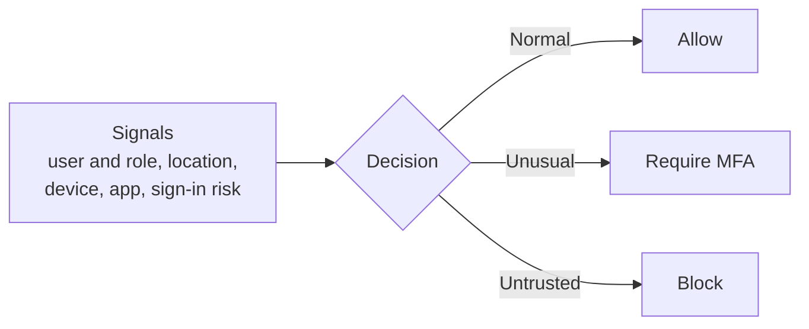

import DiagramContainer from "~/components/DiagramContainer.astro";
import LearningObjectives from "~/components/LearningObjectives.astro";

In a Zero Trust model, identity is the main control point. Almost every attack eventually depends on stealing or abusing an identity. This page covers how systems check who you are, decide what you may do, and keep those decisions current.

<LearningObjectives>
- Tell authentication and authorization apart.
- Name the types of identity an organization must manage, including AI agents.
- Describe SSO, multifactor authentication, and passwordless sign-in.
- Explain role-based access control and the principle of least privilege.
- Describe how Conditional Access makes access decisions.
- Name the main products in the Microsoft Entra family.
</LearningObjectives>

## Authentication and authorization

Two questions decide every access request:

- **Authentication** answers "who are you?" The system checks credentials to establish the identity of a person, service, or device.
- **Authorization** answers "what may you do?" After authentication, the system checks which resources and actions that identity is allowed.

Authentication always comes first. A valid sign-in doesn't mean the user can open every file.

<DiagramContainer title="Authentication, then authorization">

</DiagramContainer>

## Types of identity

| Identity type | Examples | What to watch |
|---|---|---|
| People inside the organization | Employees, administrators, developers | Strong sign-in, removal when they leave |
| External people | Partners, guests, customers | Limited access, separate lifecycle |
| Workload identities | Applications, services, containers, automation pipelines | No passwords in code, narrow permissions |
| Devices | Laptops, phones, servers, IoT devices | Health and compliance before access |
| AI agents | Assistants and autonomous agents that act on data | Their own identity, least privilege, an audit trail |

AI agents are the newest type. Microsoft Entra Agent ID gives each agent a governed identity, applies least-privilege access, and keeps an audit trail of what the agent does ([Microsoft Learn](https://learn.microsoft.com/entra/fundamentals/what-is-entra)).

## How people sign in

| Method | How it works | Security | Convenience |
|---|---|---|---|
| Password only | Something the user knows | Low | High |
| Multifactor authentication (MFA) | A password plus a second factor | High | Medium |
| Passwordless | A trusted device plus a PIN or biometric, no password at all | High | High |

**Multifactor authentication** asks for factors from at least two categories:

- Something you know, such as a password.
- Something you have, such as a code or notification on your phone.
- Something you are, such as a fingerprint or face scan.

With MFA, a stolen password alone isn't enough to sign in.

**Passwordless** sign-in removes the password altogether. Microsoft Entra ID supports Windows Hello for Business, the Microsoft Authenticator app, and FIDO2 security keys. FIDO2 keys are hardware devices that resist phishing because there's no password to steal.

**Single sign-on (SSO)** lets a user sign in once and reach many trusted applications. It cuts the number of passwords people manage and makes it easier to remove access when someone leaves. SSO is only as strong as the first sign-in, so pair it with MFA or passwordless.

Applications rely on open standards to hand identity between systems: OpenID Connect and SAML for sign-in and SSO, and OAuth 2.0 for authorization. **Federation** uses these standards so one organization's identity provider can vouch for users signing in to another organization's apps.

## Authorization and least privilege

The **principle of least privilege** says each identity gets only the access it needs to do its task. If you only need to read one storage container, you get read access to that container and nothing else.

**Role-based access control (RBAC)** makes least privilege manageable. Instead of granting permissions person by person, you assign people or groups to roles, and each role carries a set of permissions. When a new engineer joins the engineers group, they get the same access as the rest of the team.

In Azure, RBAC works like this:

- Built-in roles cover common needs, for example Owner, Contributor, and Reader. You can also create custom roles.
- You assign a role at a **scope**: a management group, a subscription, a resource group, or a single resource.
- Permissions inherit downward. Reader on a subscription lets you view every resource group and resource in it.
- Azure RBAC is an allow model. If two assignments give you read and write, you have both.
- Azure RBAC controls actions on Azure resources through Azure Resource Manager. It doesn't control access to the data inside an application. The application handles that.

**Just-in-time access** goes one step further. Instead of holding admin rights all the time, an administrator requests them for a limited period when needed. Microsoft Entra Privileged Identity Management provides just-in-time privileged access to Microsoft Entra ID and Azure resources.

## Conditional Access

**Conditional Access** is the Microsoft Entra ID feature that decides, at sign-in, whether to allow a request ([Microsoft Learn](https://learn.microsoft.com/entra/identity/conditional-access/overview)). Microsoft calls it its Zero Trust policy engine. It works in three steps:

Common Conditional Access policies:

- Require MFA for administrators, or for anyone signing in from outside trusted locations.
- Allow access to sensitive apps only from managed, compliant devices.
- Allow email only through approved client apps.
- Block sign-ins from unexpected or high-risk locations.

## Identity governance

Access that was right last year may be wrong today. **Identity governance** keeps access current:

- **Lifecycle management** creates accounts and access when people join, changes them when they move roles, and removes them when they leave.
- **Access reviews** ask managers or resource owners to confirm, on a schedule, that each person still needs their access.

In Microsoft Entra, ID Governance automates access requests, assignments, reviews, and lifecycle tasks.

## The Microsoft Entra family

Microsoft Entra is a family of identity and network access products that help you implement Zero Trust ([Microsoft Learn](https://learn.microsoft.com/entra/fundamentals/what-is-entra)).

| Product | What it does |
|---|---|
| Microsoft Entra ID | Cloud identity and access management: authentication, Conditional Access, and protection for users, devices, and apps. Every Microsoft 365, Azure, and Dynamics CRM Online tenant is a Microsoft Entra tenant. |
| Microsoft Entra Domain Services | Managed domain services (group policy, LDAP, Kerberos and NTLM) for older applications that can't use modern authentication |
| Microsoft Entra Private Access | Access to private apps and networks without a VPN |
| Microsoft Entra Internet Access | Secure access to internet resources and SaaS apps, for example web content filtering |
| Microsoft Entra ID Governance | Access requests, assignments, reviews, and lifecycle automation |
| Microsoft Entra ID Protection | Detects identity risks and feeds risk-based Conditional Access |
| Microsoft Entra Verified ID | Issues and checks verifiable credentials based on open decentralized identity standards |
| Microsoft Entra External ID | Access for partners, guests, and customers |
| Microsoft Entra Workload ID | Identities and access policies for applications, services, and containers |
| Microsoft Entra Agent ID | Identities, least-privilege access, governance, and audit for AI agents |

Microsoft Entra ID was called Azure Active Directory (Azure AD) until Microsoft announced the new name on July 11, 2023 ([Microsoft Learn](https://learn.microsoft.com/entra/fundamentals/new-name)). You'll still see the old name in older documents.

## Sources

- [What is Microsoft Entra?](https://learn.microsoft.com/entra/fundamentals/what-is-entra)
- [Describe Azure authentication methods (Microsoft Learn training)](https://learn.microsoft.com/training/modules/describe-azure-identity-access-security/3-authentication-methods)
- [Describe Azure conditional access (Microsoft Learn training)](https://learn.microsoft.com/training/modules/describe-azure-identity-access-security/5-conditional-access)
- [Describe Azure role-based access control (Microsoft Learn training)](https://learn.microsoft.com/training/modules/describe-azure-identity-access-security/6-role-based-access-control)
- [What is Conditional Access?](https://learn.microsoft.com/entra/identity/conditional-access/overview)
- [What is Microsoft Entra Privileged Identity Management?](https://learn.microsoft.com/entra/id-governance/privileged-identity-management/pim-configure)
- [Standards-based development methodologies (identity protocols)](https://learn.microsoft.com/security/zero-trust/develop/identity-standards-based-development-methodologies)
- [New name for Azure Active Directory](https://learn.microsoft.com/entra/fundamentals/new-name)
