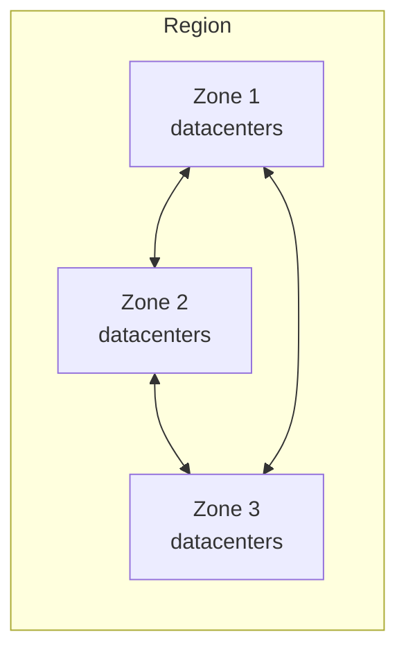

import DiagramContainer from "~/components/DiagramContainer.astro";
import LearningObjectives from "~/components/LearningObjectives.astro";
import Misconception from "~/components/Misconception.astro";

You never pick a datacenter in Azure. You pick a region, and sometimes an availability zone. This page explains those building blocks, how they protect your workloads, and how they help you keep data where it has to be.

<LearningObjectives>
- Describe the hierarchy of geographies, regions, availability zones, and datacenters.
- Explain how availability zones and region pairs protect a workload.
- Describe sovereign regions.
- Explain how region choice supports data residency.
</LearningObjectives>

## From datacenters to geographies

Azure's physical infrastructure starts with **datacenters**: buildings full of servers with their own power, cooling, and networking. Datacenters are grouped into availability zones and regions, and regions into geographies.

<DiagramContainer title="Azure infrastructure hierarchy" defaultOpen>

</DiagramContainer>

| Level | What it is |
|---|---|
| Geography | A larger area, such as the United States or Europe, that contains several regions. For most services, Microsoft doesn't replicate your customer data outside the geography you choose. |
| Region | A geographic area with one or more datacenters, linked by a low-latency network. You choose a region for most resources. |
| Availability zone | A group of one or more physically separate datacenters within a region, with independent power, cooling, and networking. |
| Datacenter | A physical facility. You don't interact with it directly. |

## Regions

When you deploy a resource, you usually choose its region. Not every service or VM size is available in every region, so check availability early. A few services are global and don't need a region, for example Microsoft Entra ID, Azure Traffic Manager, and Azure DNS.

How many regions are there? The Azure regions list on Microsoft Learn shows **57 named regions** in the global public cloud ([Azure regions list](https://learn.microsoft.com/azure/reliability/regions-list), checked October 2026). Other Microsoft pages round this to "more than 60 regions" ([compliance offerings](https://learn.microsoft.com/azure/compliance/offerings/)). The two figures aren't reconciled on Microsoft Learn, and both change as Microsoft opens new regions. Check the regions list before you quote a number.

## Availability zones

An **availability zone** is an isolation boundary inside a region. If one zone fails, for example through a power or network outage, the other zones keep running. Zones are usually several kilometers apart and within about 100 kilometers of each other, so they're close enough for fast replication but far enough apart that a local event rarely hits more than one.

Facts to remember:

- Every region that supports availability zones has at least three. Most have exactly three ([Microsoft Learn](https://learn.microsoft.com/azure/reliability/availability-zones-overview)).
- Not every region has availability zones. The regions list shows which do, and some zones are still listed as coming soon.
- Services support zones in two ways. **Zone-redundant** resources are spread across zones by Azure, which handles failover. **Zonal** resources are pinned to one zone that you choose, and you build the redundancy yourself.

## Region pairs

Some events are big enough to affect a whole region. Microsoft associates many regions with a second region, usually in the same geography, to form a **region pair**. For example, West Europe and North Europe are a pair. Pairs give you two benefits:

- During a geography-wide outage, Microsoft prioritizes recovery of one region in each pair.
- Microsoft staggers planned updates across the two regions of a pair.

Region pairs aren't automatic disaster recovery. Only some services, such as geo-redundant storage, use the pair to replicate data, and you still need your own recovery plan ([Microsoft Learn](https://learn.microsoft.com/azure/reliability/regions-paired)).

Many newer regions, such as Italy North, Poland Central, and Spain Central, have no pair. They rely on availability zones instead. A few pairs are one-way. Brazil South, for example, is paired with South Central US, outside its own geography, but South Central US isn't paired back.
## Sovereign regions

Sovereign regions are instances of Azure isolated from global Azure, for legal or compliance reasons:

- **Azure Government** regions, such as US Gov Virginia, US Gov Arizona, and US DoD Central, are physically and logically isolated and run by screened US personnel.
- Regions in China, such as China East and China North, are operated by 21Vianet. Microsoft doesn't maintain those datacenters directly.

Microsoft Sovereign Cloud builds on the same idea with Sovereign Public Cloud, Sovereign Private Cloud, and National Partner Clouds. Level 100 covers them.

## Regions and data residency

Most Azure services let you choose the region where your customer data is stored. Microsoft may replicate that data to other regions in the same geography for resilience, but doesn't replicate it outside the chosen geography ([Microsoft Learn](https://learn.microsoft.com/azure/compliance/offerings/)).

If data residency or sovereignty rules keep a workload in one region, Microsoft recommends spreading it across availability zones. That keeps every copy inside the region while surviving the loss of one zone. Zones don't protect against the loss of a whole region, so pair them with backups and tested restore steps ([Microsoft Learn](https://learn.microsoft.com/azure/reliability/availability-zones-overview)).

<Misconception>
  <Fragment slot="myth">
    Choosing an EU region is all you need for EU sovereignty.
  </Fragment>
  <Fragment slot="reality">
    Region choice controls where data is stored. Sovereignty also covers who can access the data, who operates the platform, and which laws apply. Some services are global and not tied to your region. Level 100 covers the EU Data Boundary and the other controls.
  </Fragment>
</Misconception>

## Sources

- [Describe Azure physical infrastructure (Microsoft Learn training)](https://learn.microsoft.com/training/modules/describe-core-architectural-components-of-azure/5-describe-azure-physical-infrastructure)
- [List of Azure regions](https://learn.microsoft.com/azure/reliability/regions-list)
- [What are availability zones?](https://learn.microsoft.com/azure/reliability/availability-zones-overview)
- [Azure region pairs and nonpaired regions](https://learn.microsoft.com/azure/reliability/regions-paired)
- [Azure, Dynamics 365, Microsoft 365, and Power Platform compliance offerings](https://learn.microsoft.com/azure/compliance/offerings/)
- [What is Microsoft Sovereign Cloud?](https://learn.microsoft.com/azure/azure-sovereign-clouds/microsoft-sovereign-cloud)
