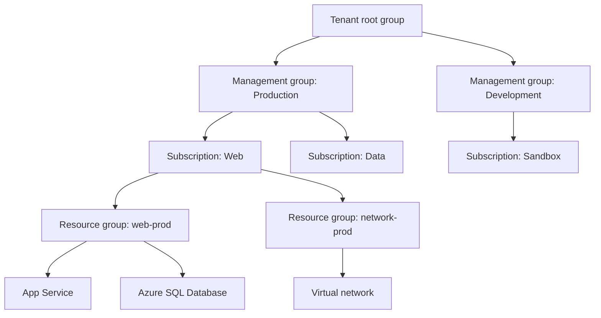

Azure is Microsoft's public cloud platform: a growing set of hundreds of services that you can use to build, deploy, and manage applications. You can run existing applications on virtual machines, or build new ones on managed services such as databases, AI models, and serverless functions.

This page explains how Azure is organized, so that later modules make sense. The next pages cover the service categories, the global infrastructure, and the tools.

## One platform, several clouds

Most people use global Azure, sometimes called Azure commercial or Azure public. Microsoft also runs separate Azure clouds for specific legal and national requirements ([Microsoft Learn](https://learn.microsoft.com/azure/compliance/offerings/)):

| Cloud | Who it's for |
|---|---|
| Azure (global) | Any customer, in regions worldwide |
| Azure Government | US government agencies and their partners, in physically and logically isolated US regions run by screened US personnel |
| Azure Government Secret and Top Secret | US classified workloads |
| Azure operated by 21Vianet | Customers in China. 21Vianet operates the datacenters, and Microsoft doesn't maintain them directly. |

Microsoft Learn calls these isolated instances **sovereign regions**. They're the starting point for Microsoft Sovereign Cloud, which Level 100 covers.

:::note
Some features of global Azure aren't in the other clouds. For example, Azure Copilot isn't available in Azure Government or Azure operated by 21Vianet ([Microsoft Learn](https://learn.microsoft.com/azure/copilot/overview)). Always check service availability for the cloud and region you plan to use.
:::

## How Azure organizes your resources

Azure has four levels for organizing what you deploy. Policies and access you set at one level apply to everything below it.

- A **resource** is anything you create: a VM, a virtual network, a database, a storage account.
- A **resource group** holds related resources. Every resource belongs to exactly one resource group. Resource groups can't be nested. Deleting a resource group deletes everything in it, which is handy for a temporary test environment.
- A **subscription** is a unit of management, billing, and scale. Each subscription gets its own invoice, and it's also an access boundary. Many organizations use separate subscriptions for development and production.
- A **management group** holds subscriptions, so you can apply policies and access to many subscriptions at once. Management groups can be nested up to six levels deep. Every Microsoft Entra tenant has one tenant root group at the top.

Every request to create, change, or delete a resource goes through **Azure Resource Manager**, whichever tool sends it. Resource Manager authenticates and authorizes the request, applies role-based access control, and passes it to the service. That's why the portal, the command line, and templates all behave the same way.

## How you pay for Azure

Azure uses the consumption-based model from Module 1. The main pricing options are:

- **Pay-as-you-go.** You pay for what you use, with no commitment.
- **Reservations.** You commit to a one-year or three-year plan for a specific resource type and get a discount ([Microsoft Learn](https://learn.microsoft.com/azure/cost-management-billing/reservations/save-compute-costs-reservations)).
- **Savings plans.** You commit to an hourly spend on compute for one or three years and get a discount across eligible services ([Microsoft Learn](https://learn.microsoft.com/azure/cost-management-billing/savings-plan/savings-plan-overview)).
- **Azure Hybrid Benefit.** You apply existing Windows Server and SQL Server licenses, and Linux subscriptions, to Azure resources ([Microsoft Learn](https://learn.microsoft.com/azure/azure-vmware/sql-server-hybrid-benefit)).

Before you deploy, the Azure Pricing Calculator estimates the cost of a design. After you deploy, Microsoft Cost Management tracks spending, and tags on resources let you report costs by project or team.

## Sources

- [What is Microsoft Azure (Microsoft Learn training)](https://learn.microsoft.com/training/modules/describe-core-architectural-components-of-azure/2-what-microsoft-azure)
- [Describe Azure physical infrastructure (Microsoft Learn training)](https://learn.microsoft.com/training/modules/describe-core-architectural-components-of-azure/5-describe-azure-physical-infrastructure)
- [Describe Azure management infrastructure (Microsoft Learn training)](https://learn.microsoft.com/training/modules/describe-core-architectural-components-of-azure/6-describe-azure-management-infrastructure)
- [Describe Azure Resource Manager and ARM templates (Microsoft Learn training)](https://learn.microsoft.com/training/modules/describe-features-tools-manage-deploy-azure-resources/4-describe-azure-resource-manager-azure-arm-templates)
- [Azure, Dynamics 365, Microsoft 365, and Power Platform compliance offerings](https://learn.microsoft.com/azure/compliance/offerings/)
- [What is Azure Copilot?](https://learn.microsoft.com/azure/copilot/overview)
- [What are Azure Reservations?](https://learn.microsoft.com/azure/cost-management-billing/reservations/save-compute-costs-reservations)
- [What are savings plans?](https://learn.microsoft.com/azure/cost-management-billing/savings-plan/savings-plan-overview)
- [Describe cost management in Azure (Microsoft Learn training)](https://learn.microsoft.com/training/modules/describe-cost-management-azure/)
